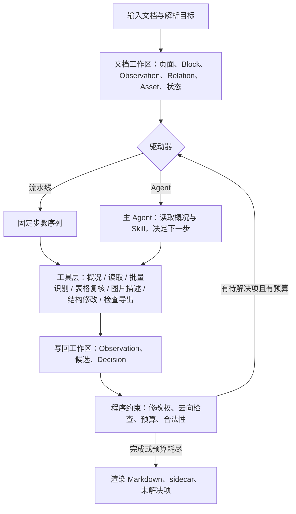

# ParserX v2 重建开发指导

> **文档状态**：草案 v0.10，2026-09-23 建立。
> 这是一份活文档。每个阶段完成后更新对应的"状态"标记和 §10 变更记录；
> 设计决策发生变化时在 §10 追加一条记录并修订正文，不要只改正文不留痕。
>
> 状态标记：⬜ 未开始 · 🟡 进行中 · ✅ 完成 · ⛔ 阻塞 · ❓ 待决策

## 0. 如何使用本文档

- **读者**：参与 v2 开发的人和 AI 助手。开始任何 v2 任务前先读 §4 核心设计和 §8 开发规范。
- **与其他文档的关系**：
  - [architecture.md](architecture.md) 描述 v1 架构，保留作历史参考，不再更新。
  - [requirements.md](requirements.md) 的痛点清单（P1–P19）和设计目标仍然有效，本文档不重复。
  - [iteration_history.md](iteration_history.md) 记录 v1 的 33 次迭代；v2 的阶段记录写在本文档 §6 和 §10。
  - [evaluation.md](evaluation.md) 的指标定义继续沿用，§7 只补充 v2 新增的约束。
- **更新规则**：阶段状态、依赖状态、开放问题三处必须随开发同步；其余章节按需修订。

### 0.1 当前状态与新会话启动清单（2026-09-23）

**状态快照**：外部依赖已全部确定（§3.1 各行均为 ✅）：OCR 走 AI Studio jobs API（PaddleOCR-VL-1.6），
LLM/VLM 走官方端点；VLM 为 **gpt-6-luna**（`.env` 已切换，`check_services.py` 三项通过），LLM 暂为 gpt-5.4-mini。
`services/llm.py` 已于 2026-09-23 适配推理模型（§3.3 接口变更全部完成）。
阶段零 🟡（端点切换、OCR 恢复、`llm.py` 适配已完成），阶段一至六 ⬜。
**2026-09-23 架构定位**：v2 的核心交付物是文档工作区 + 工具层 + 程序约束（§4.14）；固定流水线和 Agent 是两种可替换的驱动器，默认驱动器由阶段三的对比实验决定。

新会话开始时按顺序做：

1. 读本文档 §2、§4.0、§4.14、§4 其余、§6、§8、§9；不读 `architecture.md`，除非要查 v1 细节。
2. 运行 `uv run python scripts/check_services.py`，确认 OCR、LLM、VLM 三个服务都是 OK；任一失败先修 `.env`，不要绕过。
3. 运行 `uv run pytest -q --ignore=tests/test_live_e2e.py`。已知基线有 4 个失败（`test_image_processor` 1 个、`test_line_unwrap` 2 个、`test_verification` 1 个），
   在提交 87ef225 上同样失败，与本次依赖改动无关，都属于阶段二至五要替换的 v1 处理器；阶段零不修，替换时随模块一起处理。除此之外应全绿（428 通过）。
4. 从 §6 中状态为 🟡 的阶段开始。阶段零剩余任务的顺序（2026-09-23 按外部审核调整，理由见 §7.3）：
   修验收工具（表格结构指标、漏表/失败文档硬检查、阅读顺序指标、关键内容错误统计、GFM/HTML 归一）→ 回归分层（`--core`）→
   缓存层（覆盖 OCR 和 VLM）→ 回归配置关闭 LLM 兜底 → 用修好的指标冻结两份 v1 基线（gpt-5.4-mini 与 gpt-6-luna 各一份完整 run）。
5. 每完成一个产出：更新 §6 状态列和 §10 变更记录；新的决策写进 §9。
6. 结束会话前：`git status` 确认改动都在预期内；评测报告写入 `eval_reports/`。

截至 2026-09-23 工作区尚未提交的改动：`services/ocr.py` 重写为 jobs 协议、`parserx.yaml` 端点与模型切换、
`schema.py`/`llm.py` 小改、README 与 `.env.example` 更新、本文档、两份 eval_reports。建议在新会话开始前先提交一次。

## 1. 为什么重建核心

### 1.1 v1 现状（数据）

v1 从 2026-04-04 到 2026-04-17 共 108 次提交、33 次迭代。两次全量基线对比：

| 日期 | 文档数 | char_f1 | heading_f1 | table_f1 | 总耗时 |
|---|---|---|---|---|---|
| 2026-04-09 | 14 | 0.902 | 0.528 | 未记录 | 未记录 |
| 2026-04-17 | 16 | 0.897 | 0.544 | 0.487 | 570.6 s |

中间 15 次迭代，Iter 26 到 33 全部围绕标题识别，heading_f1 只变化了 0.016。

代码层面的症状：

| 症状 | 证据 |
|---|---|
| 规则堆叠 | `parserx/processors/chapter.py` 1599 行、38 个辅助函数，多数是针对单篇文档症状的守卫 |
| 状态无模型 | `PageElement.metadata` 是自由字典，全项目使用 84 个不同的标志键 |
| 评测不可复现 | 标题识别的 LLM 兜底使同一提交的 heading_f1 波动 ±0.05–0.10 |
| 图片分类缺失 | 分类只看像素尺寸；`TABLE_IMAGE` / `TEXT_IMAGE` 分支因 LayoutBuilder 从未实现而休眠 |
| AI 路径重叠 | 扫描页 OCR、图片 VLM 转录纠正、页面级 VLM 复审三层互相覆盖，靠字符串包含去重 |
| 成本无控制 | 无缓存；每次回归测试都重新调用全部 OCR/VLM |

### 1.2 根因

**首要根因：OCR、VLM 和规则之间没有明确的职责、裁决权和停止条件。** v1 里同一段内容会经历
"OCR 给出文本 → VLM 改写 → 规则发现冲突 → 页面复审再改 → 渲染阶段去重"，每一步单看都有道理，
但最终无法回答：这句话是谁改的、依据是什么、哪一步该负责。VLM 的四种用途（纠正 OCR、理解表格、描述图片、组织章节）
被混在一条可以反复修改内容的流程里，后执行的一步自动拥有最终决定权。

**次要根因：本地没有统一的版面表示。** 版面理解被外包给远程 OCR 和 VLM，于是每类新文档只能靠加规则来补，
规则之间又互相打架；图片的处理不是"先判断是什么再决定怎么做"，而是"先全部送 VLM 再用规则收拾结果"。
统一的中间表示（§4.1）是把职责边界落实到数据结构里的手段，它本身不能替代边界的定义（§4.0）。

v1 最初的方向是对的：希望工具能理解不同的文档，而不是不断积累"某种字号、某种编号就是什么"的规则。
v2 保留这个目标；要收紧的不是模型的判断空间，而是"判断之后能改什么、如何验证、失败后如何结束"。

### 1.3 决策：保留外壳，重建核心

| 路线 | 代价 | 风险 | 结论 |
|---|---|---|---|
| 从零重写 | 丢掉评测资产、服务客户端、DOCX 图片提取等可用代码 | 重新踩同样的坑 | 否 |
| 渐进重构 | 每步小 | 版面抽象仍然缺失，标志位总线换汤不换药 | 否 |
| 保留外壳、重建核心 | 中等 | 新旧路径并行期需维护开关 | **采用** |

"外壳"指配置、服务客户端、渲染器骨架、验证层、评测脚本和 ground truth。
"核心"指从提取到渲染之间的中间表示和全部处理器。§5 给出逐文件清单。

**2026-09-23 补充定位**：重建的重心从"设计一条覆盖所有文档的处理流程"转向"提供可靠的文档工具，让驱动方选择处理过程"。
核心交付物是三层：文档工作区（状态与证据）、工具层（按任务设计的能力）、程序约束（去向检查、修改权、预算）。
在这三层之上，固定流水线和 LLM 驱动的 Agent 是两种可替换的驱动器（§4.14），哪一种作默认由 §7.4 的对比实验在同一份冻结 run 上决定，不先押注。

## 2. 目标与非目标

### 2.1 目标场景

- 输入：DOCX（含 .doc 经 LibreOffice 转换）和 PDF；以中文为主、中英混排；
  文档中嵌入大量扫描图片，图片内容包括扫描文字页、表格截图、示意图、图表、照片、印章。
- 输出：适合大模型消费的 Markdown，外加机器可读的 sidecar JSON（区域、来源、置信度、页码）。
- 规模：单篇几页到几百页；需要可预期的耗时和成本上限。

### 2.2 优先级

沿用 v1 已确认的顺序：**信息保全与可读性 > 标题层级准确 > 任何公开基准分数**。
一条改动如果提升了 heading_f1 但丢了正文内容，视为回归。

v2 同时追求两件事，并且认为它们可以同时做到：

- **灵活性**：面对陌生文档仍能结合证据作判断，新增一类文档时不必修改很多处理器。
- **可控性**：每个判断能改什么、依据是什么、如何验证、失败后如何结束，都有明确定义；出错时能找到负责该判断的步骤并局部修正、局部重跑。

### 2.3 贯穿全流程的原则：内容去向可追溯

**每份已发现的内容，都必须有可追溯的去向：输出、合并、判定重复、明确排除，或识别失败。**
"已发现"包括原生字符、OOXML 节点、版面检测区域和 OCR 块。流水线内部任何静默丢失都视为缺陷，
由 §4.13 的内容去向检查在每次运行时核对。这条原则不能证明检测器从未漏检，但能抓住大部分内部丢失，
比再加一轮模型复审更值得先做。

### 2.4 非目标

- 不追 ParseBench 或 OmniDocBench 榜单；它们只作偶尔的健全性检查。
- 不为单篇文档加规则。任何阈值和规则必须在整个语料上验证。
- 不让模型在没有上下文的情况下逐元素兜底，也不把"整篇只调用一次"当作架构原则；结构分析按 §4.6 的预算分批进行，结果缓存。
- 不做通用 PDF 编辑、不做版式还原。
- 不做多智能体系统；即使采用 Agent 驱动器，也是单个主 Agent + 批量工具。
- 不做文档问答式的按需识别：完成条件是全文保全，不是"模型认为值得看的部分"。

## 3. 外部依赖现状（2026-09-23 检查）

### 3.1 检查结果总表

| 依赖 | 用途 | 状态 | 结论 |
|---|---|---|---|
| PaddleOCR-VL-1.6，AI Studio 官方 jobs API（`/api/v2/ocr/jobs`） | 扫描页 OCR + 版面标签 | ✅ 2026-09-23 接入并实测：异步提交–轮询–下载 JSONL；19 页 PDF 一次提交成功；服务端处理约 1 s/批，但端到端 4–120 s，主要耗在排队；频繁返回 10010"任务提交队列已满"（HTTP 400），客户端已按背压等待重提交 | 已恢复为可用引擎；可用性和排队时长仍不由我们控制，见 §3.2 |
| 主 LLM/VLM 端点（`OPENAI_BASE_URL`，Codex 账号中转） | 原默认 LLM/VLM，2026-09-23 停用 | ✅ 已切换（见下一行）。检查时发现：`gpt-5.4-mini` 被拒绝："not supported when using Codex with a ChatGPT account"；视觉调用遇 429"All available accounts are currently rate-limited"。`gpt-5.5`、`gpt-5.6`、`gpt-6` 文本和视觉均可用（2–5 s） | 不再作为默认；共享账号、有限流风险，只供试验 |
| 官方端点 B（`api.openai.com`） | **默认 LLM/VLM**（`parserx.yaml` 已切换） | ✅ VLM gpt-6-luna、LLM gpt-5.4-mini 经服务层调用通过（2026-09-23，`llm.py` 适配后） | 已是默认端点 |
| DashScope 端点 C（`qwen3.6-plus`） | 备用 LLM/VLM | ✅ 文本和视觉正常（约 5 s）；`/models` 在该路径返回 404，属正常 | 国内备用、中文语料对照 |
| LlamaCloud API key | 工具对比评测（LlamaParse） | ✅ key 有效（200） | Python 包 `llama-parse` 未被任何代码导入；实际调用走 `scripts/llamaparse_to_markdown.ts`，需要 `npm install`（当前 `node_modules` 缺失） |
| LibreOffice 26.8 | .doc 转 .docx | ✅ | 保留 |
| tesseract 5.5.3 | 无 | 代码中无引用；仓库根目录的 `eng.traineddata` 是遗留文件 | 删除该文件，不引入 tesseract |
| Node 26.8 / npm | 工具对比评测脚本 | ✅ 已安装 | 仅评测需要 |
| uv 0.10.11 / Python 3.13.12 | 运行环境 | ✅ | 保留 |

### 3.2 OCR 服务：是否仍然必要

**结论：远程 OCR 从"必需"降级为"可选引擎之一"。** 理由：

1. AI Studio 服务的可用性和排队时长不由我们控制（旧部署曾整体失效；新 jobs API 高峰期排队可达数十秒到两分钟）。
2. 本地版面检测器已验证可行（§4.2），它承担了 v1 中只有远程 OCR 才能提供的"版面标签"职责。
3. VLM 直接转录扫描页的成本已经很低（§3.3 实测：一页 827×1170 像素图片约 1.2k 输入 token，
   `gpt-5.6-luna` 约 0.001 美元/页）。
4. PaddleOCR-VL 在密集中文和表格上的准确率仍可能高于通用 VLM，因此保留为首选引擎，但不能是唯一引擎。

可选方案（✅ 2026-09-23 采用 A，接入方式为下表 A1 的实际形态）：

| 方案 | 做法 | 优点 | 代价 |
|---|---|---|---|
| A. ✅ AI Studio 官方 API，PaddleOCR-VL-1.6 | 已接入，见下方"1.6 接入实测"；1.6 于 2026-05-28 发布，架构与 1.5 一致，OmniDocBench v1.6 准确率 96.3% | 无需部署；结果结构与 1.5 相同 | 可用性与排队时长受平台限制 |
| B. 自托管 PaddleOCR-VL-1.6 | vLLM 容器，需 GPU | 稳定、可批量 | 需要一台 GPU 机器；本机 Mac 不适合 |
| C. VLM 作为扫描页引擎 | 本地版面检测 + VLM 按区域转录（§4.4） | 无额外部署；成本可控 | 密集中文表格准确率待评测 |

v2 的扫描页引擎接口按 `scan_engine: paddleocr | vlm` 设计。A 已落地，阶段二起以 `paddleocr` 为默认、
`vlm`（C）在阶段四作对照引擎；B 留作批量或生产部署的后备。

**PaddleOCR-VL-1.6 的 API 调用途径**（2026-09-23 调研；A1 已实际接入，其余未调用）：

| 途径 | 接口形态 | 与现有客户端的差异 | 版本 | 费用 / 配额 | 备注 |
|---|---|---|---|---|---|
| A1. ✅ AI Studio 官方托管 API（aistudio.baidu.com/paddleocr → 登录 → API 取 TOKEN） | 异步 jobs：`POST https://paddleocr.aistudio-app.com/api/v2/ocr/jobs`（multipart：`file`、`model`、`optionalPayload` JSON 串），`Authorization: bearer …` → 轮询 `GET …/jobs/{jobId}`（`pending`/`running`/`done`/`failed`）→ 下载 `resultUrl.jsonUrl`（JSONL，每行若干页的 `layoutParsingResults`） | 传输层重写（已完成，`services/ocr.py`）；`layoutParsingResults` 内部结构与旧同步接口一致，解析代码复用 | 1.6 | 官方限额页需登录，未确认；实测 19 页单次提交成功，旧的 10 页上限不适用 | 队列满返回 HTTP 400 + `code 10010`，属背压而非请求错误 |
| A2. 百度智能云 企业级"文档解析（PaddleOCR-VL）" | 异步：`/rest/2.0/brain/online/v2/paddle-vl-parser/task` 提交 + `/task/query` 轮询，access_token 鉴权 | 需新写适配器：异步轮询、响应结构不同（`position`/`polygon`/`span_boxes`） | 2026-06-12 起为 1.6 | ¥0.09/页按量，1000 页免费，包量低至 ¥0.042/页；QPS 提交 2 / 查询 5 | PDF ≤500 页、≤100 MB |
| A3. 千帆 `POST https://qianfan.baidubce.com/v2/ocr/paddleocr` | 同步，`Authorization: Bearer <API Key>`，`model: paddleocr-vl-0.9b`，请求字段与现有客户端相同，响应为 `{id, result: {layoutParsingResults…}}` | 小改：鉴权头、去掉 `errorCode/logId` 包装、错误格式 `{"error": …}`、加 `model` 字段 | 未标明 1.5 还是 1.6 | 列表价 ¥0.18/页，2026-06-30 前 ¥0.09/页 | 版本需向平台确认 |
| A4. 第三方托管 0.9B 识别模型（SiliconFlow 免费 1.5、Fireworks `paddleocr-vl-1-6`、Novita） | OpenAI 兼容 chat completions，只做识别，不含版面检测 | 需本地版面检测 + 按区域裁剪调用（与 §4.4 `vlm` 引擎同构）；可用 `paddleocr` 客户端的 `vl_rec_backend`/`vl_rec_server_url`，或用本项目的 rapid-layout 自己裁剪 | Fireworks 有 1.6 | SiliconFlow 免费（80k TPM）；Fireworks 未公开 | 与 v2 架构最契合，但要维护提示词协议 |

已采用 A1；批量或生产再评估 A2；A4 留作 v2 阶段四的对照引擎。

**1.6 接入实测**（2026-09-23）：

- 与 1.5 的差异主要在接口而非输出：同步 `/layout-parsing` + base64 + `token` 鉴权 → 异步 jobs + multipart + `bearer` 鉴权 + JSONL 结果。
  `prunedResult.parsing_res_list` 字段不变；新增 `block_id`、`group_id`、`block_polygon_points`；图片块 `block_order` 为 `null`（不在阅读流内）。
  服务端 `markdown.text` 含 HTML（`<div>` 图片块、`<table>` 表格），直接比对 ground truth 会严重低估，需先转换。
- `optionalPayload` 中的开关生效（结果 `model_settings` 可见）；`useOcrForImageBlock=true` 会把图标内的符号（☐、☀ 等）也识别出来，属噪声。
- 原始识别质量（不经 ParserX 流水线，去掉 HTML 标记后按字符计）：ocr01 F1 0.961（P 0.969 / R 0.954），
  ocr_scan_jtg3362 F1 0.961（P 0.941 / R 0.982），receipt F1 0.929（P 0.947 / R 0.913）。
  ocr01 第 1 页与 §3.3 三款 VLM 持平（F1 0.928，P 0.997），该页已达召回上限，区分不出优劣。
- 全量回归（[eval_reports/full_ocr_v16_2026-09-23.md](../eval_reports/full_ocr_v16_2026-09-23.md)）对比 Iter 32 基线（1.5）：
  平均 edit 0.244→0.226、char_f1 0.897→0.907、table_f1 0.487→0.531，OCR 调用数不变（32）。
  扫描件提升最明显：ocr01 edit 0.249→0.156 / char_f1 0.925→0.969；jtg3362 table_f1 0.638→0.839；receipt char_f1 0.957→0.971。
  注意同期还换了 LLM 端点并合入 Iter 33，差值不全归因于 OCR；patent01 的 ground truth 在工作区有改动，不可比。
- 稳定性：一轮回归（32 次 OCR 调用）中 4 次提交遇到队列满，共等待 10 次后全部成功；1 次 job 失败（服务端 500），重试成功。

### 3.3 LLM/VLM：升级建议与接口变更

官方端点可用的当前一代模型及定价（美元/百万 token，短上下文，来源：OpenAI 定价页，2026-09-23 抓取；图片输入按图片 token 计费，需以官方计算器为准）：

| 模型 | 输入 | 缓存输入 | 输出 | 本次实测 |
|---|---|---|---|---|
| gpt-5.4-mini | 0.75 | 0.075 | 4.50 | 文本、视觉、json_schema 正常；2.4 s |
| gpt-5.4-nano | 0.20 | 0.02 | 1.25 | 未测 |
| gpt-5.6-luna | 0.20 | 0.02 | 1.20 | 视觉、json_schema 正常；整页转录 `effort=none` 3.5 s、输出 244 token，charF1 0.924 |
| gpt-5.6-terra | 2.00 | 0.20 | 12.00 | 视觉正常 |
| gpt-5.6-sol | 4.00 | 0.40 | 20.00 | 未测 |
| gpt-6-luna | 0.10 | 0.01 | 0.50 | 视觉、json_schema 正常；整页转录 `effort=none` 2.9 s、输出 248 token，charF1 0.927 |
| gpt-6-sol | 2.00 | 0.20 | 10.00 | 未测 |
| qwen3.6-plus（DashScope） | 另计 | | | 整页转录 charF1 0.928、12.9 s；`json_schema` strict 不生效（返回围栏 JSON、字段名自拟），需要围栏剥离与宽松解析 |

**接口变更（✅ 2026-09-23 已在 `services/llm.py` 完成）**：

1. `gpt-5.6-*` 和 `gpt-6-*` 系列拒绝 `temperature` 参数（400 "Unsupported parameter"）；Chat Completions 路径上两代模型都拒绝 `max_tokens`，要求 `max_completion_tokens`。
   实现方式不是按模型名维护能力表，而是所有请求经过 `_create()`：后端返回 400 "Unsupported parameter/value" 时，去掉（或改名）该参数、记入服务实例的 `_unsupported` 集合并重试一次，之后不再发送。
   同一份配置因此对 gpt-5.4-mini 和 luna 系列都有效。`ServiceConfig` 新增 `reasoning_effort`、`send_temperature`、`min_output_tokens`。
   主中转端点会静默吞掉该参数，这掩盖了不兼容，不能以中转端点的结果作为兼容性依据。
2. 这些模型是推理模型：`max_output_tokens` 过小时推理 token 会耗尽预算，返回空文本
   （实测 200 token 上限时 `output_text` 为空）。需要按区域类型设定足够的输出上限，
   并通过 `reasoning.effort` 控制推理开销。实测两款 luna 都支持 `none`（0 推理 token），
   不支持 `minimal`；`low` 多出 300–500 推理 token，`medium` 在 gpt-6-luna 上多出 1400 token、耗时 15 s。
   **转录类任务用 `none`，语义提取用 `low`。** `parserx.yaml` 现为 vlm `reasoning_effort: none` + `min_output_tokens: 1024`，llm `none` + 256。
5. luna 系列不能设 `temperature`，同一输入两次输出会有差异（receipt 两次 char_f1 0.962 / 0.954，gpt-5.4-mini 两次均 0.971）。
   回归的可复现性只能靠缓存层保证，不能靠模型。
3. 结构化输出继续使用 Responses API 的 `text.format = json_schema`，实测可用。
4. ✅ 默认端点已改为官方端点（2026-09-23）；中转端点只用于开发试验。

**补充实测**（2026-09-23，官方端点，ocr01 第 1 页 827×1170 像素，charF1 以 ground truth 计；
ground truth 中脚注句重复出现一次，因此召回率上限约 0.87，三款模型的精确率均在 0.98 以上）：

| 任务 | gpt-5.6-luna | gpt-6-luna | gpt-5.4-mini |
|---|---|---|---|
| 整页转 Markdown（`effort=low`） | 8.5 s，718 out，F1 0.924 | 6.6 s，723 out，F1 0.927 | 3.1 s，394 out，F1 0.926 |
| 整页转 Markdown（`effort=none`） | 3.5 s，244 out | 2.9 s，248 out | 未测 |
| 按区域转录（本地检测 14 区域 + json_schema，`low`） | 8.3 s，1664 in / 750 out，14/14 区域，P 0.99 | 8.3 s，925 out，14/14，P 0.997 | 5.3 s，808 out，14/14，P 0.993 |
| 示意图语义提取（diagram schema，`low`） | 6.6 s，7 节点 / 10 边 | 6.4 s，12 节点 / 4 边 | 3.2 s，7 节点 / 1 边 |
| 6 路并发小请求 | 2.5 s，全部成功 | 3.1 s，全部成功 | 2.3 s，全部成功 |

按官方定价折算，整页转录（`none`）约 0.0005 美元/页（gpt-5.6-luna）或 0.00025 美元/页（gpt-6-luna）；
按区域转录（`low`）约 0.0012 美元/页。luna 转录未把信息图标签升成标题，gpt-5.4-mini 自由格式输出会。

**切换 gpt-6-luna 后的 v1 流水线抽查**（2026-09-23，`llm.py` 适配后，与最近一次 gpt-5.4-mini 全量报告对比）：

| 文档 | 指标 | gpt-5.4-mini | gpt-6-luna（两次） |
|---|---|---|---|
| receipt | char_f1 | 0.971 | 0.962 / 0.954 |
| text_report01 | char_f1 | 0.905 | 0.938 / 0.948 |
| text_report01 | heading_f1 | 0.526 | 0.500 / 0.556（LLM 兜底噪声） |

一升一降、幅度都在 0.03 以内，不构成回退。receipt 两个模型的 Markdown 逐行 diff 只差两条图片描述的措辞（luna 写"黑白环扣图标"，gpt-5.4-mini 写"OpenAI 结形 logo"），而 ground truth 的描述句正是按 gpt-5.4-mini 的措辞写的，所以这 0.01–0.02 是评测基准偏向旧模型，不是识别质量差异。v2 的评测应把图片描述从 char_f1 中剔除、单独按语义 schema 打分（§4.5）。

**模型分层**（✅ 2026-09-23 用户决定：VLM 用 gpt-6-luna；阶段四评测后可再调）：

| 用途 | 首选 | 备选 |
|---|---|---|
| 扫描页/表格图转录 | gpt-6-luna（`effort=none`） | gpt-5.6-luna；qwen3.6-plus |
| 图形语义提取 | gpt-6-luna（`effort=low`）；复杂图表可升级 gpt-5.6-terra | gpt-5.6-luna；qwen3.6-plus |
| 文档级标题候选判定（可选，单次） | gpt-5.4-mini（现用 LLM）；`llm.py` 适配后可切 gpt-6-luna | gpt-5.6-luna |

gpt-6-luna 在 `effort=none` 下最快最便宜且转录准确率与 gpt-5.6-luna 相同；本轮单张示意图的边关系提取略弱于 gpt-5.6-luna，阶段四在完整语料上复核，若语义提取明显落后再把该用途单独切到 gpt-5.6-luna。

### 3.4 Python 依赖

| 包 | 当前 | 最新 | 代码引用 | 处置 |
|---|---|---|---|---|
| pymupdf | 1.27.2 | 1.28.2 | 7 处 | 保留，阶段六升级 |
| openai | 2.30.0 | 3.19.0 | 1 处 | 3.x 是大版本，阶段零改接口时一并验证后再升 |
| pydantic | 2.12.5 | 2.13.5 | 3 处 | 保留 |
| docling | 2.84.0 | 2.130.0 | 1 处（DOCX provider） | 阶段五移除 |
| python-docx | 1.2.0 | 1.2.0 | 3 处 | 保留，成为 DOCX 主路径 |
| pdfplumber | 0.11.9 | | 仅 `tool_eval/adapters.py` | 移到 `bench` 可选依赖 |
| pypdf | 6.9.2 | | 0 处 | 删除 |
| llama-parse | 0.6.94 | | 0 处 | 删除（TS 脚本走 npm 包） |
| requests / pillow / numpy / pyyaml / python-dotenv | | | 使用中 | 保留 |
| **新增** rapid-layout + onnxruntime | | 1.2.1 / 1.30.0 | | 阶段一引入，本地版面检测 |

### 3.5 需要用户决策的事项

- ✅ 2026-09-23 决定：OCR 采用 §3.2 A1（AI Studio jobs API，PaddleOCR-VL-1.6），`services/ocr.py` 已改为 jobs 协议并删除旧同步协议代码；C（VLM）作为阶段四对照引擎。
- ✅ 2026-09-23 决定：VLM 暂用官方端点。`parserx.yaml` 的 `services.vlm` 与 `services.llm` 已改为 `*_B` 环境变量（LLM 一并切换，因为中转端点同样拒绝 gpt-5.4-mini）；模型仍为 gpt-5.4-mini，换 luna 系列待阶段零改完 `llm.py`。冒烟测试与 `tests/test_config.py` 通过。中转端点保留在 `.env`，仅供试验。
- ✅ 2026-09-23 决定并落地：VLM 模型为 gpt-6-luna；`llm.py` 已适配，`.env` 的 `VLM_MODEL_B` 已切换，三项服务检查通过。
- ✅ 2026-09-23 决定：回归测试分核心集（L1）与全量（L2），见 §7。
- ❓ 是否保留工具对比评测（LlamaParse/LiteParse）及其 Node 依赖。

## 4. 核心设计

### 4.0 AI 任务的职责、修改权与结束状态

这是 v2 的核心边界，§4.1 的 IR 只是把它落实到数据结构里。VLM 的四种用途可以用同一个模型，但必须拥有不同的输入、输出和修改权限：

| 任务 | 回答的问题 | 输入 | 输出 | 可以改变什么 | 不确定时怎么结束 |
|---|---|---|---|---|---|
| 转录与复核 | 图上实际写了什么 | 原图裁剪、必要上下文、待核查的具体问题 | 文本或 `TableGrid` **候选**，附修改位置 | 提交候选；由独立的选择步骤决定是否采用 | 保留冲突与原图，块 `status = degraded`，不再叠加"再问一次" |
| 图片描述 | 这张图展示了什么 | 图片、图注、邻近正文 | 附着在图片块上的说明（§4.5，带证据层级） | 只增加描述 | 描述缺省，图片保留；描述与正文不一致不反过来改正文 |
| 表格解释 | 某列代表什么、单位是否继承 | `TableGrid`、表头、图注 | 列语义、单位、关联信息 | 只增加解释，不改单元格 | 解释缺省 |
| 章节组织 | 哪些块是标题、几级、边界在哪 | 候选块、邻近正文、编号、样式、视觉信号、文档结构摘要 | 块的角色、层级、章节归属 | 只改结构，不改任何块的原文 | 保留正文，结构标"待定" |

规则：

- **模型的修改属于候选证据**，不因为它后执行就拥有最终决定权。每个任务后面都有一个由程序执行的选择或校验步骤（§4.4 的归属规则、§4.6 的合法性检查、§4.13 的去向检查）。
- **复核任务有明确触发条件**：普通区域直接采用 OCR，不默认全部复核；表格结构异常、文字提取缺失、不同证据明显冲突、JSON 解析失败时才进入复核。没有新证据的重复纠正必须停止。
- **忠实优先于合理**：转录与复核只回答"写了什么"。原图确实写了一个错误数字，输出也保留它；纠错不得依据常识改写原文。
- **"看起来没异常"不等于正确**：数值错误等静默问题靠抽样验证（§7.2），不能靠触发规则宣称已消除。
- **两类规则区别对待**：

| 规则类型 | 例子 | 处理 |
|---|---|---|
| 猜测文档含义的规则 | 大字号是标题；短句不是正文；某种编号固定对应某级标题；没有样式就不是标题 | 尽量不硬编码；作为证据交给模型结合上下文判断 |
| 保证处理正确性的约束 | 输出必须引用存在的块；调整章节不能改写正文；删除必须记录原因；数字与证据冲突不得覆盖 | 明确保留，由程序执行 |

- **优化目标不是"少调用"**，而是达到目标质量所需的成本、耗时和可调试性。确有必要的表格复核允许第二次调用；每个任务可按块 id 与任务类型单独重跑（§4.9），不必重跑整篇。

### 4.1 统一中间表示（IR）

所有页面（PDF 页、DOCX 流式内容、嵌入图片）都先变成一组带类型的内容块。IR 是流水线里唯一的数据载体，
替代 v1 的 `PageElement` + 自由字典。v0.7 之前只有一个 `Region`，外部审核指出它把五类概念混在一起
（坐标系、来源、置信度、关系、资源），因此拆成下面五个概念，仍然保持实现很轻（都是 pydantic 模型，放在 `parserx/ir/`）。

| 概念 | 表达什么 | 关键字段 |
|---|---|---|
| **Block** 内容块 | 段落、标题、列表、表格、图、公式、图注、页眉页脚等逻辑内容 | `id`、`kind`、`order`、`text`（表格见 §4.11 的 `cells`）、`level`、`semantic`、`status`、`chosen_observation` |
| **SourceAnchor** 来源定位 | 内容在原文件里的位置 | PDF：`page`、`bbox`、`coord_space`（`page_pt` / `image_px`）、`image_size`、`transform`；DOCX：`part`、`node_path`、`run_range`。一个 Block 可有多个 anchor（跨页合并、拼接） |
| **Observation** 识别记录 | 某个引擎对某个 anchor 的一次识别结果 | `engine`、`engine_version`、`raw_ref`（原始响应缓存键）、`text`/`cells`、`det_confidence`、`rec_confidence`、`status`（ok / empty / failed / skipped_budget） |
| **Relation** 关系 | 块与块之间的结构 | `kind`（contains / follows / continues / captions / footnotes / belongs_to_section / duplicate_of）、`src`、`dst`、`confidence` |
| **Asset** 资源 | 原图、裁剪图、渲染图 | `sha256`、`path`、`width`、`height`、`derived_from`、`transform` |

规则：

- **正文只取一个识别版本，证据层保留全部候选。** Block 的 `chosen_observation` 指向被采用的 Observation，其余 Observation 留在块上，供去重、回退、追溯。
- **置信度分三种，不再有默认 1.0。** `det_confidence` 来自检测器，`rec_confidence` 来自识别引擎，结构判断（层级、续接、去重）的把握写在 Relation 或 Decision 上。引擎不提供的置信度记为 `None`，渲染与评测把 `None` 当作"未知"而不是"可信"。
- **坐标必须带坐标系。** 子文档区域用父图片像素坐标并携带 `transform`，投影到页面坐标时显式换算；DOCX 内容没有 `page`/`bbox`，只有 `part`/`node_path`，几何处理器对它天然不适用，而不是喂假坐标。
- **状态是枚举，不是标志位。** Block 的 `status`：`ok` / `degraded`（识别不完整或置信低）/ `failed`（识别失败）/ `excluded`（明确排除，如页眉）/ `merged`（并入其他块）/ `duplicate`（判定重复）。渲染器只看 `kind`、`level`、`status`、`semantic` 和 Relation。
- **Decision 是类型化的。** `stage` 与 `choice` 用枚举，`evidence` 是带名字的数值或字符串；每个 Block 至少有一条路由 Decision。禁止再引入布尔标志或自由字典。

```python
class Block(BaseModel):
    id: str
    kind: BlockKind                      # title/text/list/table/figure/formula/caption/header/footer/page_number/footnote/scan/other
    order: int
    status: BlockStatus = BlockStatus.OK
    anchors: list[SourceAnchor]
    observations: list[Observation] = []
    chosen_observation: str | None = None
    text: str = ""                       # 由 chosen_observation 派生；表格块为空，内容在 cells
    cells: TableGrid | None = None       # §4.11
    level: int | None = None             # 仅 title
    semantic: FigureSemantic | None = None   # §4.5，类型化
    decisions: list[Decision] = []
```

### 4.2 版面检测器

**本地检测器是 v2 新增的核心组件。** 已在本机验证（Apple Silicon，CPU，ONNX Runtime，827×1170 像素页面）：

| 模型（rapid-layout） | 首次加载 | 单页推理 | 输出标签 |
|---|---|---|---|
| pp_doc_layoutv3 | 4.9 s（含 72 MB 模型下载） | 0.22 s | text / paragraph_title / image / table / … |
| doclayout_docstructbench | 22.9 s（含下载） | 0.22 s | title / plain text / figure / table / caption / abandon / formula |

选型原则：首选 `pp_doc_layoutv3`（中文文档训练，标签更细），
`doclayout_docstructbench` 作为对照。标签映射到 `RegionKind` 的表放在 `parserx/layout/labels.py`，
远程 OCR（PaddleOCR-VL）的标签也映射到同一张表；三套标签的差异只允许在这一个文件里出现。

检测器的输入统一是像素图：PDF 页渲染图、嵌入图片原图。
DOCX 流式内容不做像素检测，直接由 OOXML 结构给出区域类型（§4.6）。

**检测器只负责组织和分类，不裁决内容是否存在，也不是新的唯一裁判。** 它提供位置和类型证据，也会漏检或误判。
原生 PDF 的文字先整页提取，再按检测结果归属（§4.4）；检测器漏掉的区域里的原生文字进入"待归属"，不会因为没有检测框而消失；
检测给出的类型标签是 §4.6 章节判断的证据之一，不是判决。

### 4.3 嵌入图片 = 子文档

每张图片走同一条路。原则：**廉价判断只决定"值不值得调用识别"，不直接决定删除资源。**

1. **廉价过滤只做标记**：短边 < 30 px、像素标准差 < 1.0、长宽比 ≥ 12 的图片标为 `decorative_candidate`，记录 Decision；
   资源照常保存，只是默认不调用识别、不在 Markdown 中显示。"装饰性"与"看不清、未识别"是两种不同状态，后者标 `unrecognized`，永远保留原图链接。
2. **版面检测**：对图片像素跑 §4.2 检测器，得到子区域集合。
3. **面积统计的定义**：分母是整图面积；分子是同类检测框的**并集**面积（重叠只算一次）；
   文字类 `t` = text+title+list+table 的并集，图形类 `f` = figure/chart 的并集；图表内部的文字框若被 figure 框包含，只计入 `f`。
   大片留白不计入任何一类，因此普通扫描页的 `t` 会偏低，阈值按此校准，不用"留白多"推断 MIXED。
4. **路由**（阈值是起点，只能在整个语料上调，并单独统计"有信息图片被丢弃"的数量）：

| 条件 | 路由 | 处理 |
|---|---|---|
| `t ≥ 0.6` 且 `f ≤ 0.2` | SCAN | 子区域按 §4.4 取内容并内联进正文。**只有识别完整性检查通过**（所有子区域 `status = ok`，且内容去向检查无缺口）才默认隐藏图片链接；任一子区域失败或降级时自动显示原图 |
| `f ≥ 0.5` 且 `t ≤ 0.2` | FIGURE | 保留图片；做 §4.5 语义提取 |
| 两者都低、或检出区域置信度都低 | UNCERTAIN | 保留原图并显示；推迟语义判断；进入人工抽查清单 |
| 其他 | MIXED | 文字表格子区域内联；整图保留并做语义提取 |

5. **保存与显示是两项独立策略**：`assets.save`（默认全部保存，含 decorative）与 `render.show_image`（按路由与状态决定）。
6. **记录**：路由结果、`t`、`f`、区域数、完整性检查结果写入该图片 Block 的 `decisions`。

PDF 和 DOCX 在这一层完全相同；差别只在上游怎么拿到图片像素和它在文档中的位置。

### 4.4 内容获取与归属

顺序固定为：**全页提取 → 按版面组织和分类 → 对未归属或异常的区域补识别。**

| 区域类型 | 原生 PDF 页 | 扫描页 / SCAN 子文档 |
|---|---|---|
| text / title / list / caption | 整页提取的原生字符按检测框归属（字符中心点落入框内即归属，不用 PyMuPDF 的 `clip` 裁取，避免边界漏字） | 扫描页引擎 |
| table | 原生字符归属到表格框后由 §4.11 构建单元格；结构不完整时触发 VLM 复核，返回 `TableGrid` 候选 | 扫描页引擎；结构异常或置信低时触发 VLM 复核，返回 `TableGrid` 候选 |
| figure | 渲染裁剪 → §4.5 | 同左 |
| formula | 原生文本 + 归一化；复杂时触发 VLM 复核 | VLM |
| header / footer / page_number | `status = excluded`，记入 sidecar | 同左 |

归属规则：

- **待归属内容**：检测框未覆盖的原生字符按行聚成 `text` 块，`det_confidence = None`，进入正文而不是丢弃。
- **同一内容多来源时的选择**：原生层、OCR、图片子文档、复核候选同时给出同一区域的内容时，由一个独立的选择步骤裁决：(1) 原生层质量判定通过 → 用原生；(2) 否则用扫描页引擎；(3) 复核候选只在通过接受门（修改位置有图像证据、数字与证据不冲突、结构合法）时才替换前者，否则保留冲突并标 `degraded`。未被选中的 Observation 保留，并建立 `duplicate_of` Relation；这是删除 v1 字符串去重逻辑的前提。
- **原生层质量判定**：扫描底图上的旧 OCR 文本层（字符与像素位置不符）、乱码字体（U+FFFD 或私用区比例高）、矢量文字（drawing 多而 text 少）各有判定入口，判定失败即视为无原生层。
- **区域重叠**：两个检测框重叠超过 50% 时先合并或按置信度取舍，再归属字符；不允许同一字符归属两个块。

扫描页引擎 `scan_engine`：

- `paddleocr`：整页一次远程调用，返回文本、表格和布局标签；标签映射后直接成为 Observation。
- `vlm`：本地检测器给出区域，VLM 一次调用收到整页图片和区域列表，按区域 id 返回文本（json_schema 约束）。
  这样几何信息保留在本地，VLM 只负责识别。已在 2026-09-23 验证：三款模型都能完整返回 14/14 区域且 id 不错位（§3.3）。

两种引擎的输出形状相同，下游不感知差异。**页面级复审、逐图 VLM 纠正 OCR 这两层不再存在**；取而代之的是有明确触发条件、输出候选、由程序裁决的复核任务（§4.0、§4.10）。

表格错误分三种，复核只处理前两种，第三种是独立的解释任务（§4.0）：

| 问题 | 例子 | 处理 |
|---|---|---|
| 字符错误 | `8` 识别成 `3` | 对照图像核查字符，输出单元格级候选 |
| 结构错误 | 数据归到错误的列、合并单元格丢失 | 重建 `TableGrid` 候选 |
| 含义解释 | 某列代表什么、单位是否继承 | 表格解释任务，只增加信息 |

三者混在一个提示词里，模型会为了"理解通顺"重新组织甚至改写表格，所以提示词与输出 schema 按任务分开。

### 4.5 图形语义提取

FIGURE 区域按类型使用不同的 json_schema，VLM 一次调用返回：

| 类型 | schema 要点 |
|---|---|
| chart | `chart_type`、`title`、`x_axis`、`y_axis`、`series[{name, values}]`、`trend` |
| diagram | `diagram_type`（flow / architecture / org / other）、`nodes[]`、`edges[{from, to, label}]`、`summary` |
| photo / seal / other | `summary`（一句话）、`visible_text` |
| table（图片形式的表） | 直接返回 Markdown 表格，进入 `text`，不进 `semantic` |

每一项语义结果都必须标注**证据层级**，机器消费时与正文转录明确区分：

| 层级 | 含义 | 例子 |
|---|---|---|
| `visible` | 图中明确可见的文字或数值 | 数据标签、图例、节点名 |
| `estimated` | 根据坐标或刻度估读 | 无数据标签的折线图取值 |
| `inferred` | 模型概括或推断 | 两个节点之间未画线的关系、趋势描述 |
| `unknown` | 无法确定 | 被遮挡的数值 |

图表结果还必须带 `unit`、`axis_scale`（linear / log / unknown）和缺失值标记；边关系允许 `direction = unknown`。
评测时以人工标注的节点、边和数值为对照，"节点数/边数"只是输出规模，不能当作准确率。

图片描述是附着在图片块上的说明，与转录分开：图中可见文字属于转录（`visible_text`），"照片展示支座安装现场"属于描述，
"安装存在偏心"属于进一步判断（`inferred`）。这条路径可以失败而不影响正文：描述失败时图片仍然保留；描述与正文有差异时不反过来修改正文。

渲染规则：图片链接后紧跟一个固定格式的语义块，机器可解析，字段带证据层级；不再把描述同时写进 alt 文本和引用块。

### 4.6 标题与层级

目标是组织文档，不是重新识别文字。章节判断发生在内容基本稳定之后，主要使用文本模型能力，只有需要核对视觉证据时才引入图像。
不采用"字号和编号筛选候选 → 模型在筛剩的候选里修正层级"的流程，因为真正的标题一旦在第一步被排除就再没有机会恢复。流程改为：

> 提取内容块及证据 → 模型结合局部上下文判断角色 → 结合文档结构统一层级 → 程序检查结果是否合法 → 只对具体冲突补充上下文复核

**证据**（都是证据，不是判决）：文字内容及前后段落；字号、加粗、缩进、位置、版面检测标签；Word 的样式、大纲级别、编号定义；
当前章节、相邻标题、文档中重复出现的结构。普通正文误用了 Heading 样式，或真正的标题只做了加粗，都允许模型结合上下文发现冲突并提出遗漏的标题。

**两个问题分开回答**："这一块是不是标题"需要邻近正文和局部版面，按相邻块批量判断；"它在整篇里是几级"需要章节结构、编号体系和前后关系，
在文档级阶段统一。分开的目的是防止一次误判向整篇层级传播。

**有预算的结构分析**，而不是"整篇最多一次调用"：

- 局部判断按相邻块分批，每批带前后文；结构清楚的 Word 文档（标题样式一致、大纲级别完整）可以走确定性路径，但文档级检查发现不一致时仍允许模型提出遗漏或降级。
- 文档级阶段输入候选标题、编号、样式与结构摘要，输出层级与章节归属。
- 只有程序检查发现具体冲突（层级跳跃、同一编号模式不同层级、章节为空）时，才对相应片段补充上下文复核。
- 预算：每篇文档的结构分析请求数与 token 上限在配置中；超限保留正文、结构标"待定"。

**程序执行的合法性检查**（正确性约束，不是猜测规则）：输出只能引用存在的块 id；只改 `kind`、`level` 和章节归属，不改任何块的原文；
层级不得从 H1 直接跳到 H3；同一编号模式在同一文档内层级一致；不确定的块保留文本并标 `status = degraded`，不永久排除。

- **DOCX 的额外证据**：有效大纲级别（`w:outlineLvl`，含样式继承）、标题样式关联（Heading N / 标题 N 及其 basedOn 链）。
  `numbering.xml` 的层级是**编号层级**，普通列表同样使用它，因此只用于渲染编号；带编号但无标题样式或大纲级别的段落默认为 LIST，模型仍可依据上下文改判。Docling 不再参与。
- **PDF 的额外证据**：版面检测的 title 标签、字号聚类相对正文的比例、独立成行。
- v1 的 38 个守卫函数全部退役，不迁移。若某类误判在语料上普遍存在，改的是证据集合或合法性检查，不是加守卫。
- 回归测试的确定性模式下结构分析走缓存回放（§4.9）。

### 4.7 分页与跨页

- PDF：页锚点 `<!-- PAGE n -->` 保留，`n` 是物理页码。
- DOCX：区分三件事。**逻辑分节**（`w:sectPr`，其中 continuous 类型不换页）、**显式分页**（`w:br w:type="page"`、`pageBreakBefore`）、**实际排版页码**（只有排版引擎才知道）。
  未经排版引擎时只输出显式分页锚点 `<!-- PAGE-BREAK -->` 和分节锚点 `<!-- SECTION k -->`，不输出看起来像物理页码的 `PAGE n`。
- 跨页续接在块层做：页 i 末尾 TEXT 与页 i+1 开头 TEXT 之间无标题、前者不以句末标点结束 → 建立 `continues` Relation 并合并，合并块保留两个 anchor。
- 跨页表格：列数相同只产生候选；确认需要列位置对齐、表头结构一致、表格身份（图注或前文引用）和页面连续性；确认后合并 `cells`，保留来源。
- 页眉页脚通过跨页重复检测识别，`status = excluded`，写入 sidecar。

**OOXML 路径的支持边界**（阶段五前必须逐项标明支持 / 降级 / 不支持）：文本框、超链接、修订记录（接受或拒绝）、域代码、脚注尾注、嵌套表格、浮动图片与锚定位置、分栏、目录域。
"python-docx + 原始 XML" 只是手段，不代表这些已解决。

### 4.8 输出契约

Markdown：

- 标题用 ATX 风格，层级来自 §4.6；正文段落内不保留硬换行。
- 表格用 GFM；含合并单元格时退化为 HTML 表格，不丢单元格。
- 图片：``，下一行是语义块（§4.5）；SCAN 图片默认不输出链接。
- 公式：行内 `$…$`，独立 `$$…$$`。
- 页锚点为 HTML 注释。

Sidecar JSON（与 Markdown 同名 `.blocks.json`）：

```
{
  "document": {"source": "...", "status": "complete|partial|failed", "pages": 12,
               "engines": {...}, "prompt_hashes": {...}, "missing": [{"block": "...", "reason": "..."}]},
  "blocks": [Block, ...],              // 含 anchors、observations、decisions、cells、semantic（带证据层级）
  "relations": [Relation, ...],
  "assets": [Asset, ...],
  "images": [{"id": "...", "route": "SCAN|FIGURE|MIXED|UNCERTAIN", "shown": true, "t": 0.71, "f": 0.05}],
  "accounting": {"discovered": 812, "output": 790, "merged": 12, "duplicate": 6, "excluded": 4, "failed": 0},   // §4.13
  "stats": {"requests": {"ocr": 3, "vlm": 7, "llm": 1}, "attempts": {...}, "cost_usd": 0.0, "wall_time_s": 0.0},
  "warnings": [...]
}
```

`document.status` 是文档级结论：`complete`（无缺失）、`partial`（有块失败或预算跳过，`missing` 列出原因）、`failed`（提取本身失败）。
表格在 sidecar 里以 `cells` 结构给出，下游按 `blocks` 做分块、按 `status` 与置信度过滤，不需要解析 Markdown。

### 4.9 缓存与三种验收

- **缓存键覆盖完整请求语义**：输入图片字节（经预处理后）、区域列表、提示词内容哈希、json_schema 哈希、模型名与端点身份、识别选项、`reasoning_effort`。
- **任务级重跑**：每个 AI 任务以（块 id、任务类型、输入哈希）寻址。`parserx rerun --block <id> --task table_review` 只重跑该任务并重新走选择步骤，不重跑标题、描述和全文；调试时能同时看到原图、OCR 结果、复核候选和最终采用理由。
  `prompt_version` 保留作可读标签，但不是唯一失效机制。原始响应缓存与后处理结果缓存分开存放（`.parserx_cache/raw/`、`.parserx_cache/derived/`）。
- **三种验收分开**，不能互相替代：

| 验收 | 做法 | 证明什么 |
|---|---|---|
| 回放回归 | 固定响应（缓存），跑核心集 | 代码改动没有改变结果 |
| 服务契约检查 | 小样本真实请求（`scripts/check_services.py` 及少量区域） | 接口、参数、失败处理仍然正确 |
| 质量评测 | 固定语料与标注，真实请求或冻结 run | 实际识别质量 |

- 连续两次缓存结果一致，只证明本地回放稳定；luna 系列无法设 temperature，新请求本身不稳定，这是正常现象，不作为缺陷。
- **保留隔离验证集**：ground truth 按文档来源或模板划出一部分不参与阈值调整，只在阶段验收时跑，避免全量集退化为开发集（组成见 §9 Q8）。
- **阶段验收用完整冻结的 run**：代码提交、配置、输入、标注、响应缓存、指标版本全部可追溯，报告写入 `eval_reports/`。
  逐指标取历史最优的看板（`best_scores.json`）保留作趋势参考，但不是验收依据。

### 4.10 AI 调用规范

原则是 **每次调用职责明确，每次修改有依据，每条路径都有结束状态**（§4.0）；"少调用"不是架构原则，预算是成本控制手段。三个概念分开计数：

| 概念 | 含义 | 上限（配置项，默认值） |
|---|---|---|
| 识别任务 | 一个块（或一页）需要的一次逻辑识别，或一次复核、描述、解释、结构判断 | 每块最多 1 次基础识别、1 次复核、1 次描述或解释；结构分析按 §4.6 的预算 |
| 网络尝试 | 为完成一个任务发出的请求（含重试、参数降级重发） | 每任务最多 3 次；只重试可重试错误（网络、5xx、429、队列满） |
| 复核 | 基础识别未过接受门（表格结构异常、提取缺失、证据冲突、JSON 解析失败）后，以候选形式再识别一次 | 每块最多 1 次，且受文档预算约束；没有新证据不再复核 |

- 所有 VLM 调用使用 json_schema 结构化输出；解析失败计一次复核，不再额外重试。
- 每个任务按（块 id、任务类型、输入哈希）寻址，可单独重跑（§4.9），重跑不触发其他任务。
- **请求计数必须是真实计数**：由调度层（§4.12）在请求发出时记录，不再从元素推算。
- 每篇文档有预算：截止时间、并发数、请求数、预估费用。超预算的块 `status = degraded` 或 `failed`，图片类块退化为只保留链接，文档 `status = partial`，`missing` 记录原因。预算耗尽不等于文档失败，但必须可见。
- 模型选择在配置中按用途分层（§3.3），代码里不出现具体模型名。

### 4.11 表格结构模型

表格的主数据是单元格网格，不是 Markdown 字符串：

```python
class Cell(BaseModel):
    row: int; col: int
    rowspan: int = 1; colspan: int = 1
    content: str
    is_header: bool = False
    anchors: list[SourceAnchor] = []
    rec_confidence: float | None = None

class TableGrid(BaseModel):
    n_rows: int; n_cols: int
    cells: list[Cell]
    header_rows: int = 0
```

- GFM 和 HTML 都由 `TableGrid` 生成：无合并单元格输出 GFM，有合并单元格输出 HTML，两者信息等价。
- 跨页合并、表头关联、结构校验、评测都在 `TableGrid` 上做，不重新解析 Markdown/HTML。
- v1 的 `html_table_to_markdown` 只复用其 HTML 解析与 `_build_table_grid`（保留 rowspan/colspan），不复用最终的展开与扁平化输出。
- 扫描页引擎返回的 HTML 表格、原生 PDF 的字符归属结果、VLM 转录的表格，都先转成 `TableGrid` 再进入流水线。

### 4.12 调用调度与失败状态

所有远程调用经过一个调度层 `parserx/scheduling/`：

- 文档级截止时间、并发数、请求数与费用预算；请求前预留预算，完成后按真实用量结算。
- OCR jobs API：保存 `job_id`；轮询或下载失败时优先恢复原任务（重新轮询、重新下载），不重新提交已完成的任务；限定批次页数并校验返回页数等于提交页数，缺页视为该批失败。
- 可重试错误清单显式列出（网络错误、5xx、429、队列满 10010）；4xx 参数错误交给 `llm.py` 的参数降级，不在调度层重试。
- 每个任务的结果带 `status` 与 `attempts`；文档结束时汇总为 `complete / partial / failed`，每个缺失块记录原因（超时、预算、引擎失败、解析失败）。

### 4.13 内容去向检查

每次运行结束、渲染之前执行，结果写入 sidecar 的 `accounting` 并在不平衡时产生 warning：

- **发现集合**：原生字符（按行聚合）、OOXML 节点、检测区域、OCR 块，每项有 id。
- **去向集合**：每项必须落在且只落在一个去向：`output`（在某个 `status = ok/degraded` 的块里）、`merged`、`duplicate`、`excluded`、`failed`。
- 检查项：发现总数 = 去向总数；`failed` 与 `excluded` 的每一项都有 Decision；SCAN 图片隐藏链接的前提是其子区域全部 `output`。
- 不平衡不阻断输出，但文档 `status` 降为 `partial`，并列出未归属项。

### 4.14 工作区、工具层与驱动器

v1 的困境是"规则难穷举、处理路径互相干扰"；固定流水线要求开发者提前回答"什么时候要重新 OCR、什么表格要复核、图片该转录还是描述、
章节判断何时需要全文上下文"，这些判断的组合就是不断增长的分支。Agent 可以在运行时回答这些问题：不同文档走不同路径，而不必为每条路径写分支；
代价是调度成本和耗时不确定，以及完整性不能靠模型自觉。两种驱动方式共享同一套工作区和工具，差别只在谁决定下一步。



**工作区**：文档状态保存在程序中，模型按需读取。几百页文字、全部图片和每轮识别结果不进入对话历史；Agent 通常只看到文档概况、章节树、
处理进度和当前问题，需要时再读取原页或局部证据。§4.1 的 IR 就是工作区的数据模型，sidecar 是它的持久化形式。

**工具按任务设计，不只是暴露模型 API。** 只给 `call_ocr()` 和 `call_vlm()`，驱动方仍要自己拼提示词、解释响应、维护状态。起步提供七个工具，
每个工具的返回都带成本、失败原因和候选差异，让驱动方有依据决定是否继续：

| 工具 | 输入 | 返回 | 副作用 | 对应模块 |
|---|---|---|---|---|
| `overview` 查看文档概况 | 文档 id | 页数、原生文字量、图片数、样式与编号摘要、每页处理状态、未解决项 | 无 | `workspace/` |
| `read` 读取页面或区域 | 页或 Block id、是否要图、上下文范围 | 原图或裁剪图、文字、坐标、邻近块 | 无 | `workspace/`、`content/` |
| `recognize` 批量识别 | 页集合或区域集合、引擎 | 带 SourceAnchor 的文本、`TableGrid`、布局候选（Observation） | 写入 Observation；走调度层与缓存 | `content/`、`layout/` |
| `review_table` 复核表格 | Block id、待核查问题 | `TableGrid` 候选、与现有结构的差异、未确定单元格 | 写入候选 Observation，不改 `chosen_observation` | `tables/`、`semantic/` |
| `describe_figure` 描述图片 | Block id | 可见文字、描述、推断，带证据层级 | 写入 `semantic` | `semantic/` |
| `apply_structure` 修改结构 | 一组变更：角色、层级、阅读顺序、Relation | 接受的变更、被合法性检查拒绝的变更及原因 | 只改 `kind`/`level`/`order`/Relation，永不改原文 | `hierarchy/`、`ir/` |
| `check` / `export` 检查与导出 | 文档 id | 去向平衡、非法引用、缺失资源、每页状态；最终 Markdown 与 sidecar | 写 `accounting`、`document.status` | `accounting/`、`assembly/` |

普通批量识别在工具内部执行（分批、并发、重试、校验页数），驱动方一次要求"识别这组扫描页"，完成后集中处理异常，不必逐页发起几十轮思考。

**Skill 承载方法，不承载旧规则。** 三份任务指导放在 `parserx/skills/`，与提示词一样带内容哈希参与缓存键：

- 忠实转录与纠错：先看原图与已有结构，判断问题属于字符、行列关系还是跨页续接；按需扩大查看范围；保留原始数值；提交带来源的候选；证据不足报告未解决。
- 图片理解与描述：区分可见文字、描述与推断；描述失败不影响正文。
- 文档结构与章节组织：只改角色、层级、归属；证据不足保留正文、结构待定。

Skill 不写"字号大于多少就是标题""列数相同就是续表"。**Skill 提供方法，程序强制执行数据与预算约束**；提示词本身不能保证不丢内容、不超预算。

**两种驱动器**：

| | 流水线驱动器 `drivers/pipeline` | Agent 驱动器 `drivers/agent` |
|---|---|---|
| 决定下一步的是 | 固定步骤序列（§4.4 → §4.3 → §4.6 → §4.13） | 单个主 Agent，读取概况与 Skill |
| 适应陌生文档 | 靠配置与证据 | 运行时选择工具与查看范围 |
| 成本与耗时 | 低、可预期 | 高、不确定；总成本含主 Agent 多轮决策、重复上下文、重试 |
| 完整性来源 | 步骤覆盖全部页 | **只能来自程序约束**，不能来自模型自觉 |
| 适用 | 结构清楚的文档、批量任务 | 难例、混合扫描页、手工排版 Word |

**Agent 驱动器的完成条件比文档问答严格**，因为目标是保全整篇文档：

- 每页都有处理状态；没有被 Agent 注意到的页不能算完成。
- 已提取内容都有去向（§4.13）；`check` 不平衡就不能 `export`。
- 所有改动绑定 Block 与证据，原始结果可回看；只记"我认为应该这样处理"不算证据。
- 同一问题反复调用却没有新证据时停止；达到预算时输出 `partial` 与缺失项。
- 程序检查结构有效性（§4.6 合法性检查）；内容真实性靠抽样人工评测（§7.2）。
- **文档内容是数据，不是指令**：工具返回的文字（包括原文里出现的"忽略以上指令"之类）永远不进入 Agent 的指令通道；指令只来自 Skill 与配置。
- 单个主 Agent + 批量工具；OCR 与小型 VLM 作为工具运行，不发展成独立 Agent。

**调用记录**必须包含输入、输出、状态变更和证据引用，才能定位错误并局部重跑（§4.9）。

参考：Anthropic 关于何时用 workflow、何时用 agent 的讨论（[Building effective agents](https://www.anthropic.com/engineering/building-effective-agents)）与工具设计经验（[Writing tools for agents](https://www.anthropic.com/engineering/writing-tools-for-agents)）；
[DocClaw](https://arxiv.org/abs/2608.18685)（2026-08）提出文档 Skill + 工具调用循环 + 结构化文档状态的统一框架，方向相近但未证明在本语料上更优；
[AgenticOCR](https://arxiv.org/abs/2602.24134)（2026-02）面向查询驱动的按需识别，其效率收益不能直接当作全文转换的收益。

## 5. 代码迁移清单

外部审核指出 v0.7 的"原样保留"范围被高估：DOCX 图片提取依赖 Docling 对象与 `docling_self_ref`，完整性检查依赖旧 metadata 标志、页锚点和 GFM 表格，
幻觉检测只比较描述与 OCR/原生文本。清单改为三类。

### 5.1 可复用算法（需要适配接口）

| 路径 | 可复用部分 | 需要适配 |
|---|---|---|
| `parserx/config/` | 配置 schema 与 YAML 加载 | 新增 layout、cache、scan_engine、预算、模型分层 |
| `parserx/services/ocr.py` | jobs API 客户端 | 接入调度层（§4.12）：job_id 恢复、批次校验 |
| `parserx/services/llm.py` | 参数降级、reasoning、结构化输出 | 接入调度层与缓存；真实请求计数 |
| `parserx/builders/ocr.py` 的 HTML 表格解析 | `_parse_html_table` + `_build_table_grid` | 输出 `TableGrid`，弃用扁平化输出 |
| `parserx/builders/image_extract.py` | OOXML 图片收集（正文顺序、`a:xfrm` 旋转）、ImageMask 反色、矢量图渲染 | 去掉 Docling 对象与 `docling_self_ref` 依赖，产出 Asset |
| `parserx/providers/pdf.py` 的页面分类信号 | 图像覆盖率、乱码比例、矢量页判据 | 降级为原生层质量判定（§4.4）的输入 |
| `parserx/processors/table.py` 的跨页合并 | 列数匹配、表头去重 | 改在 `TableGrid` 上做，列数相同只产生候选 |
| `scripts/regression_test.py`、`parserx/eval/` | 运行框架、报告 | 指标按 §7.3 修复；失败文档硬失败；`--core`；冻结 run |

### 5.2 重新设计

| 路径 | 原因 |
|---|---|
| `parserx/verification/completeness.py` | 依赖旧标志与 GFM；由内容去向检查（§4.13）替代 |
| `parserx/verification/hallucination.py` | 只能比较描述与 OCR 文本；改为按证据层级校验语义结果（§4.5）并迁移"数字不得被改写"要求 |
| `parserx/assembly/markdown.py` | 输入改为 Block/TableGrid；实现 §4.8 契约 |
| `parserx/providers/docx.py` | 直接解析 OOXML，按 §4.6–4.7 的支持边界 |
| `parserx/pipeline.py` | 编排改为：提取 → 版面 → 归属 → 图片路由 → 识别与升级 → 层级 → 跨页 → 去向检查 → 渲染 |

### 5.3 新模块

| 新路径 | 职责 |
|---|---|
| `parserx/ir/` | Block、SourceAnchor、Observation、Relation、Asset、Decision |
| `parserx/layout/` | 检测器封装、标签映射、面积统计 |
| `parserx/routing/image.py` | §4.3 |
| `parserx/content/` | 全页提取与归属、扫描页引擎（paddleocr / vlm）、公式 |
| `parserx/tables/` | §4.11 `TableGrid` 构建、GFM/HTML 生成、跨页合并 |
| `parserx/semantic/` | §4.5 |
| `parserx/hierarchy/` | §4.6 |
| `parserx/scheduling/` | §4.12 |
| `parserx/accounting/` | §4.13 |
| `parserx/cache/` | §4.9 |
| `parserx/workspace/` | 文档工作区：状态读写、概况、页面与区域读取（§4.14） |
| `parserx/tools/` | 七个按任务设计的工具，统一返回信封（结果、成本、失败原因、候选差异） |
| `parserx/drivers/pipeline/` | 固定步骤驱动器 |
| `parserx/drivers/agent/` | 单主 Agent 驱动器：循环、Skill 加载、完成条件 |
| `parserx/skills/` | 三份任务指导（Markdown，带内容哈希） |

### 5.4 删除（阶段六）

`parserx/processors/chapter.py`、`processors/image.py` 的路由与纠正逻辑、`processors/vlm_review.py`、`builders/ocr.py` 中的结果整合与去重、
`models/elements.py` 的自由字典、Docling 依赖、`pypdf`、`llama-parse`、仓库根目录 `eng.traineddata`。

### 5.5 正确性要求登记（随模块替换迁移，不随测试删除消失）

旧实现可以退役，但它承载的正确性要求必须在新模块的测试里重新出现。首批登记：

| 要求 | 来源 | 迁往 |
|---|---|---|
| VLM 输出的数字与 OCR/原生证据不一致时不得覆盖（如 100 万元 → 999 万元） | `test_image_processor.py::test_vlm_json_falls_back_to_overlap_evidence_on_number_mismatch` | 复核候选的接受门（§4.0、§4.4） |
| 合并块不得丢失任一来源 | `test_line_unwrap.py` 的 bbox 合并用例 | Block 多 anchor 合并 |
| 有文字重叠的图片不得同时输出描述与重复正文 | `test_verification.py` 的 text-heavy 用例 | 内容去向检查 + `duplicate_of` |
| 页眉页脚首页身份信息保留上限 | `test_header_footer.py` | `excluded` 块的例外规则 |
| 跨页表格列数不同不得合并 | `test_table_processor.py` | `TableGrid` 合并候选校验 |

清单在替换每个模块时补充；阅读顺序、代码块、行内格式、列表、图注、交叉引用各自在 §6 中有归属阶段，不允许"顺手删掉"。

## 6. 分阶段路线

每个阶段的退出条件相同的一条：**新路径在冻结 run 上不低于旧路径（按 §7.3 修复后的指标），且真实请求数不增加。**
旧流水线留在配置开关 `pipeline: v1 | v2` 后面，直到阶段六完成再删。
顺序在 2026-09-23 两次调整：先修验收工具，再建工作区与工具层，用流水线驱动器做纵向闭环，然后做 Agent 驱动器对比实验，再按胜出的驱动器完善图片路由、标题与 DOCX，最后清理。

| 阶段 | 目标 | 产出 | 退出条件 | 状态 |
|---|---|---|---|---|
| 0 冻结现状与修验收工具 | 评测可信、快速、可复现 | ✅ 默认端点切换、OCR 恢复、`llm.py` 适配并切到 gpt-6-luna（2026-09-23）；⬜ §7.3 指标修复与硬检查；⬜ 回归分层 `--core`；⬜ 缓存层（OCR 与 VLM）；⬜ 回归配置关闭 LLM 兜底；⬜ 用修好的指标冻结两份 v1 基线（gpt-5.4-mini、gpt-6-luna）并划出隔离验证集 | 五个反例（§7.3）全部被指标或硬检查捕获；核心集回放两次一致；两份冻结 run 入库 | 🟡 |
| 1 工作区、IR 与工具层 | 建立 v2 数据模型、约束与工具 | `ir/`、`workspace/`、`tables/`、`scheduling/`、`accounting/`、`cache/`；七个工具的接口与返回信封；归属规则与失败状态；`layout/` 与 `routing/image.py` 影子运行 | 单元测试覆盖五个 IR 概念、TableGrid 往返、七个工具的契约；影子报告经人工抽查无系统性错误 | ⬜ |
| 2 流水线驱动器纵向闭环 | 三类文档各一篇走通 v2 | `drivers/pipeline/`：原生 PDF、扫描 PDF、DOCX 各选一篇（建议 text_table01、receipt、simple_doc01），贯通工具层、去向检查、渲染、sidecar | 三篇在冻结 run 上不低于 v1；去向检查平衡；sidecar 通过 schema 校验 | ⬜ |
| 3 Agent 驱动器原型与对比实验 | 用数据决定默认驱动器 | `drivers/agent/` 原型、三份 Skill；难例集（§7.4）；两种驱动器在同一模型、工具、预算下的冻结 run | §7.4 协议跑完并出报告；§9 Q13 作出决定 | ⬜ |
| 4 图片路由与扫描引擎 | 替换 OCR 整合 + VLM 纠正 + 复审 | 完整路由（含 UNCERTAIN）、两种扫描页引擎、复核任务与选择步骤、图片描述与表格解释（带证据层级） | 扫描类文档不低于 v1；"有信息图片被丢弃"为 0；专项验证低分辨率、密集表格、多栏、旧 OCR 层、矢量文字各至少一篇 | ⬜ |
| 5 标题与 DOCX 覆盖 | 退役守卫函数，统一两种格式 | `hierarchy/`（模型参与角色判断 + 文档级层级 + 合法性检查，§4.6）；OOXML provider 与支持边界表；嵌入图片走同一子文档路径 | heading_f1 不低于 v1；回放模式稳定；模型能提出 v1 漏掉的标题（在隔离验证集上抽查）；DOCX 文档全部指标不低于 v1 | ⬜ |
| 6 清理 | 删除死代码与死依赖 | §5.4 执行；§5.5 登记全部迁移完成；README 反映真实状态 | 测试全绿；依赖清单与 §3.4 一致 | ⬜ |

OCR 服务已于 2026-09-23 恢复（§3.2）；阶段二起以 `scan_engine: paddleocr` 为默认，`vlm` 作对照。
阶段三不等阶段四、五完成：对比实验只需要工具层和流水线闭环存在，越早拿到数据越早止损。

## 7. 评测规范

### 7.1 三层测试

v1 的问题不是单元测试慢（428 个用例离线 9 s），而是回归评测每次都跑全部 16 篇并真实调用服务（最近一次 1208 s、OCR/VLM/LLM 32/50/11 次）。
v2 把测试分成三层，日常只跑前两层：

| 层 | 内容 | 何时跑 | 目标耗时 | 服务调用 |
|---|---|---|---|---|
| L0 单元测试 | `uv run pytest -q`，全部离线；需要服务的用例标 `live_e2e` 默认跳过 | 每次改动 | < 15 s | 无 |
| L1 核心回归（回放） | `scripts/regression_test.py --core`，文档列表在 `configs/regression_core.txt`，响应来自缓存 | 每个任务结束、每次提交前 | 缓存命中时 < 1 min；全部未命中约 3 min | 缓存未命中时才调用 |
| L2 全量回归（冻结 run） | 全部 ground truth（含隔离验证集与 `ground_truth_public/` 子集），真实调用，结果冻结 | 阶段退出、发布、改提示词或换模型后 | 约 20 min | 全部 |

核心集的选取规则：每类输入各一篇、优先最小的文档、保留一篇当前得分最差的作哨兵。当前 6 篇：

| 文档 | 代表的输入类 | 页数 | 最近一次 O/V/L 调用 | 耗时 |
|---|---|---|---|---|
| deepseek | 原生 PDF，确定性 | 1 | 0/0/0 | 0.5 s |
| text_table01 | 原生 PDF 表格，确定性 | 3 | 0/0/1 | 1.3 s |
| receipt | 扫描小票，VLM | 3 | 1/2/0 | 2.1 s |
| ocr_scan_jtg3362 | 扫描中文标准文档，表格 | 4 | 4/6/1 | 92 s |
| simple_doc01 | DOCX，当前 char_f1 最差（0.457）哨兵 | | 0/0/1 | 3.4 s |
| text_report01 | DOCX 含嵌入图片 | | 0/2/1 | 51 s |

核心集只增不换：某篇文档在 L1 上连续三个阶段无变化且 L2 已覆盖同类，才可移出。
L2 报告记录在 `eval_reports/`，文件名含日期和阶段号；L1 只在终端打印，不留报告。

### 7.2 规则

- 指标定义沿用 [evaluation.md](evaluation.md) 并按 §7.3 修复。报告顺序固定：硬检查 → 表格结构 F1 → char_f1 与 edit distance → 阅读顺序 → heading_f1 → 关键内容错误 → 真实请求数 → 耗时 → 费用。
- L1 默认 `--offline` 且确定性模式；缓存未命中时提示并允许 `--allow-calls`。L2 单独跑、单独记录。
- 新增语料时先加 ground truth，再改代码；不允许为了通过某篇文档改阈值；隔离验证集不参与阈值调整。
- 图片路由单独评测：对语料中每张图片记录期望路由（SCAN / FIGURE / MIXED / UNCERTAIN / 装饰），报告混淆矩阵，并单独报告"有信息图片被丢弃"的数量；归入 L1。
- **静默错误抽样**：L2 每次从含数字、单位、日期的块中随机抽样固定数量，人工对照原图核对；抽样错误率单独记录，作为"触发规则未覆盖的错误"的估计，归入阶段验收。
- 每个 AI 任务类型单独评测：转录/复核按忠实度（含"原文错误被保留"的用例），描述按证据层级标注，章节按角色与层级分别计分。
- 逐步精简：替换一个 v1 模块时，删除只服务于该模块实现细节的单元测试；其承载的正确性要求先登记到 §5.5 再删。

### 7.3 验收工具的已知漏洞与修复清单

2026-09-23 外部审核给出五个最小反例，本地全部复现：

| 反例 | 当前结果 | 原因 |
|---|---|---|
| 表格中"甲=10、乙=20"改为"甲=20、乙=10" | table_f1 = 1.0 | `compute_table_metrics` 对配对表格用单元格内容多重集，忽略行列位置 |
| 两张表只输出第一张 | table_f1 = 1.0（仅 expected_count 记录 2） | 未配对的表格不进入 F1 分母 |
| 同一张表改为 HTML 输出 | 检出表格数 0 | `_extract_tables` 只识别 GFM 管道表 |
| 交换句子中的甲、乙主体 | char_f1 = 1.0（edit distance 0.25） | `compute_text_metrics` 用字符频次，忽略顺序 |
| 全部文档解析失败 | 退出码 0，打印 All clear | 退出码只取决于指标回退，失败文档只打印 |

另外 `best_scores.json` 逐指标取历史最优，会拼出任何一次真实运行都没达到过的组合；`pipeline._collect_api_calls` 按元素推算调用数，不是真实请求数。

阶段零修复清单（修完后 v1 基线必须重算，旧分数不再沿用）：

1. **表格结构指标**：GFM 与 HTML 先归一为 `TableGrid`，再按 (row, col, rowspan, colspan, content) 配对计算单元格位置 F1，另报表头关联正确率和合并单元格正确率。
2. **硬检查**：漏表数、多余表数、失败文档数、未执行文档数；任一非零则退出码非 0，`--update-baseline` 拒绝执行。
3. **阅读顺序指标**：按块序列的 Kendall tau 或成对逆序率；保留 edit distance。
4. **关键内容错误统计**：数字、单位、否定词、日期在输出与标注间的不一致计数，单独报告。
5. **真实请求计数**：由调度层记录，替代元素推算。
6. **冻结 run**：阶段验收使用完整的一次运行；历史最优看板保留但不作验收依据。

### 7.4 驱动器对比实验协议（阶段三）

目的是回答"Agent 驱动器在本语料上是否更准确、更省钱"，而不是先押注架构。

- **难例集**：每类至少一篇，且不在核心集内：密集中文表格、跨页表格、混合扫描页、手工排版 Word、复杂标题层级、照片与正文混排。
- **控制变量**：两种驱动器使用相同的底层模型、相同的七个工具、相同的预算与截止时间；避免把"换了更强模型"误认为架构优势。
- **观察项**：

| 维度 | 指标 |
|---|---|
| 质量 | 信息保全、数字归属、表格结构 F1、标题角色与层级 |
| 泛化 | 遇到陌生文档时需要新增多少专用规则或 Skill 文字 |
| 成本 | 真实请求数、token、费用、耗时、重复调用次数、未完成比例 |
| 稳定 | 同一文档多次运行的波动 |
| 可调试 | 一个错误能否定位到具体步骤并局部重跑 |

- **结论方式**：写成冻结 run 报告进入 `eval_reports/`；§9 Q13 记录决定与依据。允许的结论包括"默认流水线、难例交 Agent"这种混合形态。

## 8. 开发规范

- 运行与安装只用 `uv`：`uv run python …`、`uv add …`。
- 泛化优先：任何规则或阈值必须说明它对应的视觉或结构信号，并在整个语料上验证；禁止文档专属关键词表。
- 一次 AI 调用一个职责；调用前先问"这个区域是什么"，不是"把它送给模型看看"。
- 新增区域类型或路由分支时，必须同时补：标签映射、渲染规则、sidecar 字段、Decision 记录、一条评测用例。
- 提示词放在独立文件并带版本号；改提示词等同于改代码，需要跑回归。
- 测试驱动：v2 新模块先写测试再写实现。测试对象是 `Block` 级别的合成输入（几行文本、一张 200×200 的生成图片、一个手写的区域列表），不是整篇文档；整篇文档的验证交给 L1/L2 回归。
- 单元测试保持精简、全部离线：一个行为一个用例，不做快照断言；任何需要网络的用例标 `live_e2e`。分析与报告脚本放在 `scripts/`，不放进测试。
- 删除 v1 模块前先看 §5.5 登记：实现可以退役，正确性要求不能消失；登记项在新模块有对应测试后才允许删除旧测试。
- 任何会让内容"消失"的分支（过滤、抑制、跳过、预算截断）必须产生 Decision 并被内容去向检查计数。
- 新增一条规则前先分类（§4.0）：猜测文档含义的规则应改成交给模型的证据；保证正确性的约束才写成代码。
- 新增或修改一个 AI 任务时，必须同时写明它的输入、输出、可改变什么、不确定时的结束状态，并补对应的接受门与评测用例。
- 提交信息说明改动针对的信号和验证范围；阶段完成时更新本文档 §6 状态与 §10。

## 9. 开放问题

| 编号 | 问题 | 状态 |
|---|---|---|
| Q1 | OCR 服务走 §3.2 的 A、B 还是 C | ✅ A1（jobs API，PaddleOCR-VL-1.6）；C 作对照 |
| Q2 | 默认端点改为官方端点；中转端点是否保留 | ✅ 已决定：官方端点为默认；中转端点仅试验 |
| Q3 | 默认 VLM 取 gpt-5.6-luna 还是 gpt-6-luna | ✅ 2026-09-23 用户决定 gpt-6-luna；语义提取用途在阶段四复核 |
| Q4 | 是否保留工具对比评测及 Node 依赖 | ❓ |
| Q5 | `scan_engine: vlm` 在密集中文表格上的准确率是否足以作为唯一引擎；信息图页已达 ground truth 上限，密集表格未测 | ❓ 阶段四回答 |
| Q6 | 本地检测器在 DOCX 嵌入的低分辨率截图上的召回率 | ❓ 阶段一回答 |
| Q8 | 隔离验证集的组成：按文档来源（公司内部 / 公开）还是按模板划分；建议先划出 3 篇不同类型且不进核心集的文档 | ❓ |
| Q9 | OOXML 支持边界：文本框、修订、域、脚注、嵌套表格、浮动图片各自是支持、降级还是不支持 | ❓ 阶段五前决定 |
| Q10 | 表格复核（OCR 后再 VLM）的触发阈值与预算占比 | ❓ 阶段四回答 |
| Q11 | 结构分析预算：每篇文档局部判断批次大小、文档级调用 token 上限、冲突复核次数 | ❓ 阶段五前决定 |
| Q12 | 哪些文档类型允许标题走确定性路径跳过模型（如标题样式一致的 Word） | ❓ 阶段五回答 |
| Q13 | 默认驱动器：流水线、Agent，还是"默认流水线、难例交 Agent"；依据 §7.4 报告 | ❓ 阶段三回答 |
| Q7 | 若走 A1，PDF 按 10 页分片提交是否已实现 | ✅ 不需要：jobs API 实测 19 页单次提交完整返回，10 页上限只属于旧同步接口；官方页数上限未确认，`_BATCH_MAX_PAGES = 100` 暂保留 |

## 10. 变更记录

| 日期 | 版本 | 内容 |
|---|---|---|
| 2026-09-23 | v0.1 | 建立文档：根因分析、重建决策、依赖检查结果、核心设计、迁移清单、阶段路线 |
| 2026-09-23 | v0.2 | 补充 luna 系列与 qwen3.6-plus 实测：`reasoning.effort` 取值、按区域转录验证、单页成本；更新 Q3/Q5 |
| 2026-09-23 | v0.3 | 调研 PaddleOCR-VL-1.6 四条 API 途径（A1–A4）；Q2 决定并落地：VLM/LLM 默认切官方端点 |
| 2026-09-23 | v0.4 | Q1、Q7 关闭：OCR 接入 AI Studio jobs API（PaddleOCR-VL-1.6），记录接口差异、实测质量与全量回归 |
| 2026-09-23 | v0.5 | 依赖全部确定：§3.1 端点行改为已切换；阶段零改为 🟡 并拆分剩余任务；新增 §0.1 新会话启动清单与 `scripts/check_services.py` |
| 2026-09-23 | v0.6 | 用户修订：VLM 定为 gpt-6-luna（Q3 关闭，`llm.py` 适配提为阶段零首项）；§7 改为三层测试与核心回归集（`configs/regression_core.txt`）；§8 增加测试驱动规则 |
| 2026-09-23 | v0.7 | `llm.py` 适配推理模型（参数拒绝自动降级、`reasoning_effort`、`min_output_tokens`），VLM 切到 gpt-6-luna 并抽查两篇；阶段零剩余三项 |
| 2026-09-23 | v0.10 | 架构定位：核心交付物改为工作区 + 工具层 + 程序约束，流水线与 Agent 为可替换驱动器（§1.3、§4.14）；七个按任务设计的工具、三份 Skill、Agent 完成条件与注入防护；§6 增加阶段三"Agent 驱动器原型与对比实验"，§7.4 对比协议；Q13 |
| 2026-09-23 | v0.9 | 吸收审核后续讨论：根因改为"OCR/VLM/规则的职责、裁决权与停止条件不清"；新增 §4.0 AI 任务边界（四类任务的输入、输出、修改权、结束状态；模型修改是候选；两类规则区分）；§4.6 改为模型参与角色判断的有预算结构分析；§4.10 以"职责明确"替代"少调用"；任务级重跑；静默错误抽样 |
| 2026-09-23 | v0.8 | 吸收外部专家审核：复现五个评测反例并列入 §7.3 修复清单；IR 拆为 Block/SourceAnchor/Observation/Relation/Asset；新增内容去向原则（§2.3）与检查（§4.13）、表格结构模型（§4.11）、调度与失败状态（§4.12）；图片路由改为"判断不删除"并加 UNCERTAIN；DOCX 标题与分页规则改写；语义结果加证据层级；§5 改为可复用/重新设计/新模块三类并加正确性要求登记；§6 阶段顺序改为先修验收工具、再补契约、再纵向闭环 |
