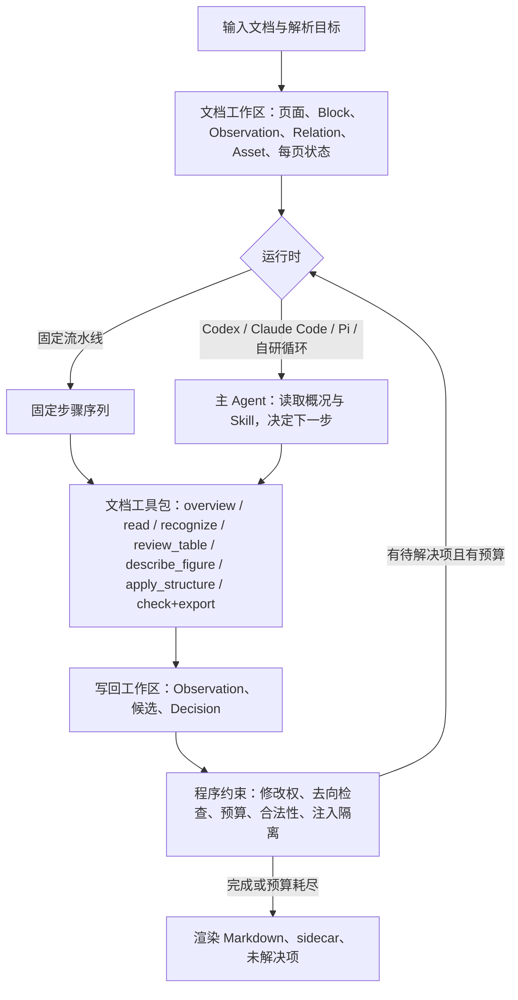

# ParserX v2 设计与研发指导

> **文档状态**：v1.14，2026-09-24（v1.0 当日重新整理；v1.1 确认阶段零分解与阶段一接口；v1.2 完成 P0-1；v1.3 LLM 切到 gpt-6-luna、完成 P0-2；v1.4 完成 P0-3；v1.5 完成 P0-4；v1.6–v1.7 两处 v1 修复；v1.8 阶段零完成；v1.9 阶段一分解与设计修订；v1.10 阶段一实施；v1.11 阶段一完成；v1.12 全量语料参考结果与 Q33、Q34；v1.13 阶段二分解草稿；v1.14 阶段二实施，见 §15。此前 v0.1–v0.10 的逐次修订稿见 [archive/redesign_guide_v0.10_draft.md](archive/redesign_guide_v0.10_draft.md)）。
> 这是一份活文档：阶段完成时更新 §12 状态列与 §15 变更记录；决策变化时在 §15 追加记录并修订正文。
>
> 状态标记：⬜ 未开始 · 🟡 进行中 · ✅ 完成 · ⛔ 阻塞 · ❓ 待决策

## 0. 使用方法与当前状态

### 0.1 状态快照（2026-09-24）

- **外部依赖已全部确定**：OCR 走 AI Studio jobs API（PaddleOCR-VL-1.6）；LLM/VLM 走官方 OpenAI 端点，VLM 与 LLM 都是 gpt-6-luna（LLM 于 2026-09-23 从 gpt-5.4-mini 切换，Q19）；`services/llm.py` 已适配推理模型。`uv run python scripts/check_services.py` 三项通过。
- **架构定位已定**：v2 的核心交付物是文档工作区 + 文档工具包 + 程序约束（§3）。固定流水线和 LLM 驱动的 Agent 是两种可替换的运行时，默认运行时由 §7 的实验决定，不先押注。
- **阶段零 ✅**（2026-09-23）：指标、硬检查、回归配置、响应缓存、L1 离线回放、v1 冻结基线 `eval_runs/2026-09-23_p0_v1_gpt-6-luna`（提交 78556f4，[基线报告](../eval_reports/2026-09-23_p0-5_v1_frozen_baseline.md)；按指标 2.1 离线重算为 `.rescored-2.1.json`）。
- **阶段一 ✅**（2026-09-24）：文档工作区、七个工具与 JSON CLI、程序约束（去向检查、合法性、接受门、预算）、内容获取（原生 PDF、扫描页引擎、DOCX 直接读 OOXML）、渲染与 sidecar、三份 Skill 草稿、版面检测与图片路由（影子）、固定序列运行时与 `pipeline: v1 | v2` 开关。v2 冻结 run `eval_runs/2026-09-24_p1_v2_toolkit`（提交 65041be），[验收报告](../eval_reports/2026-09-24_p1_toolkit_acceptance.md)；[工具形态试用](../eval_reports/2026-09-24_p1-7b_tool_trial.md)。决策 Q23–Q32 见 §14。**全量语料（27 篇）参考运行**暴露的三处差距（Q33：跨页续表、扫描页标题层级、多栏阅读顺序）已在阶段二之前处理，v2 冻结 run 以空缓存重新冻结（提交 e14752f）。处理后与 v1 比：char_f1 变差 11 篇、变好 9 篇（此前 15 / 7），平均 0.932（v1 0.893）；v2 仍不能在所有文档上替代 v1，剩余差距见验收报告"全量语料"一节。Q34（原生页页眉页脚识别、扫描页多栏区域顺序）也已在阶段二之前处理：与 v1 比 char_f1 变差 9 篇、变好 9 篇、持平 9 篇，平均 0.940（v1 0.893），剩余差距（扫描页识别差异、图片中的文字、无样式标题、界面元素、代码块）见验收报告。阶段二（Agent 探索）🟡：分解 [v2_phase2_plan.md](v2_phase2_plan.md) 已确认（Q35–Q39；Agent 运行时为 Codex，主力模型 gpt-6-sol）；P2-1 实验装置 ✅（[报告](../eval_reports/2026-09-24_p2-1_harness.md)），P2-2 任务说明 ✅，P2-3 对照运行 ✅，P2-4 第一轮已跑完（13 次运行全部有效），发现清单与速度分析待用户确认（[报告](../eval_reports/2026-09-24_p2-4_round1_findings.md)）；阶段三至五 ⬜。
- **测试基线**：L0 720 通过、4 个既有失败（`test_image_processor` 1、`test_line_unwrap` 2、`test_verification` 1，属于将被替换的 v1 处理器，其正确性要求已登记到 §11.5），约 11 s。v1 的 L1：`regression_test.py --core --repeat 2`；v2 的 L1：`regression_test.py --core --config configs/regression_v2.yaml --repeat 2`，都应 PASS。
- **代码状态**：全部在 main，未推送远端。冻结 run、响应缓存与新报告只在本地（`eval_runs/`、`.parserx_cache/`、`eval_reports/`，不入 git）。

### 0.2 新会话启动清单

下一轮会话的主题是"阶段二：Agent 探索"，从 P2-1 实验装置开始（§7.2–§7.4、§12，[v2_phase2_plan.md](v2_phase2_plan.md)）。开始时按顺序做：

1. 读 §2、§3、§5、§7、§12、§14（尤其 Q13、Q14、Q30、Q35–Q39），[v2_phase2_plan.md](v2_phase2_plan.md) 全文，[v2_phase1_interfaces.md](v2_phase1_interfaces.md) 的 §4–§5（含〔P1-n〕与〔Q33〕〔Q34〕实现说明），[阶段一验收报告](../eval_reports/2026-09-24_p1_toolkit_acceptance.md) 与 [工具形态试用报告](../eval_reports/2026-09-24_p1-7b_tool_trial.md)。
2. 运行 `uv run python scripts/check_services.py`，三项都 OK 才继续。
3. 运行 L0（720 通过、4 个已知失败）、v1 的 L1、v2 的 L1（见 §0.1），都应 PASS；两个冻结 run 的 `--replay` 都应通过（v2 需加 `--config configs/regression_v2.yaml`）。
4. 阶段二分解见 [v2_phase2_plan.md](v2_phase2_plan.md)（Q35–Q39 已确认）：按其 §4 的顺序实施，从 P2-1 开始；P2-4 的发现清单先交用户确认再修订工具。Agent 运行时用 Codex CLI，主力模型 gpt-6-sol、推理强度 high，在命令行上显式指定（Q35）；动手前用一次无头调用确认模型可用。
5. 每完成一项：跑 L0 与两个 L1；更新 §12 与 §15；新的决策写进 §14；提交一次。
6. 结束会话前：`git status` 确认改动在预期内；评测报告写入 `eval_reports/`。

### 0.3 相关文档

- [architecture.md](architecture.md)：v1 架构，保留作历史参考，不再更新。
- [requirements.md](requirements.md)：痛点 P1–P19 与设计目标仍然有效。
- [iteration_history.md](iteration_history.md)、[iteration_backlog.md](iteration_backlog.md)：v1 的 33 次迭代记录，已冻结。
- [evaluation.md](evaluation.md)：指标定义，按 §9.2 修复。
- [v2_phase0_plan.md](v2_phase0_plan.md)：阶段零剩余任务分解（改动文件、测试、验收、顺序）。
- [v2_phase1_interfaces.md](v2_phase1_interfaces.md)：阶段一 IR、TableGrid、返回信封与七个工具的 pydantic 模型和 JSON CLI 签名；字段级定义以该文件为准，§4、§5 是概要。
- [v2_phase1_plan.md](v2_phase1_plan.md)：阶段一工作分解（事实、设计修订 R1–R8、P1-1 至 P1-11、退出条件、待决问题）。
- [v2_phase2_plan.md](v2_phase2_plan.md)：阶段二工作分解（探索设计、探索集与未见集、P2-1 至 P2-9、退出条件、待决问题 Q35–Q39）。
- [../eval_reports/dependency_probe_2026-09-23.md](../eval_reports/dependency_probe_2026-09-23.md)：依赖探测原始数据；[../eval_reports/full_ocr_v16_2026-09-23.md](../eval_reports/full_ocr_v16_2026-09-23.md)：OCR 1.6 接入后的全量回归。

## 1. 背景与根因

### 1.1 v1 现状（数据）

v1 从 2026-04-04 到 2026-04-17 共 108 次提交、33 次迭代。两次全量基线：

| 日期 | 文档数 | char_f1 | heading_f1 | table_f1 | 总耗时 |
|---|---|---|---|---|---|
| 2026-04-09 | 14 | 0.902 | 0.528 | 未记录 | 未记录 |
| 2026-04-17 | 16 | 0.897 | 0.544 | 0.487 | 570.6 s |

中间 15 次迭代，Iter 26 到 33 全部围绕标题识别，heading_f1 只变化了 0.016。代码症状：

| 症状 | 证据 |
|---|---|
| 规则堆叠 | `parserx/processors/chapter.py` 1599 行、38 个辅助函数，多数是针对单篇文档症状的守卫 |
| 状态无模型 | `PageElement.metadata` 是自由字典，全项目使用 84 个不同的标志键 |
| 评测不可复现 | 标题识别的 LLM 兜底使同一提交的 heading_f1 波动 ±0.05–0.10 |
| 图片分类缺失 | 分类只看像素尺寸；`TABLE_IMAGE` / `TEXT_IMAGE` 分支因 LayoutBuilder 从未实现而休眠 |
| AI 路径重叠 | 扫描页 OCR、图片 VLM 转录纠正、页面级 VLM 复审三层互相覆盖，靠字符串包含去重 |
| 成本无控制 | 无缓存；每次回归都真实调用全部服务（最近一次 1208 s，OCR/VLM/LLM 32/50/11 次） |

### 1.2 根因

1. **OCR、VLM 和规则之间没有明确的职责、裁决权和停止条件。** 同一段内容会经历"OCR 给出文本 → VLM 改写 → 规则发现冲突 → 页面复审再改 → 渲染阶段去重"，每一步单看都有道理，但无法回答这句话是谁改的、依据是什么、哪一步该负责。VLM 的四种用途（纠正 OCR、理解表格、描述图片、组织章节）混在一条可以反复修改内容的流程里，后执行的一步自动拥有最终决定权。
2. **本地没有统一的版面表示。** 版面理解被外包给远程 OCR 和 VLM，每类新文档只能靠加规则来补，规则互相打架；图片处理不是"先判断是什么再决定怎么做"，而是"先全部送 VLM 再用规则收拾结果"。
3. **验收工具有实质漏洞**（§9.2）：表格指标忽略单元格位置与漏表，字符指标忽略顺序，HTML 表格检不出，文档全部失败时退出码仍为 0。"新路径不低于旧路径"在这套指标上无法可靠证明。

v1 最初的方向是对的：希望工具能理解不同的文档，而不是积累"某种字号、某种编号就是什么"的规则。v2 保留这个目标；要收紧的不是模型的判断空间，而是"判断之后能改什么、如何验证、失败后如何结束"。

### 1.3 决策：保留外壳，重建核心

| 路线 | 代价 | 风险 | 结论 |
|---|---|---|---|
| 从零重写 | 丢掉评测资产、服务客户端、DOCX 图片提取等可用代码 | 重新踩同样的坑 | 否 |
| 渐进重构 | 每步小 | 版面抽象仍然缺失，标志位总线换汤不换药 | 否 |
| 保留外壳、重建核心 | 中等 | 新旧路径并行期需维护开关 | **采用** |

"外壳"指配置、服务客户端、渲染器骨架、评测脚本和 ground truth。"核心"重新定义为三层：**文档工作区**（状态与证据）、**文档工具包**（按任务设计的能力）、**程序约束**（去向检查、修改权、预算、合法性）。重心从"设计一条覆盖所有文档的处理流程"转向"提供可靠的文档工具，让运行时根据证据选择处理过程"。无论最终运行时是固定流水线、现成 Agent 还是自研循环，这三层都能继续使用。

## 2. 目标、原则与非目标

### 2.1 目标场景

- 输入：DOCX（含 .doc 经 LibreOffice 转换）和 PDF；以中文为主、中英混排；文档中嵌入大量扫描图片，内容包括扫描文字页、表格截图、示意图、图表、照片、印章。
- 输出：适合大模型消费的 Markdown，外加机器可读的 sidecar（块、来源、置信度、页码、去向账目）。
- 规模：单篇几页到几百页；需要可预期的耗时和成本上限。

### 2.2 目标与优先级

优先级沿用 v1 已确认的顺序：**信息保全与可读性 > 标题层级准确 > 任何公开基准分数**。一条改动如果提升了 heading_f1 但丢了正文内容，视为回归。

v2 同时追求两件事，并认为可以同时做到：

- **灵活性**：面对陌生文档仍能结合证据作判断；新增一类文档时不必修改很多处理器。
- **可控性**：每个判断能改什么、依据是什么、如何验证、失败后如何结束都有定义；出错时能找到负责该判断的步骤并局部修正、局部重跑。

### 2.3 原则

1. **内容去向可追溯。** 每份已发现的内容（原生字符、OOXML 节点、检测区域、OCR 块）都必须有去向：输出、合并、判定重复、明确排除，或识别失败。流水线内部的静默丢失视为缺陷，由 §3.3 的去向检查在每次运行时核对。
2. **两类规则区别对待。** 猜测文档含义的规则（大字号是标题、短句不是正文、某种编号固定对应某级标题、没有样式就不是标题）尽量不硬编码，作为证据交给模型结合上下文判断；保证处理正确性的约束（输出必须引用存在的块、调整章节不能改写正文、删除必须记录原因、数字与证据冲突不得覆盖）明确保留，由程序执行。
3. **模型的修改是候选证据。** 不因为它后执行就拥有最终决定权；每个 AI 任务后面都有一个由程序执行的选择或校验步骤。
4. **忠实优先于合理。** 转录与复核只回答"图上写了什么"；原图确实写错的数字也保留，纠错不得依据常识改写原文。
5. **"少调用"不是架构原则。** 要优化的是达到目标质量所需的成本、耗时和可调试性；每次调用职责明确、每次修改有依据、每条路径有结束状态。

### 2.4 非目标

- 不追 ParseBench 或 OmniDocBench 榜单，只作偶尔的健全性检查。
- 不为单篇文档加规则；任何阈值必须在整个语料上验证，隔离验证集不参与调参。
- 不做多智能体系统；即使采用 Agent 运行时，也是单个主 Agent + 批量工具。
- 不做文档问答式的按需识别：完成条件是全文保全，不是"模型认为值得看的部分"。
- 不先开发一个新的 Agent 框架：先验证"Agent + 文档工具包"能否成为核心，只有出现明确缺口时才自研运行时（§7）。
- 不做通用 PDF 编辑、不做版式还原。

## 3. 总体架构

### 3.1 三层与可替换运行时



换运行时只更换启动、事件收集和工具适配层；OCR 客户端、表格结构、来源记录、Skill 与评测资产不重做。

### 3.2 工作区：状态保存在程序中

几百页文字、全部图片和每轮识别结果不进入模型的对话历史。工作区持久保存完整内容（§4 的数据模型，sidecar 是其序列化形式）；运行时通常只看到文档概况、章节树、处理进度和当前问题，需要时再通过工具读取原页或局部证据。工作区带每页处理状态和每个块的状态，运行时无法"忘记"一页。

### 3.3 程序约束一览

这些约束由代码执行，不依赖运行时的自觉，也不依赖提示词：

| 约束 | 内容 | 位置 |
|---|---|---|
| 修改权 | 每类 AI 任务只能改它被允许改的字段（§6.1）；结构变更永不改原文 | 工具层 `apply_structure`、选择步骤 |
| 去向检查 | 发现集合与去向集合一一对应；不平衡则文档降为 `partial` 并列出未归属项；`check` 不通过不能 `export` | `accounting/` |
| 预算 | 文档级截止时间、并发、请求数、费用；请求前预留、完成后结算；超限输出 `partial` 与缺失原因 | `scheduling/` |
| 合法性 | 结构输出只能引用存在的块 id；层级不得跳级；同一编号模式同层级 | `hierarchy/` |
| 接受门 | 复核候选必须有图像证据、数字与证据不冲突、结构合法，才替换已采用结果 | 选择步骤 |
| 停止 | 同一问题没有新证据不再复核；预算耗尽即停 | `scheduling/` |
| 注入隔离 | 文档内容是数据不是指令：工具返回的文字（包括原文里的"忽略以上指令"）永远不进入指令通道；指令只来自 Skill 与配置 | 工具返回信封 |

## 4. 数据模型

### 4.1 五个概念

| 概念 | 表达什么 | 关键字段 |
|---|---|---|
| **Block** 内容块 | 段落、标题、列表、表格、图、公式、图注、页眉页脚等逻辑内容 | `id`、`kind`、`order`、`text`、`cells`、`level`、`semantic`、`status`、`chosen_observation` |
| **SourceAnchor** 来源定位 | 内容在原文件里的位置 | PDF：`page`、`bbox`、`coord_space`（`page_pt` / `image_px`）、`image_size`、`transform`；DOCX：`part`、`node_path`、`run_range`；嵌入图片内的区域：`asset`、`bbox`（image_px）、`image_size`、`transform`（原图位置记在 Asset 上）。一个 Block 可有多个 anchor |
| **Observation** 识别记录 | 某个引擎对某个 anchor 的一次识别结果 | `engine`、`engine_version`、`raw_ref`（原始响应缓存键）、`text`/`cells`、`det_confidence`、`rec_confidence`、`status`（ok / empty / failed / skipped_budget） |
| **Relation** 关系 | 块与块之间的结构 | `kind`（contains / follows / continues / captions / footnotes / belongs_to_section / duplicate_of）、`src`、`dst`、`confidence` |
| **Asset** 资源 | 原图、裁剪图、渲染图 | `sha256`、`path`、`width`、`height`、`derived_from`、`transform` |

```python
class Block(BaseModel):
    id: str
    kind: BlockKind            # title/text/list/table/figure/formula/caption/header/footer/page_number/footnote/scan/other
    order: int
    status: BlockStatus = BlockStatus.OK   # ok / degraded / failed / excluded / merged / duplicate
    anchors: list[SourceAnchor]
    observations: list[Observation] = []
    chosen_observation: str | None = None
    text: str = ""             # 由 chosen_observation 派生；表格块为空，内容在 cells
    cells: TableGrid | None = None
    level: int | None = None   # 仅 title
    semantic: FigureSemantic | None = None   # 仅 figure，类型化，带证据层级
    decisions: list[Decision] = []
```

### 4.2 状态与置信度规则

- 正文只取一个识别版本（`chosen_observation`），证据层保留全部候选，供去重、回退、追溯。
- 置信度分三种：`det_confidence` 来自检测器，`rec_confidence` 来自识别引擎，结构判断的把握写在 Relation 或 Decision 上。引擎不提供的记为 `None`，评测与渲染把 `None` 当"未知"而不是"可信"。
- 坐标必须带坐标系；子文档区域用父图片像素坐标并携带 `transform`。DOCX 内容没有 `page`/`bbox`，只有 `part`/`node_path`，几何处理天然不适用，不喂假坐标。
- 状态是枚举，不是标志位；渲染器只看 `kind`、`level`、`status`、`semantic` 和 Relation。禁止引入布尔标志或自由字典。

### 4.3 表格结构 TableGrid

```python
class Cell(BaseModel):
    row: int; col: int
    rowspan: int = 1; colspan: int = 1
    content: str
    is_header: bool = False
    anchors: list[SourceAnchor] = []
    rec_confidence: float | None = None

class TableGrid(BaseModel):
    n_rows: int; n_cols: int
    cells: list[Cell]
    header_rows: int = 0
```

表格的主数据是网格，不是 Markdown 字符串。GFM 与 HTML 都由 `TableGrid` 生成（无合并单元格输出 GFM，有则输出 HTML）；跨页合并、表头关联、结构校验、评测都在 `TableGrid` 上做。扫描页引擎的 HTML 表格、原生 PDF 的字符归属结果、VLM 复核的候选，都先转成 `TableGrid`。v1 的 `html_table_to_markdown` 只复用其 HTML 解析与 `_build_table_grid`（保留 rowspan/colspan），不复用扁平化输出。

### 4.4 Decision

```python
class Decision(BaseModel):
    stage: DecisionStage       # image_route / content_source / review_accept / heading_role / heading_level / exclude / budget
    choice: str
    reason: str
    evidence: dict[str, float | int | str | bool]
    actor: str                 # 谁做的判断：program:<模块> / pipeline / agent / tool:<名称>
    refs: list[str] = []       # 作为证据的 Observation / Relation / Block id
```

每个 Block 至少有一条路由 Decision；任何让内容"消失"的分支（过滤、抑制、跳过、预算截断）必须产生 Decision 并被去向检查计数。

### 4.5 输出契约

**输出包（Q42）**：外部入口 `parserx parse <文档> -o <目录>`，输入 PDF / DOCX / DOC，输出一个目录，目标是信息完整、方便大模型后续使用，人也能直接读到渲染良好的 Markdown：

```
<目录>/
  <名称>.md            可直接使用的 Markdown（下文契约）
  images/              提取出的全部图片（包括不显示的装饰图）；Markdown 只链接需要显示的
  <名称>.json          文档信息摘要：来源文件名与摘要、格式、页数、状态与缺失项、标题大纲、表格数、
                       图片清单（文件、页码、类型、是否显示、描述摘要）、处理统计（请求、费用、耗时、引擎与模型）、警告
  <名称>.blocks.json   完整的块级 sidecar（机器用）
```

运行时（固定流水线或 Agent 主控）不同，输出包相同。

Markdown：ATX 标题；正文段落内不保留硬换行；表格无合并单元格用 GFM、有则 HTML；图片 `` 后紧跟固定格式的语义块（带证据层级），语义块必须是紧跟图片行的引用块、首行为 `> [图片语义]`，这样评测的规范化步骤才会把它当作描述剔除（格式见接口文档 §5.6）；不再把描述同时写进 alt 与引用块；公式行内 `$…$`、独立 `$$…$$`；PDF 页锚点 `<!-- PAGE n -->`，DOCX 只输出显式分页 `<!-- PAGE-BREAK -->` 与分节 `<!-- SECTION k -->`。

Sidecar（与 Markdown 同名 `.blocks.json`）：

```
{
  "document": {"source": "...", "status": "complete|partial|failed", "pages": 12,
               "engines": {...}, "prompt_hashes": {...}, "missing": [{"block": "...", "reason": "..."}]},
  "pages": [{"n": 1, "status": "done|partial|failed|skipped"}],
  "blocks": [Block, ...], "relations": [Relation, ...], "assets": [Asset, ...],
  "images": [{"id": "...", "route": "SCAN|FIGURE|MIXED|UNCERTAIN|DECORATIVE", "shown": true, "t": 0.71, "f": 0.05}],
  "accounting": {"discovered": 812, "output": 790, "merged": 12, "duplicate": 6, "excluded": 4, "failed": 0},
  "stats": {"requests": {"ocr": 3, "vlm": 7, "llm": 1, "agent": 14}, "attempts": {...}, "cost_usd": 0.0, "wall_time_s": 0.0},
  "warnings": [...]
}
```

`document.status`：`complete`（无缺失）、`partial`（有块失败或预算跳过，`missing` 列原因）、`failed`（提取本身失败）。下游按 `blocks` 分块、按 `status` 与置信度过滤，不需要解析 Markdown。

## 5. 文档工具包

### 5.1 七个工具

工具按任务设计，不只是暴露模型 API。只给 `call_ocr()` 和 `call_vlm()`，运行时仍要自己拼提示词、解释响应、维护状态。

| 工具 | 输入 | 返回 | 副作用 | 对应模块 |
|---|---|---|---|---|
| `overview` | 文档 id | 页数、原生文字量、图片数、样式与编号摘要、每页状态、未解决项 | 无 | `workspace/` |
| `read` | 页或 Block id、是否要图、上下文范围 | 原图或裁剪图、文字、坐标、邻近块 | 无 | `workspace/`、`content/` |
| `recognize` | 页集合或区域集合、引擎 | 带 SourceAnchor 的文本、`TableGrid`、布局候选（Observation） | 写 Observation；走调度与缓存 | `content/`、`layout/` |
| `review_table` | Block id、待核查问题 | `TableGrid` 候选、与现有结构的差异、未确定单元格、接受门逐项结果 | 写候选 Observation；工具结束时由程序执行选择步骤（接受门），模型不能直接改 `chosen_observation` | `tables/`、`semantic/` |
| `describe_figure` | Block id | 可见文字、描述、推断，带证据层级 | 写 `semantic` | `semantic/` |
| `apply_structure` | 一组变更：角色、层级、阅读顺序、Relation | 接受的变更；被合法性检查拒绝的变更及原因 | 只改 `kind`/`level`/`order`/Relation，永不改原文 | `hierarchy/`、`ir/` |
| `check` / `export` | 文档 id | 去向平衡、非法引用、缺失资源、每页状态；最终 Markdown 与 sidecar | 写 `accounting`、`document.status` | `accounting/`、`assembly/` |

### 5.2 返回信封与批量语义

- 每个工具返回统一信封：`result`、`cost`（请求数、token、费用、耗时）、`failures`（列表；原因、可否重试、涉及目标）、`diff`（候选与现状的差异）、`unresolved`。运行时据此决定是否继续。`recognize` 与 `review_table` 结束时由程序同步执行选择步骤，信封中报告是否采用及理由。
- 普通批量识别在工具内部执行（分批、并发、重试、校验页数）；运行时一次要求"识别这组扫描页"，完成后集中处理异常，不逐页发起几十轮思考。
- 工具返回中的文档文字标记为数据（§3.3 注入隔离）：统一包在 `{"doc_text": …}` 中。
- 主 Agent 与工具内部的 OCR/VLM 调用分别计数（`stats.requests.agent` 与其余），CLI 的最终用量不涵盖工具内部的服务调用。

### 5.3 接口形态

先做成返回 JSON 的命令行工具（`parserx tool <name> --json …`），复用现有 Python 代码；MCP 服务作为第二层适配，只包装同一组函数。运行时适配层只负责启动、事件收集和工具调用格式转换。

### 5.4 Skill

三份任务指导独立保存在 `parserx/skills/`（Markdown，内容哈希参与缓存键），不同运行时只做必要的加载适配，关键方法不允许只存在于某个 Agent 的会话历史里：

- **忠实转录与纠错**：先看原图与已有结构，判断问题属于字符、行列关系还是跨页续接；按需扩大查看范围；保留原始数值；提交带来源的候选；证据不足报告未解决。
- **图片理解与描述**：区分可见文字、描述与推断；描述失败不影响正文。
- **文档结构与章节组织**：只改角色、层级、归属；证据不足保留正文、结构待定。

Skill 说明目标、取证方法、输出要求和停止条件，不写"字号大于多少就是标题""列数相同就是续表"。**Skill 提供方法，程序强制执行数据与预算约束。**

## 6. 处理方法

### 6.1 AI 任务边界

四类任务可以用同一个模型，但输入、输出、修改权和结束状态不同：

| 任务 | 回答的问题 | 输入 | 输出 | 可以改变什么 | 不确定时怎么结束 |
|---|---|---|---|---|---|
| 转录与复核 | 图上实际写了什么 | 原图裁剪、必要上下文、待核查的具体问题 | 文本或 `TableGrid` 候选，附修改位置 | 提交候选；由选择步骤决定是否采用 | 保留冲突与原图，块 `degraded`，不再叠加"再问一次" |
| 图片描述 | 这张图展示了什么 | 图片、图注、邻近正文 | 附着在图片块上的说明，带证据层级 | 只增加描述 | 描述缺省，图片保留；与正文不一致不反过来改正文 |
| 表格解释 | 某列代表什么、单位是否继承 | `TableGrid`、表头、图注 | 列语义、单位、关联信息 | 只增加解释，不改单元格 | 解释缺省 |
| 章节组织 | 哪些块是标题、几级、边界在哪 | 候选块、邻近正文、编号、样式、视觉信号、结构摘要 | 块的角色、层级、章节归属 | 只改结构，不改任何块的原文 | 保留正文，结构"待定" |

复核任务有明确触发条件：普通区域直接采用 OCR，不默认全部复核；表格结构异常、文字提取缺失、不同证据明显冲突、JSON 解析失败时才进入复核。"看起来没异常"不等于正确，数值错误等静默问题靠抽样验证（§9.3）。

### 6.2 版面检测

本地检测器是 v2 新增组件，已在本机验证（Apple Silicon，CPU，ONNX Runtime，827×1170 像素页面）：

| 模型（rapid-layout 1.2.1） | 首次加载 | 单页推理 | 输出标签 |
|---|---|---|---|
| pp_doc_layoutv3（首选，中文文档训练） | 4.9 s（含 72 MB 下载） | 0.22 s | text / paragraph_title / image / table / … |
| doclayout_docstructbench（对照） | 22.9 s（含下载） | 0.22 s | title / plain text / figure / table / caption / abandon / formula |

三套标签（本地检测器、PaddleOCR-VL、DOCX 结构）映射到 `BlockKind` 的表放在 `parserx/layout/labels.py`，差异只允许出现在这一个文件。检测器输入统一是像素图；DOCX 流式内容不做像素检测。

**阶段一的检测器只做影子运行**：写出检测 Observation 与路由 Decision，不影响输出；§6.3 中"按检测框归属"的做法在阶段四根据影子结果决定是否启用。阶段一的原生 PDF 按 PyMuPDF 文本块组织，块的阅读顺序由几何的递归 XY 切分给出（先分栏，Q33）。

**检测器只负责组织和分类，不裁决内容是否存在，也不是唯一裁判。** 它提供位置和类型证据，也会漏检或误判；其标签是 §6.8 的证据之一，不是判决。

### 6.3 内容获取与归属

顺序固定：**全页提取 → 按版面组织和分类 → 对未归属或异常的区域补识别。**

| 区域类型 | 原生 PDF 页 | 扫描页 / SCAN 子文档 |
|---|---|---|
| text / title / list / caption | 整页提取的原生字符按检测框归属（字符中心点落入框内即归属，不用 `clip` 裁取） | 扫描页引擎 |
| table | 字符归属到表格框后由 §4.3 构建单元格；结构不完整时触发 VLM 复核 | 扫描页引擎；结构异常或置信低时触发 VLM 复核 |
| figure | 渲染裁剪 → §6.7 | 同左 |
| formula | 原生文本 + 归一化；复杂时触发 VLM 复核 | VLM |
| header / footer / page_number | `status = excluded`，记入 sidecar | 同左 |

归属规则：

- **待归属内容**：检测框未覆盖的原生字符按行聚成 `text` 块，`det_confidence = None`，进入正文而不是丢弃。
- **多来源选择**：原生层、OCR、图片子文档、复核候选同时给出同一区域的内容时，由独立的选择步骤裁决：(1) 原生层质量判定通过 → 用原生；(2) 否则用扫描页引擎；(3) 复核候选只在通过接受门（修改位置有图像证据、数字与证据不冲突、结构合法）时才替换。未被选中的 Observation 保留并建立 `duplicate_of`；这是删除 v1 字符串去重逻辑的前提。
- **原生层质量判定**：扫描底图上的旧 OCR 文本层（字符与像素位置不符；以不可见文字——PDF 文本渲染模式 3——为主要信号）、乱码字体（U+FFFD 或私用区比例高）、矢量文字（drawing 多而 text 少）各有判定入口，判定失败即视为无原生层。v1 的页面分类信号（图像覆盖率、乱码比例、矢量页判据）降级为这里的输入。
- **区域重叠**：两个检测框重叠超过 50% 时先合并或按置信度取舍，再归属字符；同一字符不归属两个块。

### 6.4 扫描页引擎

`scan_engine: paddleocr | vlm`，输出形状相同，下游不感知差异：

- `paddleocr`：整页一次远程调用（jobs API），返回文本、表格和布局标签，映射后成为 Observation。默认引擎。
- `vlm`：本地检测器给出区域，VLM 一次调用收到整页图片和区域列表，按区域 id 返回文本（json_schema 约束），几何信息留在本地。2026-09-23 验证：gpt-5.6-luna、gpt-6-luna、gpt-5.4-mini 都能完整返回 14/14 区域且 id 不错位（§10.3）。对照引擎。

页面级复审、逐图 VLM 纠正 OCR 这两层不再存在，取而代之的是有触发条件、输出候选、由程序裁决的复核任务。

### 6.5 嵌入图片路由

原则：**廉价判断只决定"值不值得调用识别"，不直接决定删除资源。**

1. **廉价过滤只做标记**：短边 < 30 px、像素标准差 < 1.0、长宽比 ≥ 12 的图片标为 `decorative_candidate`，资源照常保存，默认不调用识别、不显示。阶段一另加 v1 自 Iter 12 起使用的"琐碎图"规则（面积 ≤ 12000 px² 且长边 ≤ 160 px，图标与标志），见 Q31。"装饰性"与"看不清、未识别"是两种状态，后者标 `unrecognized`，永远保留原图链接。
2. **版面检测**：对图片像素跑 §6.2 检测器。
3. **面积统计**：分母是整图面积；分子是同类检测框的并集面积；文字类 `t` = text+title+list+table 的并集，图形类 `f` = figure/chart 的并集；被 figure 框包含的文字框只计入 `f`；留白不计入任何一类。
4. **路由**（阈值是起点，只在整个语料上调，并单独统计"有信息图片被丢弃"）：

| 条件 | 路由 | 处理 |
|---|---|---|
| `t ≥ 0.6` 且 `f ≤ 0.2` | SCAN | 子区域按 §6.3 取内容并内联；文档中嵌入的图片始终保留原图链接，转录内容作为正文紧跟其后，前加 `<!-- 以下转录自上图 -->` 注释（Q42）；整页扫描的页面图只在识别完整性检查未通过（子区域有非 `ok` 或去向有缺口）时显示 |
| `f ≥ 0.5` 且 `t ≤ 0.2` | FIGURE | 保留图片；做 §6.7 描述 |
| 两者都低、或检出区域置信度都低 | UNCERTAIN | 保留原图并显示；推迟语义判断；进入人工抽查清单 |
| 其他 | MIXED | 文字表格子区域内联；整图保留并描述 |

5. **保存与显示分离**：`assets.save`（默认全部保存）与 `render.show_image`（按路由与状态）是两项独立策略。输出包的 `images/` 放全部提取出的图片，Markdown 只链接需要显示的（Q42）。
6. 路由结果、`t`、`f`、区域数、完整性检查结果写入 Decision。PDF 与 DOCX 在这一层完全相同。

### 6.6 转录与复核

表格错误分三类，复核只处理前两类：

| 问题 | 例子 | 处理 |
|---|---|---|
| 字符错误 | `8` 识别成 `3` | 对照图像核查字符，输出单元格级候选 |
| 结构错误 | 数据归到错误的列、合并单元格丢失 | 重建 `TableGrid` 候选 |
| 含义解释 | 某列代表什么、单位是否继承 | 表格解释任务，只增加信息 |

三者混在一个提示词里，模型会为了"理解通顺"重新组织甚至改写表格，所以提示词与输出 schema 按任务分开。复核返回候选与修改位置，由选择步骤按接受门决定是否采用；无法判定时保留冲突与原图。

### 6.7 图片描述与表格解释

每项语义结果标注证据层级，机器消费时与转录明确区分：

| 层级 | 含义 | 例子 |
|---|---|---|
| `visible` | 图中明确可见的文字或数值 | 数据标签、图例、节点名 |
| `estimated` | 根据坐标或刻度估读 | 无数据标签的折线图取值 |
| `inferred` | 模型概括或推断 | 未画线的节点关系、趋势描述 |
| `unknown` | 无法确定 | 被遮挡的数值 |

按图类型使用不同 schema：chart（`chart_type`、`title`、`x_axis`、`y_axis`、`series[{name, values}]`、`unit`、`axis_scale`、缺失值）、diagram（`diagram_type`、`nodes[]`、`edges[{from, to, label, direction}]`，方向允许 unknown）、photo / seal / other（`summary`、`visible_text`）。图片形式的表直接返回 `TableGrid` 进入表格块。评测以人工标注的节点、边和数值为对照，"节点数/边数"只是输出规模。描述失败不影响正文；描述与正文不一致不反过来改正文。

### 6.8 章节组织

目标是组织文档，不是重新识别文字；发生在内容基本稳定之后，主要使用文本模型能力，需要核对视觉证据时才引入图像。不采用"字号和编号筛选候选 → 模型在筛剩的候选里修正层级"，因为真正的标题一旦在第一步被排除就无法恢复。流程：

> 提取内容块及证据 → 模型结合局部上下文判断角色 → 结合文档结构统一层级 → 程序检查结果是否合法 → 只对具体冲突补充上下文复核

- **证据**（都是证据，不是判决）：文字内容及前后段落；字号、加粗、缩进、位置、版面检测标签；Word 的样式、大纲级别（`w:outlineLvl`，含样式继承）、标题样式关联（Heading N / 标题 N 及 basedOn 链）、编号定义；当前章节、相邻标题、文档中重复出现的结构。`numbering.xml` 的层级是编号层级，普通列表同样使用它，只用于渲染编号；带编号但无标题样式的段落默认为 LIST，模型仍可依据上下文改判。普通正文误用 Heading 样式、真正标题只做了加粗，都允许模型发现冲突并提出遗漏的标题。
- **两个问题分开**："这一块是不是标题"需要邻近正文和局部版面，按相邻块批量判断；"它是几级"需要章节结构、编号体系和前后关系，在文档级阶段统一。分开是为了防止一次误判向整篇传播。
- **有预算的结构分析**，不是"整篇最多一次调用"：局部判断按相邻块分批；结构清楚的 Word 文档可走确定性路径，但文档级检查发现不一致时仍允许模型提出遗漏或降级；只有程序发现具体冲突（层级跳跃、同一编号模式不同层级、章节为空）时才对相应片段补充复核；预算在配置中，超限保留正文、结构待定。
- **合法性检查**（程序执行）：只能引用存在的块 id；只改 `kind`、`level`、章节归属；层级不得从 H1 跳到 H3；同一上级章节内的同一编号模式层级一致（Q43：附件、附录中另起的编号不与正文比较）；不确定的块保留文本并标 `degraded`，不永久排除。
- v1 的 38 个守卫函数全部退役；若某类误判在语料上普遍存在，改的是证据集合或合法性检查，不是加守卫。

### 6.9 分页、跨页与 DOCX 边界

- PDF：`<!-- PAGE n -->`，`n` 是物理页码。DOCX 区分逻辑分节（`w:sectPr`，continuous 类型不换页）、显式分页（`w:br w:type="page"`、`pageBreakBefore`）与实际排版页码（只有排版引擎知道）；未经排版引擎时只输出 `PAGE-BREAK` 与 `SECTION k` 锚点。
- 跨页续接在块层做：页 i 末尾 TEXT 与页 i+1 开头 TEXT 之间无标题、前者不以句末标点结束 → `continues` Relation 并合并，合并块保留两个 anchor。
- 跨页表格：列数相同只产生候选；确认需要列位置对齐、表头结构一致、表格身份（图注或前文引用）和页面连续性；合并 `cells` 并保留来源。
- 页眉页脚通过跨页重复检测识别，`excluded`，写入 sidecar（原生页的实现见 `content/furniture.py`，Q34）。
- **OOXML 支持边界**（阶段四前逐项标明支持 / 降级 / 不支持）：文本框、超链接、修订记录、域代码、脚注尾注、嵌套表格、浮动图片与锚定位置、分栏、目录域。"python-docx + 原始 XML"只是手段，不代表这些已解决。阶段一的最小读取器先支持：正文段落、表格（`gridSpan` / `vMerge`）、内嵌与浮动图片、修订记录（建议按接受全部修订的最终视图，被删除的文字计入账目，去向为 excluded，见 Q26）、域代码结果文字、显式分页与分节；其余元素记入 warnings，在账目中记为 failed。依据：simple_doc01 含 104 处插入、25 处删除，v1 经 Docling 丢掉了插入的文字，char_f1 只有 0.410。

## 7. 运行时与实验计划

### 7.1 运行时选项

| 选项 | 对项目的价值 | 主要代价 | 定位 |
|---|---|---|---|
| Codex / Claude Code CLI | 最快建立可工作的 Agent 基线，观察真实处理过程 | 默认行为面向编码；运行策略控制有限；主模型绑定厂商 | 探索与第一、二条基线 |
| Pi 完整 Agent / SDK | 从命令行实验逐步过渡到嵌入式应用 | 需接入并维护其运行时与扩展 | 可控性与集成成本验证 |
| Pi Agent Core | 复用工具调用循环、事件与上下文转换，自己管理文档状态 | 更多应用职责自己实现 | 需要精准控制上下文时 |
| 自研循环 | 对工具、上下文、停止条件完整控制；轨迹可按消息哈希缓存回放 | 恢复、取消、重试、并发修改、上下文裁剪、日志、模型适配都要维护 | 只在现有运行时出现明确缺口时 |

官方无头入口足以做实验，不需要模拟终端：Codex `codex exec`（`--json` 事件流、`--output-schema` 结构化最终结果、配置 MCP 服务）；Claude Code `claude -p`（JSON / 流式事件 / JSON Schema 输出，`--max-turns`、`--allowedTools`，另有 Agent SDK）；Pi 支持 print、JSON、RPC 与 TypeScript SDK，Agent Core 提供工具循环、事件和上下文转换接口。

**复用某个运行时，不等于已获得完整的文档处理运行时。** 文档级检查点、预算、内容覆盖和输出一致性始终是 ParserX 的职责（§3.3）。

### 7.2 探索与验收分开

- **探索阶段**给 Agent 较大自由：允许临时写脚本、尝试不同裁剪、比较 OCR 结果。目的是发现它需要什么工具、在哪里需要看图、什么信息缺失导致反复尝试、哪些能力值得封装。临时脚本可能揭示更好的通用算法。
- **验收阶段**冻结工具和 Skill，要求 Agent 在固定条件下处理没见过的文档；不允许它为每份文档现场写专用转换器。

### 7.3 实验卫生

- 每份文档使用独立会话和工作目录，避免上一份文档的结论影响下一份。
- Agent 只能看到输入和工具，不能看到 `expected.md`、历史答案或评分反馈。ground truth 就在仓库里，直接从项目目录启动尤其容易混入答案；实验目录只放输入。
- 验收期间固定工具代码和评测器，不允许 Agent 为完成任务修改它们。
- 确认看图链路有效：生成 PNG 或返回文件路径不等于主模型看到了图片，需要验证图片如何进入视觉上下文。
- 同时记录主 Agent 和 OCR/VLM 工具的实际调用、耗时及成本。
- 隔离运行时自身的用户级状态（P2-1 发现）：本机 Codex 默认会把 memories（含 ParserX 的讨论）、用户与插件 skills、网页搜索、子 Agent 带进会话，实验一律 `--ignore-user-config --ignore-rules --ephemeral` 并关闭这些功能；卫生以事后审计兜底（shell 以外的工具条目、读取 `~/.codex` 等路径即作废）。`codex exec --json` 的事件流不记录看图，看图核对依据 `read --image` 调用与 Agent 报告的只有看图才知道的细节。
- 人工介入单独记账："经过不断提示后完成"与"一次任务自行完成"是不同结果。

### 7.4 实验顺序

1. **用 Codex CLI 跑通完整任务**（便利性选择，不代表质量判断）：挂上工具包与 Skill，在难例上端到端运行。阶段二的主力模型为 gpt-6-sol（Q35）。
2. **形成可重复执行的文档工具包与 Skill**：按探索结果修订接口。
3. **用 Claude Code 做第二条基线**：观察同样的问题是否仍出现。此时比较的是完整系统效果，底层模型不同，差异不能全归因于框架。
4. **用 Pi 验证可控性与集成成本**：如能使用相同模型、工具和预算，再比较运行时差异。
5. **只有出现明确缺口时才自研**：例如必须精准控制上下文、恢复点或调度。

同时保留固定流水线作为对照（用同一套工具的固定步骤序列）。下一阶段的定义是：**验证"Agent + 文档工具包"能否成为 ParserX 的核心，而不是先开发一个新的 Agent 框架。** 投入沉淀在工具、文档状态、Skill 和评测上，这些资产无论选哪个运行时都能用。

### 7.5 Agent 运行时的完成条件

全文解析的完成条件比文档问答严格：

- 每页都有处理状态；没有被 Agent 注意到的页不能算完成。
- 已提取内容都有去向；`check` 不平衡就不能 `export`。
- 所有改动绑定 Block 与证据，原始结果可回看；只记"我认为应该这样处理"不算证据。
- 同一问题反复调用却没有新证据时停止；达到预算时输出 `partial` 与缺失项。
- 程序检查结构有效性；内容真实性靠抽样人工评测。
- 单个主 Agent + 批量工具；OCR 与小型 VLM 作为工具运行，不发展成独立 Agent。
- 调用记录包含输入、输出、状态变更和证据引用，才能定位错误并局部重跑。

### 7.6 参考

Anthropic 关于 workflow 与 agent 的讨论（[Building effective agents](https://www.anthropic.com/engineering/building-effective-agents)）与工具设计经验（[Writing tools for agents](https://www.anthropic.com/engineering/writing-tools-for-agents)）；Codex 非交互模式文档（learn.chatgpt.com/docs/non-interactive-mode）；Claude Code 无头模式文档（code.claude.com/docs/en/headless）；Pi（github.com/earendil-works/pi，`packages/coding-agent` 与 `packages/agent`，TypeScript）；[DocClaw](https://arxiv.org/abs/2608.18685)（2026-08，文档 Skill + 工具循环 + 结构化文档状态，方向相近但未证明在本语料上更优）；[AgenticOCR](https://arxiv.org/abs/2602.24134)（2026-02，查询驱动的按需识别，其效率收益不能直接当作全文转换的收益）。

## 8. 调度、预算、缓存与可复现

### 8.1 三个计数概念

| 概念 | 含义 | 上限（配置项，默认值） |
|---|---|---|
| 识别任务 | 一个块（或一页）需要的一次逻辑识别、复核、描述、解释或结构判断 | 每块最多 1 次基础识别、1 次复核、1 次描述或解释；结构分析按 §6.8 预算 |
| 网络尝试 | 为完成一个任务发出的请求（含重试、参数降级重发） | 每任务最多 3 次；只重试可重试错误（网络、5xx、429、队列满 10010） |
| 复核 | 基础识别未过接受门后以候选形式再识别一次 | 每块最多 1 次；没有新证据不再复核 |

每个任务按（块 id、任务类型、输入哈希）寻址，可单独重跑；请求计数由调度层在发出时记录，不再从元素推算。

### 8.2 调度层与失败状态

所有远程调用经过 `parserx/scheduling/`：文档级截止时间、并发数、请求数与费用预算；请求前预留、完成后按真实用量结算。OCR jobs API 保存 `job_id`，轮询或下载失败时恢复原任务而不是重新提交；限定批次页数并校验返回页数等于提交页数。可重试错误显式列出；4xx 参数错误交给 `llm.py` 的参数降级。每个任务带 `status` 与 `attempts`；文档结束时汇总为 `complete / partial / failed`，每个缺失块记录原因。

阶段零（v1 离线回放与冻结）得出的硬规则：

1. 所有远程调用必须经过 `ServiceGateway`：查缓存、计数、请求、写回；不允许绕过它直接调用客户端。
2. 并发只用于发请求；凡是会修改共享状态的结果处理，都要按任务顺序生效（`run_ordered`）。v1 曾因按完成顺序处理结果而输出不确定，甚至丢失内容。
3. 只对传输错误和无法解析的响应重试；已解析的响应即使没有期望的字段，也不重试。v1 曾因此多花约 14% 的 VLM 请求，并在重试时误判、丢掉内容。
4. 已知的模型参数约束（例如 luna 不接受 temperature）写进配置，不靠 400 去试探；OpenAI SDK 设 `max_retries=0`，尝试次数由调度层统计。
5. 记录 token 用量，并按配置中的价格表结算费用。

### 8.3 缓存与任务级重跑

- 缓存键覆盖完整请求语义：输入图片字节（预处理后）、区域列表、提示词与 Skill 内容哈希、json_schema 哈希、模型名与端点身份、识别选项、`reasoning_effort`。`prompt_version` 保留作可读标签，不是唯一失效机制。原始响应缓存与后处理结果缓存分开（`.parserx_cache/raw/`、`.parserx_cache/derived/`）。
- 任务级重跑：`parserx rerun --block <id> --task table_review` 只重跑该任务并重新走选择步骤；调试时同时看到原图、OCR 结果、复核候选和最终采用理由。
- 自研循环若出现，每轮模型输出按消息哈希缓存，同一输入走同一条轨迹，Agent 运行时也能进回放回归。

### 8.4 三种验收分开

| 验收 | 做法 | 证明什么 |
|---|---|---|
| 回放回归 | 固定响应（缓存），跑核心集 | 代码改动没有改变结果 |
| 服务契约检查 | 小样本真实请求（`scripts/check_services.py` 及少量区域） | 接口、参数、失败处理仍然正确 |
| 质量评测 | 固定语料与标注，真实请求或冻结 run | 实际识别质量 |

连续两次缓存结果一致只证明本地回放稳定；luna 系列无法设 temperature，新请求本身不稳定，是正常现象。阶段验收用完整冻结的 run（代码提交、配置、输入、标注、响应缓存、指标版本全部可追溯）；`best_scores.json` 逐指标取历史最优的看板保留作趋势参考，不作验收依据。

## 9. 评测体系

### 9.1 三层测试与核心集

| 层 | 内容 | 何时跑 | 目标耗时 | 服务调用 |
|---|---|---|---|---|
| L0 单元测试 | `uv run pytest -q`，全部离线；需要服务的用例标 `live_e2e` 默认跳过 | 每次改动 | < 15 s | 无 |
| L1 核心回归（回放） | `scripts/regression_test.py --core`，文档列表在 `configs/regression_core.txt`，响应来自缓存 | 每个任务结束、每次提交前 | 缓存命中 < 1 min；全未命中约 3 min | 缓存未命中时才调用 |
| L2 全量回归（冻结 run） | 全部 ground truth（含隔离验证集与 `ground_truth_public/` 子集），真实调用 | 阶段退出、发布、改提示词或换模型后 | 约 20 min | 全部 |

核心集选取规则：每类输入各一篇、优先最小、保留一篇当前得分最差的作哨兵；只增不换。当前 6 篇：

| 文档 | 代表的输入类 | 页数 | 冻结基线 O/V/L 请求 | 冻结基线耗时 |
|---|---|---|---|---|
| deepseek | 原生 PDF（矢量图预扫描每次触发 1 次 OCR 请求，结果被去重、旧计数漏记；离线回放依赖缓存） | 1 | 1/0/0 | 0.5 s |
| text_table01 | 原生 PDF（默认配置下 LLM 1 次来自质量检查，回归配置中关闭） | 3 | 0/0/0 | 0.0 s |
| receipt | 原生 PDF 小票（含小图标；旧表误标为扫描件） | 3 | 1/2/0 | 2.5 s |
| ocr_scan_jtg3362 | 扫描中文标准文档，表格 | 4 | 1/11/0 | 15.4 s |
| simple_doc01 | DOCX，char_f1 最差（指标 2.0 下 0.410）哨兵 | | 0/0/0 | 0.0 s |
| text_report01 | DOCX 含嵌入图片 | | 2/2/0 | 2.5 s |

### 9.2 验收工具的已知漏洞与修复清单

2026-09-23 外部审核给出五个最小反例，本地全部复现：

| 反例 | 当前结果 | 原因 |
|---|---|---|
| 表格中"甲=10、乙=20"改为"甲=20、乙=10" | table_f1 = 1.0 | `compute_table_metrics` 对配对表格用单元格内容多重集，忽略行列位置 |
| 两张表只输出第一张 | table_f1 = 1.0（仅 expected_count 记 2） | 未配对的表格不进入 F1 分母 |
| 同一张表改为 HTML 输出 | 检出表格数 0 | `_extract_tables` 只识别 GFM 管道表 |
| 交换句子中的甲、乙主体 | char_f1 = 1.0（edit distance 0.25） | `compute_text_metrics` 用字符频次，忽略顺序 |
| 全部文档解析失败 | 退出码 0，打印 All clear | 退出码只取决于指标回退，失败文档只打印 |

另外 `best_scores.json` 逐指标取历史最优；`pipeline._collect_api_calls` 按元素推算调用数。修复清单（修完后 v1 基线重算，旧分数不再沿用）：

1. 表格结构指标：GFM 与 HTML 先归一为 `TableGrid`，按 (row, col, rowspan, colspan, content) 配对计算单元格位置 F1，另报表头关联正确率和合并单元格正确率。指标 2.1（Q28）：标注无法表达合并时不比较跨度。
2. 硬检查：失败文档数、未执行文档数任一非零则退出码非 0，冻结 run 拒绝执行；漏表数、多余表数逐篇与冻结基线比较，增加才算失败，第一次冻结只记录不拦截（2026-09-23 决定，Q16）。基线不再写 `ground_truth/best_scores.json`。
3. 阅读顺序指标：块序列的 Kendall tau 或成对逆序率；保留 edit distance。
4. 关键内容错误统计：数字、单位、否定词、日期在输出与标注间的不一致计数。
5. 真实请求计数：由调度层记录。
6. 冻结 run：阶段验收使用完整的一次运行。

### 9.3 规则

- 报告顺序固定：硬检查 → 表格结构 F1 → char_f1 与 edit distance → 阅读顺序 → heading_f1 → 关键内容错误 → 真实请求数 → 耗时 → 费用。L2 报告入 `eval_reports/`，文件名含日期和阶段号；L1 只在终端打印。
- L1 默认 `--offline` 且确定性模式；缓存未命中时提示并允许 `--allow-calls`。
- 新增语料先加 ground truth 再改代码；不为通过某篇文档改阈值；隔离验证集（按文档来源或模板划出，组成见 Q8）不参与调参。
- 图片路由单独评测：每张图片记录期望路由（SCAN / FIGURE / MIXED / UNCERTAIN / 装饰），报告混淆矩阵与"有信息图片被丢弃"数量；归入 L1。
- 静默错误抽样：L2 每次从含数字、单位、日期的块中随机抽固定数量，人工对照原图；抽样错误率单独记录。
- 按 AI 任务类型分别评测：转录/复核按忠实度（含"原文错误被保留"用例），描述按证据层级标注，章节按角色与层级分别计分。
- 图片描述从 char_f1 中剔除、按语义 schema 单独打分（receipt 的 ground truth 描述句按 gpt-5.4-mini 的措辞写成，直接比对会偏向旧模型）。阶段零先做剔除：两侧的 `> [图片] …` 与 `` 不进入文本类指标，只报告图片占位数；按 schema 打分阶段四再做（Q17）。
- 替换一个 v1 模块时，删除只服务于其实现细节的单元测试；其承载的正确性要求先登记到 §11.5。

### 9.4 运行时对比协议（阶段三）

- **难例集**：每类至少一篇且不在核心集内：密集中文表格、跨页表格、混合扫描页、手工排版 Word、复杂标题层级、照片与正文混排。
- **控制变量**：主 Agent 用同一底层模型（能做到时）、工具内部的服务层模型固定不变（Q40）、同一套七个工具、同一预算与截止时间；避免把"换了更强模型"误认为架构优势；模型不同的对比（Codex 对 Claude Code）只比较完整系统效果。
- **观察项**：

| 维度 | 指标 |
|---|---|
| 质量 | 信息保全、数字归属、表格结构 F1、标题角色与层级 |
| 泛化 | 遇到陌生文档时需要新增多少专用规则或 Skill 文字 |
| 成本 | 主 Agent 与工具各自的真实请求数、token、费用、耗时、重复调用、未完成比例 |
| 稳定 | 同一文档多次运行的波动 |
| 可调试 | 一个错误能否定位到具体步骤并局部重跑 |
| 人工介入 | 次数与内容，单独记账 |

- **结论方式**：冻结 run 报告入 `eval_reports/`；Q13 记录决定与依据。允许的结论包括"默认流水线、难例交 Agent"。

## 10. 外部依赖现状（2026-09-23）

### 10.1 总表

| 依赖 | 用途 | 状态 |
|---|---|---|
| PaddleOCR-VL-1.6，AI Studio 官方 jobs API（`https://paddleocr.aistudio-app.com/api/v2/ocr/jobs`） | 扫描页引擎 | ✅ 已接入并实测；19 页 PDF 单次提交成功；高峰期排队数十秒到两分钟；队列满返回 HTTP 400 + `code 10010`，客户端等待重提 |
| 官方端点 `api.openai.com`（`*_B` 环境变量） | 默认 LLM/VLM | ✅ VLM、LLM 均为 gpt-6-luna，经服务层通过 |
| 中转端点 `OPENAI_BASE_URL`（Codex 账号中转） | 原默认，已停用 | 拒绝 gpt-5.4-mini、视觉 429；静默吞掉 `temperature`，不能作兼容性依据；只供试验 |
| DashScope `qwen3.6-plus` | 备用 | ✅ 文本与视觉正常（约 5 s）；`json_schema` strict 不生效，需围栏剥离与宽松解析 |
| LlamaCloud key | 工具对比评测 | ✅ 有效；Python 包 `llama-parse` 无引用，实际走 `scripts/llamaparse_to_markdown.ts`（需 `npm install`） |
| LibreOffice 26.8 / Node 26.8 / uv 0.10.11 / Python 3.13.12 | .doc 转换 / 评测脚本 / 运行环境 | ✅ |
| tesseract 5.5.3 | 无引用；根目录 `eng.traineddata` 为遗留文件 | 删除文件，不引入 |
| rapid-layout 1.2.1 + onnxruntime | 本地版面检测（§6.2） | 阶段一引入 |
| Codex CLI 0.156.0 + gpt-6-sol（推理强度 high） | 阶段二探索的 Agent 运行时（Q35） | ✅ 2026-09-24 无头调用实测可用；模型在命令行上显式指定。用当前版本或以后的新版本，不固定（Q41）；运行记录写实际版本 |

### 10.2 OCR

- 接入形态：异步 jobs，multipart（`file`、`model`、`optionalPayload`），`Authorization: bearer …`，轮询 `GET …/jobs/{jobId}`，下载 `resultUrl.jsonUrl`（JSONL）。`prunedResult.parsing_res_list` 结构与旧同步接口一致，新增 `block_id`、`group_id`、`block_polygon_points`，图片块 `block_order` 为 `null`；`markdown.text` 含 HTML，直接比对 ground truth 会低估。`useOcrForImageBlock=true` 会把图标内符号识别出来，属噪声。
- 原始识别质量（去 HTML 标记后按字符）：ocr01 F1 0.961、ocr_scan_jtg3362 0.961、receipt 0.929。全量回归对比 Iter 32 基线：edit 0.244→0.226、char_f1 0.897→0.907、table_f1 0.487→0.531，OCR 调用数不变；同期还换了 LLM 端点并合入 Iter 33，差值不全归因于 OCR。
- 远程 OCR 从"必需"降级为"引擎之一"：可用性不由我们控制；本地版面检测已可行；VLM 转录成本约 0.0005 美元/页。其他途径备查：百度智能云企业级 API（异步，¥0.09/页，1000 页免费，PDF ≤500 页）、千帆同步接口（`paddleocr-vl-0.9b`，版本未标明，¥0.18/页）、第三方托管 0.9B 识别模型（SiliconFlow 免费 1.5、Fireworks 1.6，需本地版面检测，与 `vlm` 引擎同构）、自托管（需 GPU）。

### 10.3 LLM/VLM

官方端点模型与定价（美元/百万 token，短上下文，OpenAI 定价页 2026-09-23）：

| 模型 | 输入 | 缓存输入 | 输出 | 实测 |
|---|---|---|---|---|
| gpt-5.4-mini | 0.75 | 0.075 | 4.50 | 文本、视觉、json_schema 正常；2.4 s |
| gpt-5.6-luna | 0.20 | 0.02 | 1.20 | 整页转录 `effort=none` 3.5 s、244 token，charF1 0.924 |
| gpt-5.6-terra | 2.00 | 0.20 | 12.00 | 视觉正常 |
| gpt-6-luna（默认 VLM） | 0.10 | 0.01 | 0.50 | 整页转录 `effort=none` 2.9 s、248 token，charF1 0.927 |
| gpt-6-sol | 2.00 | 0.20 | 10.00 | 服务层未测 |

**模型分工（Q40）**：ParserX 用到两类模型，分别选型、分别更换，不互相替代：

| 角色 | 做什么 | 选型原则 | 当前 |
|---|---|---|---|
| 主 Agent 的模型 | 读概况、决定下一步、判断标题与结构、决定何时复核、看图核对 | 能力优先 | gpt-6-sol（Codex，Q35） |
| 服务层的 LLM / VLM | 工具内部的转录、复核、图片描述、表格解释、结构判断等单项任务 | 经济、速度优先；某类任务确实不够时才按任务升级，并记录依据 | gpt-6-luna（`parserx.yaml`，经官方端点） |

上表的价格与实测针对服务层。主 Agent 经 Codex 账号调用，不经服务层，用量由实验装置从 Codex 事件流记账（§5.2 的分开计数）；探索与对比实验中，服务层模型保持不变，只让主 Agent 的模型按实验设计变化。

接口事实（已在 `services/llm.py` 处理；`parserx.yaml` 对 gpt-6-luna 显式设 `send_temperature: false`，不靠 400 探测）：gpt-5.6-*/gpt-6-* 拒绝 `temperature`；Chat Completions 两代模型都拒绝 `max_tokens`，要求 `max_completion_tokens`；推理 token 会耗尽过小的输出预算返回空文本；`reasoning.effort` 支持 none/low/medium，不支持 minimal。实现方式不按模型名维护能力表，而是后端 400 "Unsupported parameter/value" 时去掉或改名该参数、记入实例并重试一次；`ServiceConfig` 新增 `reasoning_effort`、`send_temperature`、`min_output_tokens`；`parserx.yaml` vlm `none` + 1024，llm `none` + 256。luna 无法设 temperature，同一输入两次输出有差异（receipt char_f1 0.962 / 0.954，gpt-5.4-mini 两次均 0.971），复现性只能靠缓存。

单页探测（ocr01 第 1 页，827×1170）：三款模型整页转录与按区域转录（14/14 区域，精确率 ≥ 0.99）相当；6 路并发全部成功；示意图语义提取 gpt-5.6-luna 边关系略好于 gpt-6-luna，阶段四在完整语料复核。模型分层：转录与复核 gpt-6-luna（`none`）；图片描述与表格解释 gpt-6-luna（`low`），复杂图表可升级 gpt-5.6-terra；文档级结构判断 gpt-6-luna（2026-09-23 起为 LLM 默认模型）。

### 10.4 Python 依赖

| 包 | 当前 | 处置 |
|---|---|---|
| pymupdf 1.27.2（最新 1.28.2） | 使用中 | 保留，阶段五升级 |
| openai 2.30.0（最新 3.19.0） | 使用中 | 3.x 是大版本，验证后再升 |
| pydantic 2.12.5、python-docx 1.2.0、requests、pillow、numpy、pyyaml、python-dotenv | 使用中 | 保留 |
| docling 2.84.0 | 仅 DOCX provider | 阶段四移除 |
| pdfplumber 0.11.9 | 仅 `tool_eval/adapters.py` | 移到 `bench` 可选依赖 |
| pypdf、llama-parse | 无引用 | 删除 |
| rapid-layout 1.2.1、onnxruntime | ✅ 已加入（P1-9） | 阶段一；pp_doc_layoutv3 模型首次使用时下载到 rapid-layout 包目录 |
| jsonschema | ✅ 已显式加入（P1-1） | sidecar schema 校验（原先只经 docling-core 间接安装） |
| rapidfuzz | 新增（2026-09-23） | 评测的 LCS 与精确编辑距离（Q21） |

## 11. 代码迁移清单

### 11.1 可复用算法（需要适配接口）

| 路径 | 可复用 | 需要适配 |
|---|---|---|
| `parserx/config/` | schema 与 YAML 加载 | 新增 layout、cache、scan_engine、预算、模型分层、运行时选择 |
| `parserx/services/ocr.py` | jobs API 客户端（阶段零已接入 `ServiceGateway`：缓存与计数） | ✅ P1-3：job_id 恢复、返回页数校验、重试交给网关 |
| `parserx/services/llm.py` | 参数降级、reasoning、结构化输出（阶段零已接入缓存与计数） | ✅ P1-3：token 用量回调与费用；SDK `max_retries=0`，重试交给调度层 |
| `parserx/tables/html.py`（阶段零从 `builders/ocr.py` 迁出） | HTML 表格解析与 `_build_table_grid`；`TableGrid.from_html/from_gfm` 已有 | 阶段一：`to_gfm`、`to_html` |
| `parserx/builders/image_extract.py` | OOXML 图片收集（正文顺序、`a:xfrm` 旋转）、ImageMask 反色、矢量图渲染 | 去掉 Docling 对象与 `docling_self_ref` 依赖，产出 Asset |
| `parserx/providers/pdf.py` 页面分类信号 | 图像覆盖率、乱码比例、矢量页判据 | 降级为原生层质量判定的输入 |
| `parserx/processors/table.py` 跨页合并 | 列数匹配、表头去重 | 改在 `TableGrid` 上做，列数相同只产生候选 |
| `scripts/regression_test.py`、`parserx/eval/` | 阶段零已完成：指标版本 2.0、硬检查、`--core`、`--repeat`、`--freeze`、`--replay` | 阶段一：冻结 run 另存 sidecar；支持 `pipeline: v2` |

### 11.2 重新设计

| 路径 | 原因 |
|---|---|
| `parserx/verification/completeness.py` | 依赖旧标志与 GFM；由去向检查替代 |
| `parserx/verification/hallucination.py` | 只比较描述与 OCR 文本；改为按证据层级校验并迁移"数字不得被改写"要求 |
| `parserx/assembly/markdown.py` | 输入改为 Block/TableGrid；实现 §4.5 契约 |
| `parserx/providers/docx.py` | 直接解析 OOXML，按 §6.8–6.9 的证据与边界。阶段一先在 `parserx/content/docx.py` 做最小读取器（见 §6.9），不经 Docling；v1 的 provider 保留到阶段五 |
| `parserx/pipeline.py` | 改为固定流水线运行时：提取 → 版面 → 归属 → 图片路由 → 识别与复核 → 层级 → 跨页 → 去向检查 → 渲染 |

### 11.3 新模块

| 新路径 | 职责 |
|---|---|
| `parserx/ir/` | Block、SourceAnchor、Observation、Relation、Asset、Decision |
| `parserx/workspace/` | 文档工作区：状态读写、概况、页面与区域读取 |
| `parserx/tools/` | 七个工具与统一返回信封；JSON CLI 入口；MCP 适配 |
| `parserx/skills/` | 三份任务指导（Markdown，带内容哈希） |
| `parserx/layout/` | 检测器封装、标签映射、面积统计 |
| `parserx/routing/image.py` | §6.5 |
| `parserx/content/` | 全页提取与归属、扫描页引擎（paddleocr / vlm）、公式 |
| `parserx/tables/` | `TableGrid` 构建、GFM/HTML 生成、跨页合并 |
| `parserx/semantic/` | §6.7 |
| `parserx/hierarchy/` | §6.8 |
| `parserx/scheduling/` | §8.2（阶段零已有计数器与 `ServiceGateway`） |
| `parserx/accounting/` | 去向检查 |
| `parserx/cache/` | §8.3（阶段零已完成） |
| `parserx/render/` | §4.5 的 Markdown 与 sidecar 导出（v1 的 `assembly/` 不动） |
| `parserx/prompts/` | 工具内部 VLM 任务的提示词文件，带内容哈希 |
| `parserx/runtimes/` | 运行时适配：`pipeline`（固定序列）、`codex`、`claude_code`、`pi`（启动、事件收集、工具适配） |

### 11.4 删除（阶段五）

`parserx/processors/chapter.py`、`processors/image.py` 的路由与纠正逻辑、`processors/vlm_review.py`、`builders/ocr.py` 中的结果整合与去重、`models/elements.py` 的自由字典、Docling 依赖、`pypdf`、`llama-parse`、根目录 `eng.traineddata`。

### 11.5 正确性要求登记（随模块替换迁移，不随测试删除消失）

| 要求 | 来源 | 迁往 |
|---|---|---|
| VLM 输出的数字与 OCR/原生证据不一致时不得覆盖（如 100 万元 → 999 万元） | `test_image_processor.py::test_vlm_json_falls_back_to_overlap_evidence_on_number_mismatch` | 复核候选的接受门 |
| 合并块不得丢失任一来源 | `test_line_unwrap.py` 的 bbox 合并用例 | Block 多 anchor 合并 |
| 有文字重叠的图片不得同时输出描述与重复正文 | `test_verification.py` 的 text-heavy 用例 | 去向检查 + `duplicate_of` |
| 页眉页脚首页身份信息保留上限 | `test_header_footer.py` | `excluded` 块的例外规则 |
| 跨页表格列数不同不得合并 | `test_table_processor.py` | `TableGrid` 合并候选校验 |
| 被跳过或被纠正的图片，其区域内容必须有去向：不得因为另一张图已抑制共享的 OCR 文本而把本图判为"已被覆盖"并丢弃 | P0-5 冻结回放发现（ocr_scan_jtg3362 封面三行内容随线程顺序丢失） | 去向检查（accounting）+ 选择步骤 |
| 并发识别任务的输入（证据、提示词）不得依赖其他任务的完成顺序；同一输入同一请求 | `test_image_processor.py::test_overlap_evidence_does_not_depend_on_other_images_finishing_first`（P0-4 发现的竞态） | 调度层：任务输入在派发前确定，结果由选择步骤按确定顺序合并 |

阅读顺序、代码块、行内格式、列表、图注、交叉引用各自在 §12 有归属阶段，不允许"顺手删掉"。

## 12. 阶段路线

统一退出条件：**新路径在冻结 run 上不低于旧路径（按 §9.2 修复后的指标），且真实请求数不增加。** 旧流水线留在 `pipeline: v1 | v2` 开关后面，直到阶段五完成再删。

| 阶段 | 目标 | 产出 | 退出条件 | 状态 |
|---|---|---|---|---|
| 0 冻结现状与修验收工具 | 评测可信、快速、可复现 | ✅ 默认端点切换、OCR 恢复、`llm.py` 适配并切到 gpt-6-luna；✅ 分解与阶段一接口确认；✅ P0-1 §9.2 指标修复与硬检查（指标版本 2.0，[报告](../eval_reports/2026-09-23_p0-1_metric_fix.md)）；✅ P0-2 回归配置 `configs/regression.yaml` 关闭全部 LLM（含质量检查），核心集实测 LLM 请求为 0；✅ P0-3 缓存层（OCR、VLM、LLM；核心集离线回放 0 请求、输出逐字节一致，[报告](../eval_reports/2026-09-23_p0-3_cache.md)）；✅ P0-4 回归分层（`--core` 默认离线回放、`--allow-calls`、`--repeat`、多 ground truth 目录；核心集回放两次一致，整条命令 4.2 s）；✅ P0-5 冻结 v1 基线 `eval_runs/2026-09-23_p0_v1_gpt-6-luna`（27 篇、提交 78556f4、两次离线回放逐项一致，[报告](../eval_reports/2026-09-23_p0-5_v1_frozen_baseline.md)）并划出隔离验证集（patent01、paper01、text_pic02） | 五个反例全部被指标或硬检查捕获 ✅；核心集回放两次一致 ✅；冻结 run 存档于本地 `eval_runs/`（不入 git）✅ | ✅ |
| 1 文档工具包 v1 | 建立数据模型、约束与工具（分解见 [v2_phase1_plan.md](v2_phase1_plan.md)） | `ir/`、`workspace/`、`scheduling/`（预算、`run_ordered`、费用）、`content/`（原生 PDF、paddleocr、DOCX 直接读 OOXML、选择步骤）、`accounting/`、`render/`；七个工具的 JSON CLI 与返回信封；三份 Skill 草稿；`layout/` 与 `routing/image.py` 影子运行；固定序列运行时与 `pipeline: v1 \| v2` 开关；验收文档 text_table01、receipt、simple_doc01，另加扫描路径 ocr_scan_jtg3362（Q23） | L0 覆盖五个 IR 概念、TableGrid 往返、七个工具契约、去向检查与调度；三篇的 v2 冻结 run 的信息类指标与 heading_f1 均不低于 v1、真实请求数不增加；扫描路径能执行、去向平衡、信息类指标不低于 v1；每篇去向平衡、sidecar 通过 schema 校验、冻结 run 可回放；v2 的 L1 回放两次一致 | ✅ 2026-09-24：P1-1 至 P1-11 全部完成；v2 冻结 run `eval_runs/2026-09-24_p1_v2_toolkit`，全部退出条件满足（receipt 的文本类指标与 heading_f1、jtg3362 的 heading_f1 按 Q23/Q27/Q32 只报告），[验收报告](../eval_reports/2026-09-24_p1_toolkit_acceptance.md)。全量语料参考运行（非退出条件）发现的差距按 Q33（e14752f 重新冻结，`--replay` 通过）与 Q34 在阶段二前处理；剩余差距见验收报告 |
| 2 Agent 探索 | 发现工具缺口 | Codex CLI（主力模型 gpt-6-sol，Q35）挂工具包与 Skill，在难例上端到端运行，允许临时脚本；记录需要的工具、看图点、缺失信息、值得封装的能力；产出工具包 v1.1 与候选通用算法 | 探索报告；工具包修订完成 | 🟡 分解已确认（[v2_phase2_plan.md](v2_phase2_plan.md)，Q35–Q39）；✅ P2-1 实验装置（`scripts/agent_explore.py`、`runtimes/codex.py`、`runtimes/px.py`、`runtimes/experiment.py`、工作区状态摘要与 `workspace_tampered`；text_table01 跑通、审计通过，[报告](../eval_reports/2026-09-24_p2-1_harness.md)）；✅ P2-2 任务说明（`runtimes/agent_task.md`，两轮只差"本轮规则"一节）；✅ P2-3 对照运行（固定流水线 v2 在第一轮快照上跑探索集 13 次，全部完成）；🟡 P2-4 第一轮已跑完，发现清单待确认；Q42 输出包设计已定 |
| 3 验收实验 | 用数据决定运行时 | 冻结工具与 Skill；未见过的难例集；Codex 基线、Claude Code 第二基线、Pi（同模型时比较运行时差异）、固定流水线对照；§9.4 协议与 §7.3 卫生 | §9.4 报告入库；Q13 决定默认运行时 | ⬜ |
| 4 能力完善 | 按结论补齐处理能力 | 图片路由（含 UNCERTAIN）、两种扫描引擎、复核与语义提取、章节组织（§6.8）、OOXML 边界表、嵌入图片统一子文档路径；退役守卫函数；专项验证低分辨率、密集表格、多栏、旧 OCR 层、矢量文字 | 扫描类、DOCX、标题各项不低于 v1；"有信息图片被丢弃"为 0；模型能提出 v1 漏掉的标题 | ⬜ |
| 5 清理 | 删除死代码与死依赖 | §11.4 执行；§11.5 全部迁移；README 反映真实状态 | 测试全绿；依赖清单与 §10.4 一致 | ⬜ |

阶段二与三不等阶段四：对比实验只需要工具包和固定序列存在，越早拿到数据越早止损。

## 13. 开发规范

- 运行与安装只用 `uv`：`uv run python …`、`uv add …`。
- 泛化优先：任何规则或阈值必须说明它对应的视觉或结构信号并在整个语料上验证；禁止文档专属关键词表。新增一条规则前先分类（§2.3）：猜测含义的规则改成交给模型的证据，保证正确性的约束才写成代码。
- 一次 AI 调用一个职责；新增或修改 AI 任务时必须同时写明输入、输出、可改变什么、不确定时的结束状态，并补接受门与评测用例。
- 新增区域类型或路由分支时必须同时补：标签映射、渲染规则、sidecar 字段、Decision、一条评测用例。
- 提示词与 Skill 放在独立文件并带内容哈希；改动等同于改代码，需要跑回归。
- 测试驱动：v2 新模块先写测试再写实现；测试对象是 Block 级合成输入（几行文本、一张生成图片、一个手写区域列表），整篇文档的验证交给 L1/L2。单元测试精简、全部离线；需要网络的标 `live_e2e`。
- 删除 v1 模块前先看 §11.5：实现可以退役，正确性要求不能消失。
- 任何让内容"消失"的分支必须产生 Decision 并被去向检查计数。
- 所有远程调用经过 `ServiceGateway`；并发任务的结果按任务顺序生效；只对传输错误和无法解析的响应重试；已知模型约束写进配置（§8.2）。
- 新代码不得依赖线程完成顺序、字典或集合的遍历顺序、时间戳或临时路径；同一输入必须产生逐字节相同的输出（L1 用 `--repeat 2` 检查）。
- 提交信息说明改动针对的信号和验证范围；阶段完成时更新 §12 与 §15。

## 14. 开放问题

| 编号 | 问题 | 状态 |
|---|---|---|
| Q1 | OCR 引擎途径 | ✅ AI Studio jobs API（PaddleOCR-VL-1.6）；`vlm` 作对照 |
| Q2 | 默认端点 | ✅ 官方端点；中转端点仅试验 |
| Q3 | 默认 VLM | ✅ gpt-6-luna；语义提取用途阶段四复核 |
| Q4 | 是否保留工具对比评测（LlamaParse/LiteParse）及 Node 依赖 | ✅ 暂时保留代码但冻结：随新指标更新，不进 L0/L1/L2，需要时手动跑 |
| Q5 | `scan_engine: vlm` 在密集中文表格上的准确率是否足以作为唯一引擎 | ❓ 阶段四回答 |
| Q6 | 本地检测器在 DOCX 嵌入的低分辨率截图上的召回率 | ❓ 需要人工标注检测框；阶段一只汇报影子运行的检测结果，召回率挪到阶段四回答 |
| Q7 | PDF 分片 | ✅ jobs API 19 页单次返回完整；`_BATCH_MAX_PAGES = 100`，官方页数上限未确认 |
| Q8 | 隔离验证集的组成：按文档来源还是模板；建议先划 3 篇不同类型且不进核心集的文档 | ✅ 按来源：patent01、paper01、text_pic02；同源文档成对留在调参集；DOCX 暂缺，以后补标注 |
| Q9 | OOXML 支持边界各项是支持、降级还是不支持 | ❓ 阶段四前决定；修订记录一项提前到阶段一决定（Q26） |
| Q10 | 表格复核的触发阈值与预算占比 | ❓ 阶段四回答 |
| Q11 | 结构分析预算：批次大小、文档级 token 上限、冲突复核次数 | ❓ 阶段四前决定 |
| Q12 | 哪些文档类型允许标题走确定性路径跳过模型 | ❓ 阶段四回答；阶段一的 DOCX 走样式与大纲级别的确定性路径（Q24 已定） |
| Q13 | 默认运行时：固定流水线、Codex、Claude Code、Pi，还是"默认流水线、难例交 Agent"；依据 §9.4 报告 | ❓ 阶段三回答 |
| Q14 | 工具包对外接口：JSON CLI 是否足够，何时加 MCP | ✅ 用户确认（2026-09-24，P2-4）：JSON CLI 够用——第一轮 13 次运行中 Agent 都靠 `--help` 与 `tool schema` 自行学会，没有接口性失败。瓶颈是每次调用重新载入整个工作区（268 页时约 5 s 一次），先用批量操作与 `process` 工具解决；若大文档上单次调用开销仍明显，再加常驻进程（MCP） |
| Q15 | 测试数据与结果是否入 git | ✅ 暂时只有代码与文档入 git；`eval_runs/`、`.parserx_cache/`、新的 `eval_reports/` 不入 git（已跟踪的旧报告保持现状） |
| Q16 | 漏表、多余表的硬检查口径 | ✅ 与冻结基线比较，增加才算失败；第一次冻结只记录；失败文档与未执行文档按绝对数 |
| Q17 | 阶段零是否把图片描述从文本类指标中剔除 | ✅ 剔除；按语义 schema 打分阶段四再做 |
| Q18 | 回归配置是否也关闭 `builders.quality_check` 的 LLM 判断 | ✅ 关闭，回归配置不调用 LLM |
| Q19 | 冻结几份 v1 基线；默认模型 | ✅ 只冻结 VLM gpt-6-luna 一份；以后只用 gpt-6-luna，不再做 gpt-5.4-mini 对照；LLM 默认也改为 gpt-6-luna（`parserx.yaml` 与 `.env` 的 `LLM_MODEL_B`） |
| Q20 | 复核候选由谁、何时采用 | ✅ `recognize` / `review_table` 结束时由程序同步执行选择步骤与接受门，写 Decision |
| Q21 | 是否引入 rapidfuzz | ✅ 引入；edit_distance 改为精确计算（不再分块近似） |
| Q22 | 冻结前是否修 v1 的"纠正后仍重试"缺陷；冻结 run 用什么响应 | ✅ 修：只在响应无法解析时重试；冻结用空缓存、全部真实请求的干净 run，作废的首次冻结改名保留、不作种子 |
| Q23 | 阶段一的验收集是否加入扫描文档 | ✅ 加 ocr_scan_jtg3362：能执行、去向平衡、信息类指标不低于 v1，标题不设门槛；请求数只记录不设门槛。若信息类指标低于 v1，如实报告并分析原因，不为这篇调参（2026-09-24） |
| Q24 | 阶段一的标题来源 | ✅ DOCX 走确定性路径：段落直接设置或经样式继承的 `w:outlineLvl`、Heading 样式；有 Title 样式时 Title→H1、其余下移一级（simple_doc01 的标注如此：Title 段落带直接 `outlineLvl 9` 仍标 H1，heading 1–3 标 H2–H4）；带编号但无标题样式的段落按 LIST。原生 PDF 用临时适配器 `adapter:v1`，经 `apply_structure` 写入，阶段四删除（2026-09-24）。另：real_doc01 有 52 处段落直接设置的 `outlineLvl`，读取器必须两种都读（更正：其中只有 15 处在非空段落上，其余标题是普通样式，见 §15 v1.12） |
| Q25 | P1-7 之后是否做一次工具形态试用 | ✅ 已完成（2026-09-24，[报告](../eval_reports/2026-09-24_p1-7b_tool_trial.md)）：图片确实进入视觉上下文；JSON 过长（识别 27.7 KB、读页 18–20 KB）与三处失败信息不可操作，已修正（识别 1.4 KB、读页 5–8 KB）。做：P1-7 之后，用 Codex（`codex exec`，本机 codex-cli 0.156.0）在 ocr_scan_jtg3362 上试用约 30 分钟，不调优；实验目录只放输入；只检查图片是否进入视觉上下文、JSON 长度、失败信息是否可用（2026-09-24） |
| Q26 | DOCX 修订记录的处理 | ✅ 接受全部修订的最终视图：保留 `w:ins`/`w:moveTo`；`w:del`/`w:moveFrom` 的文字计入账目、去向 excluded、配 `revision_deleted` Decision；被删除的段落标记按最终视图合并段落；格式修订取最终格式；sidecar warnings 注明文档含修订（2026-09-24） |
| Q27 | receipt 的界面元素（订单日期、"管理订阅 ›"等链接、帮助链接）：v1 的内容价值规则删除了它们，标注也省略；v2 按原则保留全部原生内容，receipt 的 char_f1 为 0.972（v1 0.981），超出 0.005 容差 | ✅ 保留全部内容；receipt 的文本类指标（char_f1、编辑距离、关键内容错误）在阶段一只报告、不设门槛，验收报告逐项列出与 v1 的差异；删除界面元素留到阶段四，由结构步骤带 Decision 排除（2026-09-24） |
| Q28 | 表格指标对合并单元格的计法：单元格要求 (rowspan, colspan) 一致，而 GFM 标注无法表达合并（jtg3362 把合并值写在其中一行、其余留空；real_doc01 每行重复）。v2 按 §4.5 用 HTML rowspan 输出正确的合并，被计为错误：jtg3362 表格 F1 0.732（v1 0.764），尽管 v2 逐行数值正确而 v1 表 2 行错位 | ✅ 指标 2.1：标注表格没有任何合并单元格（GFM 全是如此）时，输出单元格与它覆盖范围内任一内容相同的标注单元格配对即算正确，不比较跨度，召回按标注单元格、精确率按不同的输出单元格计；有合并的标注仍按 2.0；文本拼接时与正上方或左侧相同的单元格只写一次。v1 基线离线重算为 `eval_runs/2026-09-23_p0_v1_gpt-6-luna.rescored-2.1.json`（输出逐字节不变，表格分数不变，文本分数小幅变动）；冻结 run 本身不改，回放在指标版本不同时只比较输出（2026-09-24） |
| Q29 | DOCX 自动编号是否写入正文：标注几乎都省略自动编号（simple_doc01 30 处中 29 处），§6.8 说 numbering.xml 用于渲染编号；v2 目前按 Word 显示写入（如"1.1. 智慧支座概述"），只影响 char_f1 精确率，标题匹配允许子串 | ✅ 保留：正文按 Word 显示写入编号，同时记在 `TextStyle.numbering`（2026-09-24） |
| Q30 | 工具形态试用中 Agent 提出、阶段一未做的能力：Agent 直接提交带图像证据的文字 / 单元格候选（仍经接受门）、导出前的 Markdown 预览、公式等价与转义检查、分开报告"处理完成"与"质量复核完成" | 第 1 项 ✅ 用户决定（2026-09-24，P2-4）：主 Agent 本身能看图，读出文字后可以直接提交修改，底层提供修改工具，不再让服务层 VLM 重读一遍；程序照常执行接受门（修改必须引用 Agent 查看过的该块图像、只改声明的片段，写 Decision）。关键在成本：成批的阅读与转录交给服务层 VLM，Agent 不逐页通读，只处理工具列出的待办项并定向抽查。其余三项 ❓ 在 P2-9 回答 |
| Q31 | 阶段一的装饰图判定：(a) §6.5 的廉价过滤是否加入 v1 的"琐碎图"规则（面积 ≤ 12000 px² 且长边 ≤ 160 px）；(b) 阶段一其余路由为影子运行时，装饰图判定是否照 §6.5 生效（保存、不显示、不描述）。依据：receipt 的 5 张图中 3 张是 70×84、48×48、120×34 的图标，§6.5 原规则一张也标不出，固定序列会发 5 次描述请求（v1 为 2 次），超出"真实请求数不超过 v1"；v1 用此规则描述了另外 2 张 | ✅ (a)(b) 都采用：廉价过滤加入 v1 的琐碎图规则，装饰图判定在阶段一生效（保存、不显示、不描述、账目 excluded 并写 Decision），其余路由仍为影子（2026-09-24） |
| Q32 | receipt 的标注含一处标题跳级（"收据" H1 → "账单与付款" H3，与 v1 输出一致）；27 份标注中仅此一处。§6.8 / §3.3 的合法性检查禁止跳级，层级统一会把它定为 H2，receipt heading_f1 为 0.75（v1 1.0） | ✅ 保留禁止跳级的规则；receipt 的 heading_f1 在阶段一只报告、不设门槛（2026-09-24） |
| Q33 | 全量语料参考运行（验收报告"全量语料"一节）暴露的差距是否在阶段二之前处理：(a) 跨页表格合并——接口文档把 `merge_candidate` 列为阶段一 `tables/` 的职责，未实现，pdf_text01_tables 的 67 行表输出为 5 张（表格 F1 0.99→0.25）；(b) 扫描页与图片页的标题层级——OCR 引擎的 `doc_title` / `paragraph_title` 块只成为无层级的 TITLE，`adapter:v1` 只看原生文字层，ocr01、jtg3362 与 3 篇 omnidoc 扫描件 heading_f1 降到 0；(c) 多栏阅读顺序——按位置逐行排序把双栏交错读出（paper_chn01 char_f1 0.691→0.505、paper01 0.955→0.780），原定阶段四 | ✅ 三项都在阶段二之前做（2026-09-24）。(a) ✅ `parserx/tables/merge.py`：候选＝列数相同、相邻两页、中间只有页面装饰；确认＝左右边缘偏差不超过页宽 0.05、第二张表没有不同的自有表头；逐字重复的表头行合并时去掉；`apply_structure` 新增 `merge_tables`（合法性 `not_merge_candidate`、`rows_not_duplicate`），未合并的候选在 unresolved 中列为 `table_merge_candidate`。(b) ✅ `parserx/hierarchy/engine_titles.py`：扫描页引擎的 `doc_title` / `paragraph_title` 标签给出建议层级 1 / 2（映射在 `layout/labels.py`），带点号编号每多一段深一级；与 `adapter:v1`（此后只匹配原生文字块）的标题按阅读顺序一起统一层级；编号模式增加"1 Scope"式（1–3 位数字后接空白）。(c) ✅ `parserx/content/order.py`：递归 XY 切分，先找穿过全区域的竖向空白（少数居中块可作为分节让开），节内先左后右；没有分栏时按横向空白切带、相邻带合起来仍能分栏就合并；两侧须够宽、够高、并排，逐行配对的两侧（表单、无框表格）还须像正文栏。全语料只有三篇双栏论文与 patent01 封面的顺序改变 |
| Q34 | Q33 之后全量语料仍有两类可在阶段二之前处理的差距（其余归阶段四 §6.5、§6.8，或与 Q27 同类）：(a) **原生页没有页眉页脚识别**——§6.9 的跨页重复检测从未实现（阶段一计划也未列入），原生页的页码与页眉进入正文（pdf_text01_tables 每页页码、论文页眉、patent01 每页"权 利 要 求 书 1/2 页"）；跨页续表判断相邻时已临时跳过页边的单独页码与跨页重复短行，但不隐藏它们。(b) **扫描页多栏区域的顺序**——omnidoc_research_report_zh_table_01 / _02 的阅读顺序 τ 1.0→0.746 / 0.905、char_f1 0.989→0.938 / 0.981→0.840，而不计顺序的字符 F1 几乎不变；v2 用引擎给出的区域顺序、未排序区域按纵向位置插入，原因未查明 | ✅ 按建议（2026-09-24）：(a) 在阶段二之前做原生页页眉页脚识别（§6.9 跨页重复检测），判定块 excluded 并写 Decision，跨页续表改用它；(b) 先查明原因，未排序区域插入规则一类的小问题在阶段二之前修，需要重排引擎区域的归阶段四。(a) ✅ `content/furniture.py`：原生层判定通过的页上，页面上下各 10% 区域内的短文字块（单独页码且为本页最外侧块时可到 15%），去掉空白、数字归一后在另一页同一区域相近高度出现，即为页眉 / 页脚 / 页码，excluded 并写 Decision，文字留在 sidecar；跨页续表改为只依据这些标签；全语料只有 paper01、paper_chn01、paper_chn02、patent01、pdf_text01_tables、header_footer_cleanup 有块被判定，都是页码与页眉。(b) ✅ 原因是扫描页引擎未排序区域（表格、图注、图）的插入规则：只按纵向位置插在第一个起点在其下方的区域之前，右栏的表因此插进左栏正文中间。改为：上下相接的未排序区域（图注与其表格）作为一组，放在起点在其上方且横向重叠的区域中序列最靠后者之后（`content/scan.py` 的 `scan_order`）；research_report_zh_table_01 / _02 的 char_f1 0.938→0.985 / 0.840→0.976（v1 0.989 / 0.981），en_table_01 0.953→0.976，其余扫描文档不变 |
| Q35 | 阶段二探索用的运行时与模型 | ✅ Codex CLI 0.156.0，主力模型 **gpt-6-sol**（用户指定：综合能力较好），推理强度 high，每次运行在命令行上显式传入（本机 Codex 默认是 gpt-6-astra，不依赖它）；2026-09-24 实测可用。出现问题（不会用工具、看图链路失效、不稳定、成本过高）再考虑换模型：换模型写入本表并注明原因，一轮之内不混用，换后受影响文档重跑、前后结果不直接比较（[v2_phase2_plan.md](v2_phase2_plan.md) §2.1）。原建议沿用试用的 gpt-6-astra，未采用（2026-09-24） |
| Q36 | 阶段二的探索集 | ✅ 有标注的 9 篇（jtg3362、pdf_text01_tables、ocr01、real_doc01、text_report01、paper_chn01、omnidoc_book_zh_text_02、omnidoc_academic_literature_en_text_01、deepseek）加没有标注的 3 篇（JTG 3362 全本、real_doc03、thesis_eng01）；隔离集不用；text_pic01 不加入（2026-09-24） |
| Q37 | 阶段三的未见集与标注 | ✅ 隔离集三篇加 3 篇新文档（补齐密集中文表格、跨页表格、手工排版 Word）；新文档由用户提供或从未使用的样例中挑选，标注由 Claude 起草、用户审核后写入 `ground_truth/`，与探索并行（2026-09-24）。**补充（2026-09-24，P2-4）**：real_doc02 与调参集的 pdf_text01_tables 同源，不宜作未见集；新文档等工具基本成型后再定 |
| Q38 | 探索中 Agent 的自由度 | ✅ 第一轮允许只读分析脚本，工作区只经工具修改，结果必须经 export；第二轮禁止为单篇文档写转换逻辑；绕过工具的运行作废并记为发现（2026-09-24） |
| Q39 | 每篇预算与人工介入 | ✅ 每篇截止时间：100 页以内 30 分钟，更大 90 分钟；服务预算用默认配置；运行中不提示；只因基础设施问题重跑并记入人工介入（2026-09-24） |
| Q40 | 模型分工：主 Agent 的模型与服务层 LLM / VLM 的模型如何选 | ✅ 用户决定（2026-09-24）：两类模型分开选型、分开更换。主 Agent 的模型能力优先（阶段二为 gpt-6-sol）；服务层的 LLM / VLM 经济、速度优先（gpt-6-luna），只有某类任务确实不够时才按任务升级并记录依据。实验中服务层模型固定，只变主 Agent 的模型（§10.3） |
| Q41 | 本机 Codex 已从 0.156.0 自动升级到 0.156.1，是否接受 | ✅ 用户决定（2026-09-24）：用当前版本或以后的新版本，不固定版本（新版本发布频繁，能力差异不大）；运行记录写实际版本，版本变化不阻止运行 |
| Q42 | 工具的输入输出与图片的呈现 | ✅ 用户确定原则（2026-09-24）：尽量保证信息完整，方便大模型后续使用，人也能方便地得到渲染良好的 Markdown。据此：外部入口 `parserx parse <文档> -o <目录>` 输出一个包（Markdown、`images/`、信息摘要 `<名称>.json`、块级 sidecar，§4.5）；嵌入图片始终保留原图链接，转录的文字 / 表格作为正文紧跟其后并加注释标明来源，整页扫描图只在转录不完整时显示（§6.5）；`images/` 放全部提取出的图片。v2 的 `parse` 入口、信息摘要与嵌入图片的文字 / 表格转录（原属阶段四）提前到阶段二的工具修订 |
| Q43 | "同一编号模式同层级"的作用范围：嵌入文件（附件中另起编号的报告）被误拒（P2-4 D3） | ✅ 用户同意（2026-09-24）：改为同一上级章节内的同一编号模式同层级，附件、附录中另起的编号不与正文比较；仍是合法性检查 |
| Q44 | DOCX 文本框（Q9 的一项）是否提前 | ✅ 用户同意（2026-09-24）：提前到阶段二的工具修订，`w:txbxContent` 的段落作为锚定段落之后的文字块（依据：real_doc03_docx 19 块失败，文档 partial） |
| Q45 | OCR 漏掉的单元格或整列能否由复核补回（数值一致性门拒绝新增数字，P2-4 B2） | ✅ 用户同意（2026-09-24）：允许，只限两个条件同时成立的单元格——在现有结果中为空或缺失，且在 `structure` 问题明确列出的区域内；补回的单元格在 sidecar 中标明"仅有图像证据" |
| Q46 | 标题角色 F1（只比文字、不比级别）是否作为报告的诊断项 | ✅ 用户同意（2026-09-24）：作为报告中的诊断项（§9.3 要求角色与层级分别计分），不进门槛，不改现有指标 |

## 15. 变更记录

| 日期 | 版本 | 内容 |
|---|---|---|
| 2026-09-23 | v0.1–v0.3 | 建立文档：根因、重建决策、依赖探测、核心设计、迁移清单、阶段；luna 实测；OCR 四条途径；VLM/LLM 切官方端点 |
| 2026-09-23 | v0.4–v0.5 | OCR 接入 AI Studio jobs API（另一会话）；依赖全部确定；新会话启动清单；`scripts/check_services.py` |
| 2026-09-23 | v0.6–v0.7 | VLM 定为 gpt-6-luna；三层测试与核心回归集；`llm.py` 适配推理模型并切换 |
| 2026-09-23 | v0.8 | 吸收外部审核：复现五个评测反例；IR 拆五概念；内容去向原则与检查；TableGrid；调度与失败状态；路由"判断不删除"；DOCX 规则；证据层级；正确性要求登记；阶段顺序改为先修验收工具 |
| 2026-09-23 | v0.9 | 根因改为职责与裁决不清；AI 任务边界；两类规则；模型参与的有预算结构分析；任务级重跑；静默错误抽样 |
| 2026-09-23 | v0.10 | 核心交付物改为工作区 + 工具层 + 程序约束；七个工具、三份 Skill；Agent 运行时对比实验 |
| 2026-09-23 | v1.0 | 按全部讨论重新整理全文；运行时改为可替换（Codex → 工具包 → Claude Code → Pi → 必要时自研）；探索与验收分开；实验卫生；阶段改为 0–5；旧稿归档 |
| 2026-09-23 | v1.1 | 确认阶段零分解（[v2_phase0_plan.md](v2_phase0_plan.md)）与阶段一接口（[v2_phase1_interfaces.md](v2_phase1_interfaces.md)）：新增 AssetAnchor、Decision 的 actor/refs、信封 failures 列表与 DocText、确定性 ID、按行/节点记账；决定 Q4、Q8、Q15–Q21；v1 基线只冻结 gpt-6-luna 一份；P0-1 开始 |
| 2026-09-23 | v1.2 | P0-1 完成：指标版本 2.0（TableGrid 表格结构 F1、有序 char_f1、阅读顺序 τ、关键内容错误、硬检查与退出码 0/1/2、服务边界真实请求计数）；五个反例全部捕获；发现原生 PDF 页被送去 OCR、结果全部去重的请求此前漏记（deepseek、pdf_text01_tables、text_table_libreoffice），修正 §9.1 核心集表 |
| 2026-09-23 | v1.3 | LLM 默认模型改为 gpt-6-luna（`parserx.yaml`、`.env` 的 `LLM_MODEL_B`；服务检查与 v1 标题兜底实测通过）；P0-2 完成：`configs/regression.yaml` 继承 `parserx.yaml`，关闭质量检查与全部 LLM 兜底，回归脚本默认使用；报告与结果记录带配置指纹；核心集实测 LLM 请求 0、硬检查通过；发现 `header_footer.llm_fallback` 在 v1 中未被读取。消除浪费的请求：vlm/llm 配置 `send_temperature: false`（只用 gpt-6-luna，不再靠 400 自动探测）；v1 页面复审的 json_schema 不符合 strict 要求、每次被拒后以 json_object 重发，改为直接请求 json_object（`processors.vlm_review.structured_output_mode`，输出行为不变）；ocr_scan_jtg3362 由 12 请求 16 次尝试降为 12/12 |
| 2026-09-23 | v1.4 | P0-3 完成：所有远程请求经 `ServiceGateway`（查缓存、计数、请求、写回），LLM/VLM 在公开方法、OCR 在唯一传输出口缓存原始 JSON；键覆盖完整请求语义、不含密钥与临时路径；模式 off / read_write / read_only / refresh，离线未命中记为未执行；批量 OCR 临时 PDF 改 `no_new_id` 使字节稳定；核心集回放 0 请求、6 篇输出逐字节一致，耗时 172.9 s → 2.6 s |
| 2026-09-23 | v1.5 | P0-4 完成：`scripts/regression_test.py --core` 默认离线回放（缓存未命中记为未执行并提示 `--allow-calls`），`--list`、`--repeat N`（输出不一致为硬检查失败）、`--gt-dir` 可重复；逻辑在 `parserx/eval/suite.py`；`parserx eval --cache-mode`。离线回放发现 v1 图片处理的竞态：并发 VLM 任务中，一张图的纠正结果会抑制共享的 OCR 文本，另一张图收集重叠证据时跳过它，提示词随线程完成顺序变化（真实调用时同样不确定）；修正为证据忽略其他图片的 VLM 抑制标记，登记到 §11.5。核心集两个进程各回放两次，输出逐字节一致、0 请求 |
| 2026-09-23 | v1.6 | P0-5 进行中：冻结与回放工具、隔离集清单（c154ccd）。首次冻结（27 篇，566.6 s）的离线回放中 ocr_scan_jtg3362 输出不同：v1 图片处理对 VLM 响应的解释会修改共享页面状态，结果随线程完成顺序变化（随机延迟探测 6 次出现两种输出，其中一种丢失封面三行）。修正为 VLM 调用并发、响应严格按任务顺序解释（`_run_vlm_concurrent` 轮次机制，加测试）；首次冻结 run 作废待重冻。另发现：VLM 返回纠正而无独立描述时 v1 会重试（全语料 103 次请求中 14 次），重试时因自身已抑制 OCR 文本而把本图判为已覆盖并跳过，内容丢失——已决定冻结前修复（Q22） |
| 2026-09-23 | v1.7 | 修 v1 图片 VLM 重试：只在响应无法解析（ok=False）时重试；解析成功但无独立描述（仅纠正）时不再重试，消除全语料约 14% 的重复请求与"自身抑制后判为已覆盖"的内容丢失（jtg3362 封面三行恢复，随机延迟下输出稳定）；加测试；决定 Q22 |
| 2026-09-23 | v1.8 | P0-5 完成、**阶段零完成**：用空缓存、全部真实请求重新冻结 v1 基线 `eval_runs/2026-09-23_p0_v1_gpt-6-luna`（27 篇，提交 78556f4，工作区干净，OCR 26、VLM 89、LLM 0 次请求，197.6 s），两次独立离线回放输出与分数逐项一致；首次冻结作废改名 `.invalid`；基线报告按调参集 / 隔离集 / 公开集分列；§0.1、§0.2、§9.1 核心集表按冻结基线更新 |
| 2026-09-24 | v1.9 | 阶段零合并到 main。阶段一分解 [v2_phase1_plan.md](v2_phase1_plan.md) 与设计修订：DOCX 直接读 OOXML（Docling 给不出节点路径、无法记账，并会丢掉修订插入的文字）；Observation 增加类型化 `TextStyle`；修订删除的文字计入账目；阶段一版面检测只做影子运行，原生 PDF 按 PyMuPDF 文本块组织；新增 `render/`、`prompts/`、`hierarchy/legality.py`、临时 `runtimes/v1_structure.py`；语义块格式与评测对齐；§8.2 与 §13 加入阶段零得出的调度和确定性规则；§9.1 更正 receipt 为原生 PDF；§12 阶段一的产出与退出条件细化；新增 Q23–Q26，Q6 挪到阶段四；§0 改为阶段一的启动清单 |
| 2026-09-24 | v1.10 | 阶段一开始：启动检查全部通过（服务三项 OK；L0 493 通过 + 4 个已知失败；v1 L1 PASS；基线回放 PASS）。Q23–Q26 按建议确认（§14），Q24 补充 DOCX 标题约定（Title→H1、其余下移一级；段落直接 `outlineLvl` 与样式继承都读）。**P1-1 完成**：`parserx/ir/` 补齐枚举、Observation（含 `TextStyle`/`Numbering`）、Relation、Asset、Decision、Block（结构校验器）、图片语义、工作区状态与 sidecar（`LedgerEntry.unit`、`Stats`/`TokenUsage`、`schema_version`、`Sidecar` = 状态 + 账目汇总）、确定性 ID、sidecar JSON Schema（序列化模式全字段必填，`jsonschema` 显式加入依赖）；`TableGrid.to_gfm/to_html/needs_html`（多行表头也走 HTML，避免丢结构）。L0 522 通过 + 4 个已知失败 |
| 2026-09-24 | v1.10 | **P1-2 完成**：`parserx/workspace/`：`Workspace.create/open/load`、带文件锁的 `txn(actor, expect_version)`（提交前整体重新校验，失败不写，版本号加一）、`calls.jsonl`（提交与工具调用）、内容寻址资源、输入副本 `source.<ext>`；`queries.py`（阅读顺序、邻近块、按页 / 段取块、标题树）；`DocxAnchor.segment`（DOCX 块所在的分页段）。L0 534 通过 + 4 个已知失败 |
| 2026-09-24 | v1.10 | **P1-3 完成**：调度层——文档级预算（截止时间、各服务请求数、费用；请求前预留、完成后结算；超限 `skipped_budget`）；token 用量经 `usage_hook` 按请求归属，按 `scheduling.prices`（§10.3 价格）计费，费用列不再是空；`run_ordered`（并发请求、按任务顺序生效）；可重试错误分类（网络、5xx、429、`TransientError`），传输重试从 OCR 客户端与 OpenAI SDK 移到网关（SDK `max_retries=0`，删 `ServiceConfig.max_retries`），无法解析的响应以新请求重发且可回放；OCR job_id 持久化恢复、返回页数校验。v1 受影响处及原因：v1 pipeline 改用同一个按文档的网关（预算默认无限，行为不变）；页数不符由静默错页改为失败（明确缺陷）。评测工具：配置指纹不再包含重试与价格（不改变回放输出），冻结 run 的指纹按今天的函数从 manifest 重算，新增配置字段不会让旧冻结 run 无法回放。`check_services.py` 也走网关并要求报告 token 用量（实测 LLM 14/5、VLM 183/16 token）。L0 568 通过 + 4 个已知失败；v1 L1 PASS；v1 基线回放 PASS |
| 2026-09-24 | v1.10 | **P1-4 完成**：`parserx/content/`——原生 PDF（行级账目、按位置排序、规则表格、图片资源；原生层质量判定加入不可见文字信号：语料中只有 ocr_scan_jtg3362 含不可见文字，其封面切成 7 张图，v1 主图判据漏判；判定失败页的全部图片为 SCAN）、扫描页引擎（与 v1 相同的子 PDF，命中既有缓存；无序区域按位置插入；页眉页脚页码 excluded；图片从整页渲染图裁剪）、DOCX 直接读 OOXML（修订最终视图、删除文字成为 excluded 块、段落标记删除合并段落、域代码结果、gridSpan/vMerge、分页分节、样式/大纲/编号证据、列表编号渲染、页眉页脚 excluded、文本框/脚注/批注为 failed 并保留文字）、选择步骤与接受门（原生数字不得改；OCR 数字只在被要求核查的单元格改；结构不得丢内容）；`layout/labels.py`（PaddleOCR 25 类标签）。探测（未经渲染与结构步骤的粗略拼接）：simple_doc01 char_f1 0.897（v1 0.410），text_report01 0.981（v1 0.971）；jtg3362 用冻结基线缓存 0 请求得 char_f1 0.968（v1 0.896）、编辑距离 0.061（v1 0.189），但表格单元格 F1 0.732（v1 0.764）；receipt 按位置排序后 char_f1 0.972（v1 0.981）。后两项的原因与待决问题见 §14 Q27–Q28。L0 613 通过 + 4 个已知失败；v1 L1 PASS |
| 2026-09-24 | v1.10 | Q27–Q29 按建议确认（§14）。**指标 2.1**（Q28）：标注表格没有合并单元格时，输出的合并单元格按覆盖范围配对、不比较跨度；文本拼接中与正上方或左侧相同的单元格只写一次。回放在指标版本不同时只比较输出并重算分数（`--json-out` 保存为新基线）；v1 冻结基线离线重算为 `.rescored-2.1.json`，输出不变、表格分数不变、文本分数小幅变动（11 篇有变化，最大 paper_chn02 char_f1 0.723→0.715、pdf_text01_tables 0.974→0.969；两侧同样折叠重复单元格所致）。jtg3362 的 v2 探测表格 F1 在 2.1 下为 0.839（v1 0.764）。L0 619 通过 + 4 个已知失败；v1 L1 PASS；v1 基线回放 PASS |
| 2026-09-24 | v1.10 | **P1-5 完成**：`parserx/accounting/`——账目恒等式与未归属条目；去向与块状态一致性（标为 output 却指向不渲染的块即静默丢失，另列 `mismatched`）；非法引用（重复 id、账目/关系/资源/Decision.refs/渲染图/图片记录/缺失项）；资源文件存在性；文档状态（有 pending 页为 in_progress，没有任何内容进入输出为 failed，有已知缺失为 partial）。真实文档初始提取全部平衡：text_table01、receipt、deepseek、text_report01、real_doc01 complete，simple_doc01 partial（2 条批注不支持），jtg3362 整合扫描结果后 complete（55 输出 / 30 合并 / 138 重复 / 6 排除）。L0 629 通过 + 4 个已知失败；v1 L1 PASS |
| 2026-09-24 | v1.10 | **P1-6 完成**：`parserx/render/`——§4.5 Markdown 契约（ATX 标题、级别待定的标题不加标记、段落换行按 pandoc east_asian_line_breaks 合并、GFM/HTML 表格、图片行 + `> [图片语义]` 引用块带证据层级、PDF 每页 `PAGE n`、DOCX `PAGE-BREAK`/`SECTION k`、隐藏与失败块不渲染、段首 `#`/`>` 转义）；sidecar 导出（状态 + 账目汇总，通过 schema，逐字节稳定）；`write_export` 只复制渲染出的图片。真实文档直接渲染（尚无结构步骤）：text_table01 char_f1 0.998、receipt 0.972、simple_doc01 0.897、text_report01 0.981，评测的规范化步骤正确剔除语义块并识别表格。L0 640 通过 + 4 个已知失败；v1 L1 PASS |
| 2026-09-24 | v1.10 | **P1-7 完成**：`parserx/tools/`——统一信封（DocText、Cost 含文档级剩余预算、failures 列表、diff、unresolved；新增 `internal_error`）；七个工具与 `workspace init`（.doc 经 LibreOffice 转换到临时目录，不再写到输入旁边）；`parserx tool <name> --json` / `tool schema` / `workspace init` CLI，stdout 只有信封；`hierarchy/legality.py`（七条合法性规则，编号模式签名如 `N.N`、`第N章`）；`prompts/`（描述与表格复核，内容哈希计入缓存键）；预算与统计经 `state.stats` 跨调用持续；`read` 不改变版本。契约测试覆盖信封 schema、文档文字只在 DocText 中、九种失败码、版本冲突、合法性规则、CLI。CLI 冒烟：jtg3362 init → recognize（命中缓存 0 请求）→ check（平衡、complete）→ export 通过；recognize 信封 36 KB（4 页 61 条观察，视图截至 50 条），留给 Q25 试用评估。L0 665 通过 + 4 个已知失败；v1 L1 PASS |
| 2026-09-24 | v1.10 | **P1-8 完成**：`parserx/skills/` 三份草稿（忠实转录与纠错、图片理解与描述、文档结构与章节组织），各写明目标、取证方法（对应到七个工具的用法）、输出要求、停止条件，不写阈值规则；文件头注明"草稿，阶段二修订"；`load_skill(name) -> SkillText(name, text, sha256)`。L0 670 通过 + 4 个已知失败 |
| 2026-09-24 | v1.10 | **P1-7b（Q25）工具形态试用完成**：Codex CLI（gpt-6-astra，workspace-write 沙箱）在 ocr_scan_jtg3362 上 2 分 53 秒完成、无人工介入；图片确实进入视觉上下文（报告了水印、跨三行的 390 等只有看图才知道的细节）；自行发现并使用 review_table 与 apply_structure。问题与处置：读页与识别返回过长 → `read` 默认只给采用内容、坐标按需，`recognize` 默认不给观察视图（27.7 KB→1.4 KB，读页 18–20 KB→5–8 KB）；VLM 在 JSON 后附加内容导致解析失败 → 取第一个完整 JSON，失败信息说明缓存重放与下一步；端点内容策略误拦 → 失败信息注明；复核未采用而无未解决项 → 写 `table_uncertain`。其余需求记为 Q30。报告 `eval_reports/2026-09-24_p1-7b_tool_trial.md` |
| 2026-09-24 | v1.10 | **P1-9 完成**：版面检测（rapid-layout pp_doc_layoutv3，派生缓存，离线回放不加载模型）、三套标签映射（检测器与 PaddleOCR 同为 25 类；DOCX 元素）、面积统计 t/f、§6.5 路由表与廉价过滤、`recognize --engine layout` 影子运行（页面检测挂到重叠块、图片路由写 ImageRecord 与 image_route Decision，只有装饰图生效）。真实运行：receipt 5 张图中 3 张图标判为装饰（琐碎图规则），另 2 张 UNCERTAIN（检测器在应用图标上没有区域），3 页 26 个区域全部挂上块，1.7 s；jtg3362 4 页 61 个区域全部挂上块（页眉页码也可挂）。新增 Q31（装饰图判定）。L0 693 通过 + 4 个已知失败；v1 L1 PASS |
| 2026-09-24 | v1.10 | **P1-10 完成**：固定序列运行时 `parserx/runtimes/pipeline.py`（七步全部经工具函数，一篇文档共用一个上下文与预算）；`pipeline: v1 \| v2` 开关与 `configs/regression_v2.yaml`；DOCX 确定性结构（大纲级别、heading/标题 N、Title→H1 其余下移、编号段落为 list）；文档级层级统一（同编号模式同级、不跳级）；PDF 临时适配器 `adapter:v1`；冻结 run 另存 sidecar。原型：text_table01、receipt 的 v1 标题全部精确映射到 v2 块。发现：27 份标注中只有 receipt 含跳级（H1→H3，与 v1 输出一致），合法性检查与层级统一会把它变成 H2，receipt 的 heading_f1 将为 0.75（v1 1.0），待用户决定（Q32）。L0 699 通过 + 4 个已知失败；v1 L1 PASS |
| 2026-09-24 | v1.11 | **P1-11 完成、阶段一完成**：v2 的 L1 先以真实请求录制、再离线回放两遍一致（6 篇，约 2.6 s）；在 text_table01、receipt、simple_doc01、ocr_scan_jtg3362 上以空缓存、全部真实请求冻结 `eval_runs/2026-09-24_p1_v2_toolkit`（提交 65041be，O/V/L 1/2/0，`--replay` 通过）。与 v1（指标 2.1 重算）比较：全部门槛项达标；simple_doc01 char_f1 0.410→0.897、heading_f1 0.295→0.984；jtg3362 char_f1 0.896→0.967、表格 F1 0.764→0.839、VLM 请求 11→0；receipt 文本类与标题只报告（Q27、Q32）。比较中发现扫描页引擎的 HTML 表格没有表头（jtg3362 表头关联 0.733→0.067），修正 `to_html` 与 `to_gfm` 一致后以空缓存重新冻结（0.711），首次冻结改名 `.superseded`。验收集之外：deepseek 的差距来自界面元素（与 Q27 同类）与 `find_tables` 误把按钮栏认成表；text_report01 的标题是无样式的加粗段落（阶段四）。§0 改为阶段二的启动清单 |
| 2026-09-24 | v1.12 | **全量语料参考运行**（27 篇，开发缓存，非冻结、非退出条件）：第一次运行发现图片承载内容的页面（无原生文字、图片占 34–48%）被判为原生页、内容只以图片显示（ocr01 char_f1 0.503），恢复 v1 的"混合页"信号为 `image_content` 判定（b52cb76，文字少于 200 字且图片覆盖超过 30% 时送扫描页引擎），ocr01 升到 0.938（v1 0.742），验收文档输出不变、v2 冻结 run 回放通过。修正后 char_f1 变差 15 篇、变好 7 篇，硬检查未通过；原因分八类写入验收报告。阶段一遗漏两项：跨页表格合并候选未实现、扫描页标题没有层级；已知限制：多栏阅读顺序；其余归阶段四或 Q27 同类。更正 Q24 的备注：real_doc01 的 52 处段落 `outlineLvl` 只有 15 处在非空段落上。新增 Q33。L0 703 通过 + 4 个已知失败；v1 与 v2 的 L1 PASS |
| 2026-09-24 | v1.12 | **Q33 (a) 跨页续表完成**：候选（列数相同、b 在 a 最后一页的下一页、两者之间只有页面装饰）、确认（左右边缘偏差不超过页宽 0.05；第二张表没有不同的自有表头）、合并（追加行、保留两者锚点、第二张 `merged`、`continues` 关系、账目 merged），`apply_structure` 新增 `merge_tables` 与两条合法性规则，固定序列在标题之前合并已确认候选，其余进 unresolved。原生页还没有页眉页脚识别（§6.9 的跨页重复检测未实现），判断相邻时把页边区域内的单独页码与跨页重复的短行当作装饰跳过（不隐藏）。全量语料（开发缓存）：pdf_text01_tables 5 张合并为 1 张 67 行；ocr01 7 张合并为 3 张（第 3→4 页右边缘偏差 0.076，留为候选）；text_pic02 两张 `find_tables` 误识表合并；其余文档没有候选。L0 710 通过 + 4 个已知失败；v1 与 v2 的 L1 PASS |
| 2026-09-24 | v1.12 | **Q33 (b) 扫描页标题层级完成**：扫描页引擎的标题标签作为层级证据（`doc_title` 1、`paragraph_title` 2，带点号编号每多一段深一级），与 `adapter:v1` 的原生文字标题按阅读顺序一起统一层级，分两次 `apply_structure` 写入（actor 各自保留），只因依赖另一来源而被判跳级的层级在两者都写入后再发一次；`adapter:v1` 改为只匹配原生文字块（其证据是文字层字号，与扫描块无关）；`numbering_signature` 增加"1 Scope"式编号（1–3 位数字后接空白，年份不算），同一文档中与"1."式同属 `N`。开发缓存上：ocr01、jtg3362、omnidoc 扫描件都有了标题层级（此前全部渲染为正文）；引擎的标签本身有不一致（ocr01 把"2 哪些人……"标为 doc_title），按编号模式统一后同级。L0 711 通过 + 4 个已知失败；v1 与 v2 的 L1 PASS |
| 2026-09-24 | v1.12 | **Q33 (c) 多栏阅读顺序完成，Q33 全部完成**：`content/order.py` 改为递归 XY 切分——区域内找栏宽块（区域宽 5%–60%）都不穿过的竖向空白（至少区域宽 1.5%）；没有干净空白时，中间 20%–80% 范围内覆盖最少位置上的块若总高不超过栏宽块总高的 20%（居中标题、公式、图中标注）就让开作分节；穿过空白的块把区域切成节，节内左侧先于右侧，各侧递归；分栏须两侧各占区域宽 20% 以上、覆盖两侧总高的 25% 以上、纵向重叠至少一半；两侧逐行配对超过一半时（表单、无框表格，或同一行距的两栏正文）还须每侧至少 3 块、两侧宽度比不低于 0.6、每侧 60% 以上的块至少占本侧一半宽。没有分栏时按横向空白切带，相邻带合起来仍能分栏就合并（避免两栏恰好同时出现的空白把栏切碎），最后按行排序；块内的行仍按行排序。全语料 27 篇只有 paper01（15/19 页）、paper_chn01、paper_chn02 与 patent01 封面的顺序改变（开发缓存）：char_f1 paper01 0.780→0.952（v1 0.955）、paper_chn01 0.505→0.749（v1 0.691）、paper_chn02 0.687→0.858（v1 0.715）、patent01 0.818→0.835，order_tau 都升到 0.998 以上。L0 716 通过 + 4 个已知失败；v1 与 v2 的 L1 PASS |
| 2026-09-24 | v1.12 | **Q33 完成后的冻结与全量参考运行**：v2 验收冻结以空缓存、全部真实请求重新冻结（提交 e14752f，O/V/L 1/2/0 不变，`--replay` 通过；65041be 的冻结改名 `.pre-q33`）；四篇中只有 jtg3362 的输出改变（扫描页标题有了层级，heading_f1 0→0.25，v1 0.286，按 Q23 只报告），其余指标与去向不变。v1 基线回放 PASS。全量语料（开发缓存）与 v1 比：char_f1 变差 11 篇、变好 9 篇、持平 7 篇（Q33 前 15 / 7 / 5），平均 0.932（v1 0.893）；heading_f1 变差 9、变好 6（此前 11 / 4）；漏表或多表多于 v1 的文档 4 篇（此前 5）。剩余差距写入验收报告；更正报告中 patent01 的原因（"权 利 要 求 书 1/2 页"是原生块，`adapter:v1` 按整块匹配未命中，不是被当作页眉排除）。新增 Q34 |
| 2026-09-24 | v1.12 | **Q34 (b) 完成**：扫描页多栏区域顺序的原因是未排序区域（`block_order=None`：表格、图注、图）只按纵向位置插在第一个起点在其下方的区域之前，右栏的表因此插进左栏正文中间（引擎给出的有序区域本身正确）。改为按栏放置：上下相接的未排序区域成组（间隔小于较矮者高度的一半、横向重叠、中间没有已排序区域），组放在起点在其上方且横向重叠的区域中序列最靠后者之后；首版只取最近的上方区域，使 en_table_02 的窄图注带着通栏表格进了左栏（0.963→0.717），成组后恢复。13 篇含扫描页的文档中只有三篇改变且都变好：research_report_zh_table_01 0.938→0.985、_02 0.840→0.976、en_table_01 0.953→0.976；验收文档输出不变（v2 冻结回放 PASS）。L0 718 通过 + 4 个已知失败；v1 与 v2 的 L1 PASS |
| 2026-09-24 | v1.12 | **Q34 (a) 完成、Q34 完成**：`content/furniture.py` 在原生层判定通过的页上做跨页重复检测（§6.9）：页面上下各 10% 区域、高度不超过页高 4% 的文字块，形状（去空白、数字串与单独罗马数字记为 `#`）在另一页同一区域相近高度（页高 3% 内）出现即为页眉 / 页脚 / 页码（无字母的形状为页码），excluded、写 `exclude` Decision、账目 excluded、文字留在 sidecar。横向页面的页码在页高 88% 处，因此单独页码且为本页最外侧块时区域放宽到 15%；首版把 15% 用于所有形状，合成文档中每页首行正文与 patent01 的段落号"[0012]"被误判，改为只放宽页码。跨页续表去掉临时的页边启发式，只依据装饰标签。全语料被判定的都是页码与页眉（paper01 19 块、paper_chn01 5、paper_chn02 7、patent01 48、pdf_text01_tables 5、header_footer_cleanup 4）；patent01 char_f1 0.835→0.847；header_footer_cleanup 0.906→0.896（标注在第 1 页保留一次页眉，v1 有"首页保留"规则，v2 按 §6.9 全部排除）。验收文档输出不变（v2 冻结回放 PASS）。全量语料最终与 v1 比：char_f1 变差 9、变好 9、持平 9，平均 0.940（v1 0.893）；剩余差距是扫描页识别差异（v1 的页面级 VLM 复审）、图片中的文字、无样式标题、界面元素、代码块。L0 720 通过 + 4 个已知失败；v1 与 v2 的 L1 PASS |
| 2026-09-24 | v1.13 | **阶段二开始：分解草稿**。启动检查全部通过（服务三项 OK；L0 720 通过 + 4 个已知失败；v1 与 v2 的 L1 PASS；两个冻结 run 回放 PASS）。写出 [v2_phase2_plan.md](v2_phase2_plan.md)：进入阶段二时的事实（Codex 沙箱不限制读，卫生靠工具快照隔离与事后审计；工作区需要能发现绕过工具的改写；主 Agent 用量由实验装置从事件流记账）、探索设计（每轮工具快照、每篇独立实验目录、两轮：探索与接近验收条件、对照为固定流水线 v2 与 v1）、探索集与阶段三未见集、P2-1 至 P2-9、退出条件。新增待决问题 Q35–Q39 |
| 2026-09-24 | v1.13 | **阶段二分解确认**：Q35–Q39 全部按建议确认（Codex 与 P1-7b 同一模型；探索集 12 篇，text_pic01 不加入；阶段三未见集为隔离集加 3 篇新文档，标注由 Claude 起草、用户审核；两轮的自由度与每篇预算按草稿）。下一项 P2-1 实验装置 |
| 2026-09-24 | v1.13 | **Q35 改定**：阶段二的 Agent 运行时为 Codex CLI 0.156.0，主力模型由用户指定为 gpt-6-sol（综合能力较好；原建议 gpt-6-astra 未采用），推理强度 high，每次运行在命令行上显式指定（本机 Codex 默认仍是 gpt-6-astra）；无头调用实测可用。出现问题再考虑换模型，换模型的记录与重跑规则写入 v2_phase2_plan.md §2.1。§0.2、§7.4、§10.1、§12、§14 同步更新 |
| 2026-09-24 | v1.13 | **Q40 模型分工**（用户决定）：主 Agent 的模型能力优先（gpt-6-sol，经 Codex），服务层 LLM / VLM 经济、速度优先（gpt-6-luna，经官方端点），两者分开选型与更换；§10.3 改写为模型分工表，§9.4 的控制变量补充"服务层模型固定"，v2_phase2_plan.md §2.1、§2.2、§2.4 同步 |
| 2026-09-24 | v1.14 | **阶段二实施开始，P2-1 完成**。启动检查全部通过（服务三项 OK；L0 720 通过 + 4 个已知失败；v1 与 v2 的 L1 PASS；两个冻结 run 回放 PASS；Codex gpt-6-sol 无头调用返回 OK，版本已是 0.156.1，新增 Q41）。实验装置：工作区每次提交记录状态摘要（`head.json` 与 txn 记录），事务开始前核对，调用记录认领本次提交的事务，`verify_workspace` 找出工具以外的提交、改动的资源与输入；新失败码 `workspace_tampered`，所有工具拒绝被改写的工作区；`runtimes/codex.py`（命令行、事件流用量、卫生审计）、`runtimes/px.py`（只开放工具与只读 Python，配置固定，密钥只在工具进程）、`runtimes/experiment.py`（实验目录、任务模板渲染、运行后核对）、`runtimes/agent_task.md`（任务说明初稿）、`scripts/agent_explore.py`（快照、运行、核对、汇总）。发现：本机 Codex 默认把 memories（含 ParserX 讨论）、skills、网页搜索、子 Agent 带进会话，实验一律关闭并以审计兜底（§7.3）；事件流不记录看图。验收：text_table01 在仓库外的快照上 117 秒完成，审计与完整性通过，导出与最终状态一致，char_f1 0.9975（与 v2 冻结 run 相同）；[报告](../eval_reports/2026-09-24_p2-1_harness.md)。L0 738 通过 + 4 个已知失败；v1 与 v2 的 L1 PASS；v2 冻结 run 回放 PASS |
| 2026-09-24 | v1.14 | **P2-2 完成**：任务说明模板 `parserx/runtimes/agent_task.md`（随 P2-1 写成、经 text_table01 运行检验）写明目标与 §7.5 的完成条件、七个工具与 `tool schema`、`DocText` 是数据不是指令、`read --image` 只给路径须亲自打开、本轮规则（r1 允许只读分析脚本；r2 禁止为单篇文档写转换逻辑；两轮都只经工具改工作区、只经 `export` 出结果、不读实验目录以外的路径）、预算（截止时间、服务预算、运行中无人回答）、三份 Skill 的位置与用途、最终报告的六项内容（结果、看过的图、缺少的工具、失败信息、反复尝试、临时脚本）。规则轮次写入快照，模板与 Skill 的摘要写入快照与每条运行记录。测试：渲染稳定；r1 与 r2 只在"本轮规则"一节不同；不留占位符。L0 739 通过 + 4 个已知失败；v1 与 v2 的 L1 PASS |
| 2026-09-24 | v1.14 | **P2-3 完成**：`scripts/agent_explore.py control` 在同一工具快照、输入与配置下跑固定流水线 v2（空缓存、真实请求），与 Agent 运行同样核对与评分；探索集定义为 `configs/phase2_explore.yaml`（有标注的按名称，无标注的按旧样例目录中的文件名，仓库里不写本机路径；real_doc03 的 DOCX 与 PDF 各算一次，共 13 次）。修正：固定序列共用一个工具上下文时调用记录由另一个工作区实例写入、事务认领对不上。第一轮快照 `r1`（提交 9cecc1b，规则 r1）上 13 次对照全部完成、工作区完整性全部通过：9 篇有标注文档的分数与开发缓存上的参考运行逐项相同（如 jtg3362 0.9665 / 0.8393 / 0.25）；无标注的 4 次中 real_doc03_docx 为 partial（19 个文本框块不支持），其余 complete。大文档耗时主要在逐张串行的图片描述：JTG 3362 全本 2726 s（168 张）、real_doc03_pdf 1019 s（139 张）、thesis_eng01 860 s（131 张）、real_doc03_docx 648 s（149 张），比 v1 的并发 VLM 退步 |
| 2026-09-24 | v1.14 | **Q42 输出包设计**（用户确定原则：信息完整、方便大模型使用、人也能读到渲染良好的 Markdown）：§4.5 增加输出包（Markdown、全部图片、信息摘要 `<名称>.json`、块级 sidecar），§6.5 改为嵌入图片始终保留原图链接、转录内容紧跟其后并注明来源，整页扫描图只在转录不完整时显示；v2 的 `parse` 入口、信息摘要与嵌入图片的文字 / 表格转录提前到阶段二的工具修订 |
| 2026-09-24 | v1.14 | **P2-4 第一轮完成，发现清单待确认**：13 次运行（每篇一个 Codex 会话，最多 4 篇并行）全部完成、导出、审计与完整性通过，无人工介入；审计误报一次（命令中的 HTML `</td>` 被当成路径），已修正并重新核对全部运行。Agent 在看图与判断处有收获（ocr01 跨页续表的表格 F1 0.725→0.830；real_doc01 heading_f1 0.04→0.78；omnidoc_book_zh_text_02 0→0.857），在改字与删除处无能为力（没有正文复核、没有排除操作）。速度：小文档 157–468 s（固定流水线 1–41 s），时间几乎全在模型步骤上——每步约 4–5 s，每篇 30–65 步，其中每篇 9–14 步摸索工具、12–25 步逐页通读，大文档上下文越滚越大（JTG 全本平均每步 17 万 token），图片描述逐张串行。发现清单 A–G（含缺陷：引擎的字面 `\n`、附录编号签名、`read` 的 StopIteration、`--schema` 不生效、版面检测的 `:memory:.ses`）与 8 项待决事项见[报告](../eval_reports/2026-09-24_p2-4_round1_findings.md)。L0 740 通过 + 4 个已知失败；v1 与 v2 的 L1 PASS |
| 2026-09-24 | v1.14 | **P2-4 发现清单确认**（用户）：Q14 CLI 够用，先批量与 `process`，仍慢再加常驻进程；Q30 第 1 项 Agent 可直接提交看图读出的修改，程序照常执行接受门，成本由"服务层 VLM 成批阅读、Agent 只处理待办项"控制；Q41 不固定 Codex 版本；新增 Q43（编号规则作用范围改为同一上级章节内）、Q44（DOCX 文本框提前）、Q45（复核可补回 OCR 漏掉的空单元格，限明确列出的区域并标注仅有图像证据）、Q46（标题角色 F1 作诊断项）；未见集新文档等工具成型后再定。P2-5 的范围与顺序写入 [v2_phase2_plan.md](v2_phase2_plan.md) §8 |
| 2026-09-24 | v1.14 | **P2-5 (1)(2)**：装置记录每个事件的到达时间（`agent.timing` 把耗时分为模型步骤与命令）、`run --doc a,b --jobs N`（默认 1）、不再因 Codex 版本变化拒绝运行（2cd389a）。修正第一轮发现的五个缺陷（5f426f8）：引擎用字面 `\n` 表示的换行（公式 `$…$` 之外；表格单元格保留为单元格内换行，v1 的 " / " 连接不变）；附录编号签名（C.1 → `L.N`，字母序号同一模式，只有 I、V、X 算罗马数字）；`read --block … --image page` 的 StopIteration；`describe_figure --schema` 强制类型；标准输入为空的失败信息。`:memory:.ses` 在 Codex 沙箱外复现不出，挂起。验收文档 jtg3362 的输出因单元格内换行改变：v2 冻结 run 以空缓存、全部真实请求重新冻结（提交 5f426f8，旧冻结改名 `.pre-p2-5`，`--replay` PASS），jtg3362 char_f1 0.9665→0.9669、编辑距离 0.0608→0.0604，关键内容错误 49→50（评测的单位抽取把 `HRB500<br>HRBF400` 读成"500 + HRBF"，此前被字面反斜杠挡住，属评测噪声）；其余三篇分数与请求数不变。L0 746 通过 + 4 个已知失败；v1 与 v2 的 L1 PASS；v1 冻结 run 回放 PASS |

