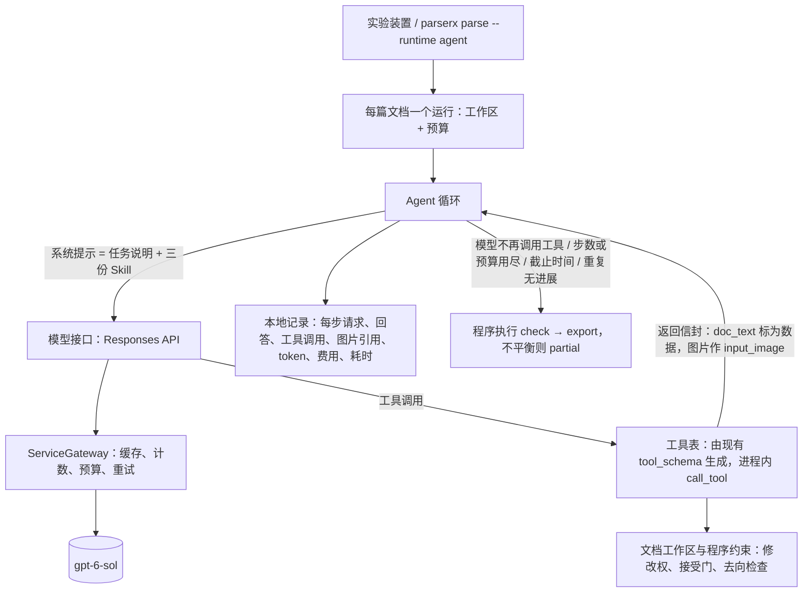

# Agent 运行时调研：框架选型与架构建议

> 2026-09-24 · 调研范围：OpenAI Agents API 与 Agents SDK、Pi（pi.dev）、PydanticAI、Claude Agent SDK、Inspect AI、LangChain / LangGraph 等，另有我们用 Codex 的实际记录（阶段一至三）。版本号与日期都是当日在官方文档、PyPI、npm、GitHub 上核实的；未能核实的地方单独注明。
> 相关：指导 [§7 运行时与实验计划](redesign_guide.md)、[阶段二探索报告](../eval_reports/2026-09-24_p2_agent_exploration.md)、[阶段三对比报告](../eval_reports/2026-09-24_p3_runtime_comparison.md)。

## 1. 结论

1. **建议自己写一个很薄的 Agent 循环**：Python，进程内直接调用工具包，不基于第三方 Agent 框架。主 Agent 的模型请求走现有的 `ServiceGateway`，缓存、计数、预算和重试都直接沿用。设计参考 Pi 的 `pi-agent-core` 与 mini-swe-agent。估计 400–500 行，外加离线测试。
2. **理由**：
   - ParserX 真正难的部分已经在工具包里：工作区状态、修改权、接受门、去向检查、服务预算、缓存。循环本身只剩"调用模型 → 执行工具 → 判断是否停止"。
   - 框架的主要价值是多厂商适配，而主 Agent 目前只用一个模型：gpt-6-sol，经 OpenAI Responses API。
   - 引入框架会与我们已有的重试、用量统计和预算形成两套并存的机制。
3. **不建议**：
   - **OpenAI Agents API**（用户提供的第一个链接）：它就是托管在 OpenAI 服务器上的 Codex。系统提示只能追加、不能替换，循环在服务器端，无法在本地缓存和回放，也不支持零数据保留（ZDR），比现在更难控制。
   - **Claude Agent SDK**：同样是把整个 Claude Code 作为子进程运行，而且只能用 Claude 模型。
   - **经 RPC 驱动 Pi 的完整命令行工具**：
     - 要多维护一套 TypeScript/Node 运行环境；
     - 没有步数与费用上限；
     - 默认功能需要逐个关掉；
     - 工具要写成 TypeScript 扩展才能注册。
4. **备选**：**PydanticAI**，现成框架里最合适的一个。以后主 Agent 若确实要在多家模型间切换（Claude、Qwen），就换用它的模型层。我们的模型接口先留好这一层。
5. **Codex 的位置**：
   - 保留作探索用：允许写脚本、自由度大，适合发现工具缺什么。
   - 验收与正式的"精修"运行改用自研循环（指导 §7.2 本来就把探索与验收分开）。
6. **预期要说清楚**：自研循环改善的是可控性、成本、可观测性和可回放，**不会直接提高解析质量**。阶段三已表明信息质量取决于工具包（缺陷 D1–D6），Agent 的收益主要在标题。

## 2. 背景：用 Codex 遇到的问题

阶段二、三共约 60 次 Codex 运行都有效完成，但为此做了大量绕行。按类别汇总如下，逐条证据见阶段二的各轮报告与 `parserx/runtimes/codex.py`。

| 类别 | 问题 |
|---|---|
| 控制 | 主 Agent 没有步数或费用上限，只能到截止时间后强行终止进程；运行中不能干预；Codex 自带约 19k token 的系统提示，我们的任务说明只能作为 `AGENTS.md`（17.6 KB）附加在后面 |
| 隔离 | 本机的 memories（含 ParserX 的讨论）、用户与插件 skills、网页搜索、子 Agent 默认都会带进会话，需要 `--ignore-user-config` 等参数加 14 个 `--disable`，再用事后审计兜底；沙箱只限制写、不限制读 |
| 工具通道 | 只能经 shell 调用 `./px tool …`，每次调用都重新载入工作区（268 页约 5 s）；并行命令出现 `UnknownProcessId`，69 条命令以 −1 退出；超过约 30 s 的命令被移到后台，之后没有完成事件，少计约 100 s |
| 观测 | 事件流不记录看图，也没有时间戳（装置按到达时间补记）；费用经 Codex 账号，只能按标价估算 |
| 运行环境 | 沙箱中 LibreOffice 建不了配置目录、onnxruntime 往外发遥测、快照环境不可写，都要单独处理 |
| 可复现 | 主 Agent 的请求无法缓存回放；同一篇两次运行的标题分数最多相差 0.16 |
| 成本 | 阶段三每篇 10–26 个模型步骤，输入 0.33M–1.02M token（约 90% 命中缓存），约 2.7 分钟、按标价约 $0.22 |

指导 §7.4 定的顺序是"Codex → 工具包 → Claude Code → Pi → 出现明确缺口再自研"。上表中预算、系统提示、看图记录和回放这几项，就是当时说的"明确缺口"。

## 3. 需求（从我们的实际用法归纳）

| # | 需求 | 现状 |
|---|---|---|
| N1 | 工具在进程内调用，不经 shell | 已有 `call_tool` 与 `tool_schema`（`parserx/runtimes/pipeline.py`、`parserx/tools/cli.py`） |
| N2 | 工具可以把图片交给主模型，而且留下记录 | Codex 做不到记录 |
| N3 | 硬停止：步数、每篇费用与时间；循环结束后由程序执行 `check` / `export`（完成性在循环外强制，指导 §3.3、§7.5） | Codex 只有截止时间 |
| N4 | 系统提示完全由我们决定：任务说明加三份 Skill，没有别的 | Codex 做不到 |
| N5 | 每一步的请求、回答、工具调用、token、费用、耗时写入本地记录 | Codex 事件流不全 |
| N6 | 主 Agent 的请求按完整请求哈希缓存，可回放（指导 §8.3 已预留） | Codex 做不到 |
| N7 | 多篇文档并发批量运行 | 装置已有 `--jobs` |
| N8 | 模型：主 Agent 至少支持 OpenAI Responses API（gpt-6-sol、推理强度），其他厂商可选 | — |
| N9 | 文档文字只作数据 | 返回信封已有 `doc_text` |

## 4. 候选评估

### 4.1 OpenAI Agents API（用户提供的链接）

- **是什么**：2026-09-10 发布的公开测试版（`/v1/agents/sessions`，请求头 `OpenAI-Beta: agents=v1`）。官方原话是通过 OpenAI 管理的 API 使用 **Codex harness**。循环、上下文压缩、子 Agent、故障恢复都在 OpenAI 那边；会话、轮次和记录保存在 OpenAI。
- **运行环境**：三种选项。
  - 无环境；
  - OpenAI 托管的沙箱，按容器时长另计费；
  - 自己运行 `codex exec-server`，以 WebSocket 连回 OpenAI。
- **自定义工具**：会话发出 `requires_action`，我们执行后回传结果，工具结果可以带图片。每次工具调用都要走一次网络往返。
- **控制**：
  - 可设模型、推理强度、结构化输出，可以追加指令、取消与恢复。
  - **系统提示只能追加，不能替换**（Codex 的基础提示总在）。
  - 文档里没有步数上限、`tool_choice`、预算的设置项。有 `session_budget_exceeded` 这个错误码，但没找到设置方法，未核实。
- **数据**：只在美国存储，**不支持 ZDR**；自己运行执行环境也不改变这一点。追踪记录默认保存在 OpenAI 的控制台。
- **模型**：只能用 OpenAI 模型。示例用的是 gpt-6-astra，是否支持 gpt-6-sol 未核实。
- **判断**：不适合。它解决的是"不想自己运行 Agent"，我们的问题是"需要控制 Agent"。与本机 Codex 相比，它少了本地缓存回放，多了数据保留问题。

### 4.2 OpenAI Agents SDK（`openai-agents`）

- **版本**：v0.22.3（2026-09-17），MIT，仍是 0.x，小版本也可能不兼容。
- **运行方式**：循环在我们自己的进程里。
- **有什么**：
  - 工具是普通 Python 函数，可返回图片（`ToolOutputImage`）；
  - `max_turns`、`tool_choice`、`parallel_tool_calls`、按工具停止（`StopAtTools`）；
  - 钩子（`on_llm_end`、`on_tool_end`）、可序列化与恢复的运行状态、结构化输出。
- **缺什么**：
  - 没有费用上限，要自己在钩子里算。
  - 追踪默认上传到 OpenAI，可以关闭或换成本地记录。
  - 走非 OpenAI 模型要经 Chat Completions，这条路径会**静默丢掉工具结果里的图片**，除非打开 `strict_feature_validation` 让它直接报错。
- **判断**：能用，但它给的东西我们用几十行就能写出来，又多一个快速变化的依赖。

### 4.3 Pi（用户提供的链接）

- **现状**：
  - 仓库 `earendil-works/pi`，MIT。Mario Zechner 开发，2026-04 起由 Armin Ronacher 联合创办的 Earendil 接手。
  - 版本 0.87.1（2026-09-22）；3 个半月约 40 个版本，0.86 与 0.87 相隔两天都有不兼容改动。
  - GitHub 约 10.9 万星，提交主要来自两位维护者。
- **分层**：
  - `pi-ai`：统一调用约 30 家模型服务，自带价格表，已收录 gpt-6-sol 与 gpt-6-luna；
  - `pi-agent-core`：工具循环、事件、上下文钩子；
  - `pi-coding-agent`：命令行 Agent，含会话、压缩、扩展、Skill，以及 TUI / print / JSON / RPC 几种模式。
- **设计上的优点**（值得借鉴）：
  - 工具结果可以直接带图片：Responses API 下放进 `function_call_output`，Chat Completions 下改作一条用户消息补发。
  - 事件完整：Agent、轮次、消息、工具执行的开始与结束。
  - 在关键环节都有钩子：请求前的上下文变换、工具调用前后、每轮结束时决定是否停止。
  - 支持中途插话（steer）与追加任务（follow-up），可以中止。
  - 会话是一个树形 JSONL 文件，图片也存在里面，可以回放、分叉。
- **对我们的不足**：
  - 只有 TypeScript / Node（≥ 22.19）。
  - **没有步数上限和费用上限**，也没有权限控制，都要自己加。
  - RPC 模式不能注册工具，工具必须写成 TypeScript 扩展，或者退回到经 bash 调用，这又回到 Codex 的问题。
  - 默认会自动读取 `AGENTS.md`、`~/.agents/skills`、项目下的 `.pi/`，要干净运行需要约 8 个参数加一个环境变量。
  - 更新频繁，需要锁定版本。
- **三种用法**：
  - (a) Python 经 RPC 驱动完整命令行，工具写成约 150 行 TS 扩展：最快能和 Codex 做对比，但保留了大部分多余功能。
  - (b) 在 `pi-agent-core` 上写约 300–500 行的 TS 宿主，工具通过子进程调用我们的 JSON CLI：最干净，但要两种语言、自己记录会话。
  - (c) 把它的循环设计照搬成 Python：它的 `agent-loop.ts` 共 898 行（含并行执行），核心逻辑约 300 行。
- **判断**：Pi 最有价值的是设计，不是依赖本身。我们照 (c) 做。

### 4.4 PydanticAI

- **现状**：v2.49.0（2026-09-24），MIT；稳定版 v2 于 2026-06-23 发布，只在大版本里做不兼容改动。
- **合适的地方**：
  - 工具是普通 Python 函数，在进程内执行。
  - 工具可以返回图片（`ToolReturn`、`BinaryContent`）；模型 API 不接受工具结果带图时，框架自动改作用户消息补发。
  - `UsageLimits` 可限制请求数、工具调用数、token 与费用（`cost_limit`，美元）。
  - `agent.iter()` 可以逐步推进循环。
  - 模型层支持 OpenAI Responses、Anthropic、DashScope（`AlibabaProvider`）等；可以限制并发；支持 OpenTelemetry。
- **缺的与重叠的**：
  - 没有按请求哈希缓存，相关 issue #2452 仍开着，需自己包一层模型，约 40 行。
  - 它自己的重试、用量统计、费用计算与我们的 `ServiceGateway` 重叠。
  - 版本更新很快，需要锁定。
- **判断**：现成框架里最合适的一个。如果主 Agent 以后需要多家模型，首选接入它的模型层。

### 4.5 其他

| 候选 | 版本（日期） | 要点 | 适合度 |
|---|---|---|---|
| Claude Agent SDK | 0.2.159（09-23） | 每个会话启动一个 Claude Code 子进程；有 `max_turns`、`max_budget_usd`；只能用 Claude；缓存回放需要代理 | 低 |
| Inspect AI | 0.3.268（09-22） | 本是评测框架，但自带按完整请求缓存、每个样本的步数 / token / 时间 / 费用上限、本地记录与查看器、并发；以"任务 / 样本 / 评分"组织，0.3.x、依赖较重 | 中 |
| LangChain `create_agent` / LangGraph | 1.4.2 / 1.2.12 | 有调用次数限制的中间件、多厂商；抽象层多，依赖重，观测偏向 LangSmith | 中 |
| AWS Strands | 1.57.0 | 多厂商、工具结果可带图、OTel；预算靠钩子 | 中 |
| Microsoft Agent Framework | 1.19.0 | 稳定版，侧重多 Agent 工作流与 Azure | 低 |
| Google ADK | 2.9.2 | 以 Gemini 为主，依赖很重 | 低 |
| smolagents | 1.26.0（05-29） | 默认让 Agent 写代码执行；没有 token 或费用上限；4 个月未发版 | 低 |
| Mastra、Vercel AI SDK | — | TypeScript | 低 |
| LiteLLM（只作模型适配） | 1.102.1 | 支持 100+ 厂商、带缓存；**2026 年 3 月 PyPI 包被投毒**（1.82.7、1.82.8 带窃取凭据的代码），用时需按哈希锁定 | 中 |

"自己写循环"有公开的先例：

- Anthropic《Building effective agents》建议从直接调用 API 开始、少用抽象层；
- Sketch《The Unreasonable Effectiveness of an LLM Agent Loop》的核心循环不到十行；
- mini-swe-agent 的默认 Agent 约 180 行，带步数、费用、时间上限，并在结束时保存完整轨迹。

### 4.6 对照

| 候选 | 循环在哪 | 工具返回图片 | 硬停止 / 预算 | 本地缓存回放 | 系统提示完全可控 | 语言 | 适合度 |
|---|---|---|---|---|---|---|---|
| **自研薄循环** | 我们的进程 | 自己写（Responses 原生支持） | 自己写（沿用现有预算） | 沿用 `ServiceGateway` | 是 | Python | **高** |
| PydanticAI | 我们的进程 | 是，自动补发 | 请求、工具、token、费用 | 需包一层 | 是 | Python | 高（备选） |
| Inspect AI | 我们的进程 | 是 | 步数、token、时间、费用 | 自带 | 是 | Python | 中 |
| OpenAI Agents SDK | 我们的进程 | 是（非 OpenAI 模型会丢） | 步数；费用自己写 | 需包一层 | 是 | Python | 中 |
| Pi agent-core | 我们的进程（Node） | 是 | 无，需自己写 | 需自己写 | 是 | TypeScript | 中（作设计参考） |
| Pi 完整命令行（RPC） | 子进程 | 是 | 无 | 否 | 需关掉多项默认 | TypeScript | 低 |
| Codex CLI（现状） | 子进程 | 看图不记录 | 只有截止时间 | 否 | 否（只能附加） | — | 低（保留作探索） |
| OpenAI Agents API | OpenAI 服务器 | 是 | 未见设置项 | 否 | 否（只能追加） | 任意 | 低 |
| Claude Agent SDK | 子进程 | 是 | 步数、费用 | 需代理 | 部分 | Python / TS | 低 |

## 5. 建议的架构

### 5.1 组成与规模（估计）

| 文件 | 内容 | 行数 |
|---|---|---|
| `parserx/runtimes/agent/loop.py` | 循环、停止条件、上下文中旧图片的替换 | ~150 |
| `parserx/runtimes/agent/model.py` | Responses API 适配：工具定义、推理内容回传（`store=false` 时带 `reasoning.encrypted_content`）、流式、用量与费用；经 `ServiceGateway` | ~150 |
| `parserx/runtimes/agent/tools.py` | 由现有 pydantic 工具模型生成工具定义；执行结果转成模型输入（文字、图片、过长结果截断） | ~100 |
| `parserx/runtimes/agent/trace.py` | 本地 JSONL 记录 | ~50 |
| 装置接入 | `agent_explore.py` 增加 `--runtime agent`，评分、计时与工作区检查沿用 `experiment.py` | ~50 |

### 5.2 关键设计

1. **只有工具包的工具，没有 shell 和文件系统**：卫生由构造保证。现在的事后路径审计可以简化为检查调用记录。
2. **系统提示只有我们的内容**：`agent_task.md` 去掉 Codex 与 shell 相关的段落，加三份 Skill。
3. **停止**：
   - 循环在以下任一情况下停止：模型不再调用工具；达到步数上限；主 Agent 费用用尽；到截止时间；同一工具、同一参数连续重复而没有新结果（指导 §3.3 的停止约束）。
   - 循环结束后，程序总是执行 `check` → `export`，不依赖模型记得去做。
4. **预算**：主 Agent 与服务层分开计数（Q40、§5.2），但记在同一份文档级预算上，任何一方超限都停。
5. **看图**：两种方式都保留。
   - `ask_image`：Q47 的默认，由服务层 VLM 读图。
   - `read` 直接返回图片：进入主模型上下文，并且有记录。
   - 上下文只保留最近几张图片，更早的换成"已查看第 3 页图片"之类的占位。状态在工作区里，需要时可以再取。
6. **缓存回放**：
   - 主 Agent 的请求经 `ServiceGateway`，缓存键是完整请求：历史、工具定义、模型、推理强度。
   - 回放时每一步命中同一条缓存，走出同一条轨迹，Agent 运行也能进 L1 回放回归（指导 §8.3 已预留这一条）。
7. **并发**：每篇文档一个进程，沿用装置的 `--jobs`。循环本身是同步的，不需要 asyncio。
8. **模型接口留薄抽象**：需要 Claude 或 Qwen 时，加一个实现，或换用 PydanticAI 的模型层。
9. **不做**：子 Agent、上下文压缩、MCP、权限确认、界面。
   - 阶段三每篇最多 26 步；268 页的 JTG 全本也在一轮内完成。
   - 真需要压缩时，先丢弃旧的工具结果，因为状态都在工作区里。

### 5.3 预期收益（需实测）

- **token**：Codex 每一步都重发约 19k token 的自带系统提示；我们的任务说明加 Skill 约 19 KB。估计主 Agent 的输入 token 可减少约一半，每步延迟也会下降（Codex 每步至少 2.5–4 s）。
- **观测**：看图、每步时间与费用都有完整记录，§2 表中的大部分绕行不再需要。
- **可回放**：Agent 精修模式也能做回归测试。

## 6. 风险

| 风险 | 应对 |
|---|---|
| Responses API 在 `store=false` 下回传推理内容的细节 | 先写最小实验确认（一个工具、两步），再写循环 |
| 离开 Codex 的系统提示后，gpt-6-sol 用工具的方式可能变化 | 在阶段三的同样 6 篇上对比，见 §7 |
| 模型适配要自己维护 | 只有一家时成本低；需要多家时换用 PydanticAI 的模型层 |
| 以为换循环能提高质量 | 与 D1–D6 的修复分开评估：信息质量看工具包，Agent 看标题与待核对项 |

## 7. 验证（从简）

1. **最小原型**：循环 + 模型接口 + 全部工具；用录下的回答写 L0 离线测试。
2. **对比**：在阶段三的 6 篇上跑 2 次，条件与阶段三的 Codex 运行相同（gpt-6-sol、medium、`ask_image`），与已有的 12 次 Codex 运行比较。
   - 信息类指标不变；
   - 标题与 Codex 相当，考虑到 Codex 自身两次最多相差 0.16；
   - token、费用、耗时下降。
3. **通过后**：Agent 精修模式改用自研循环；Codex 只作探索。

估计工作量：原型加对比约 2–3 天。

## 8. 需要用户决定

| 编号 | 问题 | 建议 |
|---|---|---|
| Q62 | 主 Agent 的运行时：自研薄循环、PydanticAI，还是 Pi | 自研薄循环（Python，经 `ServiceGateway`），参考 Pi 与 mini-swe-agent；Codex 保留作探索 |
| Q63 | 主 Agent 是否需要支持多家模型（Claude、Qwen 等） | 暂时只用 OpenAI Responses API；接口留一层，需要时接 PydanticAI 的模型层 |
| Q64 | 与缺陷修复的先后 | 先修 D1、D2（信息错误，按用户的优先级），再做循环；Q13 按阶段三报告的建议定下后，自研循环就是"精修"模式的运行时 |

## 9. 参考

- OpenAI Agents API：[概述](https://developers.openai.com/api/docs/guides/agents-api/overview)、[架构](https://developers.openai.com/api/docs/guides/agents-api/architecture)、[自运行环境](https://developers.openai.com/api/docs/guides/agents-api/environments/self-hosted)、[函数工具](https://developers.openai.com/api/docs/guides/agents-api/tools/functions)、[数据保留](https://developers.openai.com/api/docs/guides/your-data)、[发布帖](https://community.openai.com/t/introducing-the-agents-api-and-hosted-sandboxes/1396481)
- OpenAI Agents SDK：[github.com/openai/openai-agents-python](https://github.com/openai/openai-agents-python)（docs/tools.md、models/index.md、tracing.md）
- Responses API：[函数调用](https://developers.openai.com/api/docs/guides/function-calling)、[对话状态](https://developers.openai.com/api/docs/guides/conversation-state)
- Codex SDK / app-server（`dynamicTools` 可注册自有工具，实验性）：[learn.chatgpt.com/docs/app-server.md](https://learn.chatgpt.com/docs/app-server.md)
- Pi：[pi.dev](https://pi.dev/)、[github.com/earendil-works/pi](https://github.com/earendil-works/pi)（`packages/agent/src/agent-loop.ts`、`packages/coding-agent/docs/rpc.md`、`docs/sdk.md`、`examples/sdk/12-full-control.ts`）、[Earendil 公告](https://earendil.com/posts/announcing-pi-and-lefos/)
- PydanticAI：[Agent](https://pydantic.dev/docs/ai/core-concepts/agent/)、[工具进阶](https://pydantic.dev/docs/ai/tools-toolsets/tools-advanced/)、[版本策略](https://pydantic.dev/docs/ai/project/version-policy/)、[缓存 issue #2452](https://github.com/pydantic/pydantic-ai/issues/2452)
- Claude Agent SDK：[自定义工具](https://code.claude.com/docs/en/agent-sdk/custom-tools)、[Python 参考](https://code.claude.com/docs/en/agent-sdk/python)
- Inspect AI：[缓存](https://inspect.aisi.org.uk/caching.html)、[上限](https://inspect.aisi.org.uk/setting-limits.html)、[自定义 Agent](https://inspect.aisi.org.uk/agent-custom.html)
- LangChain 中间件：[docs.langchain.com](https://docs.langchain.com/oss/python/langchain/middleware/built-in)；LiteLLM 安全通告：[docs.litellm.ai](https://docs.litellm.ai/blog/security-update-march-2026)
- 自写循环：[Building effective agents](https://www.anthropic.com/engineering/building-effective-agents)、[The Unreasonable Effectiveness of an LLM Agent Loop](https://sketch.dev/blog/agent-loop)、[mini-swe-agent](https://github.com/SWE-agent/mini-swe-agent)
