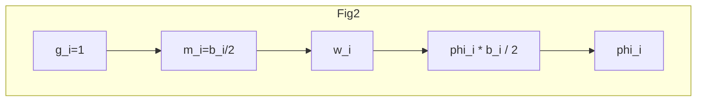

第 50 卷 第 4 期 西 南 交 通 大 学 学 报 Vol. 50 No. 4
2015 年 8 月 JOURNAL OF SOUTHWEST JIAOTONG UNIVERSITY Aug. 2015

**文章编号**: 0258-2724(2015)04-0623-07　　**DOI**: 10.3969/j.issn.0258-2724.2015.04.008

# 预制装配式板梁桥的模型修正方法

**周正茂，袁桂芳，田清勇**

（上海同豪土木工程咨询有限公司，上海 200092）

## 摘要

为反映在役桥梁的实际状况，提出了板梁桥的模型修正方法。假设铰缝相对位移与铰缝剪力成正比，将铰缝刚度、板梁抗弯刚度和板梁抗扭刚度均作为未知量进行修正。基于板梁边实测位移建立位移方程，并采用 QR 分解法得到矛盾方程组的最优解。模型考虑了多个静载试验工况、多个荷载及荷载偏心的特点，可以直接应用于桥梁荷载试验。对有防撞护栏和有损伤的板梁桥进行了数值模拟，结果表明：无论是板梁有较大损伤，还是有复杂附属结构，该修正方法均可给出准确的修正系数；试验应尽可能采用多个试验工况，并将荷载布置在被试测的铰缝和板梁附近。

**关键词**: 板梁桥；模型修正；QR 算法；荷载试验；铰缝；板梁刚度

**中图分类号**: U446.1；TU317.2　　**文献标志码**: A

## Model Updating Method for Prefabricated Multi-girder Bridges

**ZHOU Zhengmao, YUAN Guifang, TIAN Qingyong**

(Shanghai Tonghao Civil Engineering Consulting Co. Ltd., Shanghai 200092, China)

### Abstract

In order to reflect the real status of an existing bridge, a new model updating method for multi-girder bridges was presented. In this method, the relative displacement in a hinge joint is supposed to be proportional to the shear force; the stiffness of hinge joint, flexural and torsional rigidity of girders are simultaneously taken as unknown parameters to be modified. The displacement equations are established with measured displacements on both sides of girders, and the optimal solution for the over-determined equations is obtained by the QR algorithm. The characters of multi-load cases, multi-loads and eccentric loads are considered in the proposed model, so that it can be used to bridge load tests. Numerical simulations for a multi-girder bridge with crash barriers and damages were carried out. The simulation results show that the proposed method can produce accurate corrected factors for girders with large damage or complex affiliated structures; load cases should be adopted as many as possible, and the loads should be arranged near the hinge joints or girders to be tested.

**Key words**: multi-girder bridge; model updating; QR algorithm; load test; hinge joint; girder stiffness

利用现场实测数据修正结构的有限元模型，使修正后结构分析参数与试验值趋于一致，称为结构模型修正[1]。近年来，模型修正技术在桥梁领域逐渐成为研究热点[1]。早期研究以单根梁为主，如悬臂梁、简支梁等，现在已逐步扩展到整桥构[2]、[1,3]，如 T 构带挂孔梁桥[4]、连续梁桥[5-7]、钢桁梁桥[8]、系杆拱桥[9-10]、斜拉桥[11-15]和悬索桥[16]等。这些研究极大地促进了模型修正方法在桥梁工程中的应用。

目前模型中参数修正的对象是主要构件的计设参数如弹性模量等，对于连接构件的参数修正则研究较少。连接构件在预制装配式桥梁中扮演着重要角色，一方面，连接构件如空心板梁桥中的铰缝、

收稿日期：2014-09-07
作者简介：周正茂（1970-），男，教授级高级工程师，博士，研究方向为桥梁检测、评定与加固技术，电话：021-65979772，E-mail：zm_zhou@hotmail.com
引文格式：周正茂，袁桂芳，田清勇. 预制装配式板梁桥的模型修正方法[J]. 西南交通大学学报，2015，50（4）：623-629.

---

<!-- PAGE 2 · 页码：624 · 页眉：西南交通大学学报 · 页眉：第 50 卷 -->

T 梁桥或小箱梁桥中的横隔梁等对桥梁横向受力的分配起着重要作用; 另一方面, 这些构件均为易损构件, 它们的损坏将改变桥梁的受力状态, 使之与设计不符。因此, 连接构件设计参数的修正对于掌握预制装配式桥梁的受力状态至关重要。但连接构件不易模拟, 目前关于预制装配式桥梁模型修正的研究也非常少。

朱张峰等研究了 5 片小箱梁组成的装配式简支梁桥的模型修正问题, 其中桥梁横向刚度的修正通过改变桥面板的弹性模量或厚度模拟[17]。该方法用于模拟横隔梁效果较好, 但用于模拟铰缝则困难较大。在空心板梁桥力学模型中, 铰缝作为铰来模拟, 它既无厚度参数, 也无弹性模量参数, 因此, 无法将文献 [17] 的方法直接应用于空心板梁桥。周正茂等提出了铰缝刚度的概念, 假设铰缝受力后会产生相对位移, 且该位移与铰缝剪力成正比[18]。在此基础上, 建立了可以考虑铰缝损伤的模型, 通过该模型可以评价铰缝的损伤程度。但该模型只考虑了铰缝损伤, 并未考虑板梁受损, 也不适用于桥上有防撞护栏、隔离墩和桥面铺装等附属结构的情况, 工程应用受到一定限制。

本文中尝试建立空心板梁桥的结构修正模型, 不仅能模拟铰缝损伤, 通过定义板的抗弯刚度和抗扭刚度修正系数, 还能反映板梁损伤和附属结构的贡献。该模型既能反映空心板梁桥可能受到的各种损伤, 又能克服一般力学模型模拟附属结构的困难。为检验模型的正确性, 采用数值方法模拟一座单跨空心板梁桥的荷载试验, 考察了该模型的反演误差。

## 1 板梁桥的结构模型修正

### 1.1 模型假设与板边位移方程

提出的模型是在铰接板梁法的基础上改造而成, 所以, 基本假设同铰接板梁法[19]: 荷载、剪力和位移沿纵向均为半波正弦分布; 板间竖向剪力只靠铰缝传递; 板梁横向为刚性等。文献 [18] 中假设铰缝相对位移与铰缝剪力成正比, 已得到试验数据支持[20], 这里继续沿用。关于板刚度, 假设板刚度的变化由板的抗弯刚度和抗扭刚度体现。

铰接板梁法模型见图 1。对编号及方向作如下规定: 板的编号自左至右分别为 $1, 2, \cdots, n$; 铰缝编号自左至右分别为 $1, 2, \cdots, n-1$; 铰缝剪力以图示方向为正, 相对位移正方向与剪力正方向相反; 板上荷载以图示方向为正, 其横向偏心以板中心为原点, 向右为正; 板位移的正方向与板上荷载的正方向相同。

点, 向右为正; 板位移的正方向与板上荷载的正方向相同。

图 1 铰接板桥计算模型
Fig. 1 Mechanical model of hinged slab bridge

于是, 板左侧和右侧的位移方程分别为:

$$ \sum_{k=1}^{n-1} \delta_{ik}^l g_k + \sum_{j=1}^n f_{ij}^l p_j = \Delta_i^l, \quad i = 1, 2, \cdots, n, \quad (1) $$

$$ \sum_{k=1}^{n-1} \delta_{ik}^r g_k + \sum_{j=1}^n f_{ij}^r p_j = \Delta_i^r, \quad i = 1, 2, \cdots, n, \quad (2) $$

式中: $\delta_{ik}^{l(r)}$ 为作用在第 $k$ 条铰缝处的单位铰缝剪力在第 $i$ 块板左 (右) 侧产生的位移 (上标 $l$ 表示左侧, $r$ 表示右侧); $f_{ij}^{l(r)}$ 为作用在第 $j$ 块板上的单位荷载在第 $i$ 块板左 (右) 侧产生的位移; $g_k$ 为作用在第 $k$ 条铰缝处的铰缝剪力; $p_j$ 为作用在第 $j$ 块板上的荷载, 其相对第 $j$ 块板中心的偏心为 $e_j$; $\Delta_i^{l(r)}$ 为第 $i$ 块板左 (右) 侧的实测位移。

### 1.2 $\delta_{ik}$ 和 $f_{ij}$ 的计算

铰缝剪力对板的作用可等效为一个作用在板中心的荷载和一个扭矩。图 2 为单位铰缝剪力与板两边位移的关系。

根据图 2, 单位铰缝剪力和单位板上荷载在第 $i$ 块板左侧产生的位移分别为:

图 2 单块板梁中力与位移的关系
Fig. 2 Relationship of force and displacement of slab

---

<!-- PAGE 3 · 页眉：第 4 期 · 页眉：周正茂，等：预制装配式板梁桥的模型修正方法 · 页码：625 -->

$$ \left. \begin{aligned} \delta_{ik}^l &= -\left( \frac{w_i}{\beta_i} - \frac{b_i}{2} \frac{\varphi_i}{\alpha_i} \right), \\ &k = i = 1, 2, \cdots, n-1, \\ \delta_{ik}^l &= \left( \frac{w_i}{\beta_i} + \frac{b_i}{2} \frac{\varphi_i}{\alpha_i} \right), \\ &k = i - 1 = 1, 2, \cdots, n-1, \\ \delta_{ik}^l &= 0, \quad \text{其他情况}; \end{aligned} \right\} \eqno(3) $$

$$ \left. \begin{aligned} f_{ij}^l &= \left( \frac{w_j}{\beta_j} - e_j \frac{\varphi_j}{\alpha_j} \right), \quad j = i = 1, 2, \cdots, n, \\ f_{ij}^l &= 0, \quad \text{其他情况}, \end{aligned} \right\} \eqno(4) $$

式中:$w_i$ 为板中心单位竖向荷载作用下的跨中挠度;$\varphi_i$ 为 $b_i/2$ 扭矩作用下的扭转角;$b_i$ 为第 $i$ 块板的宽度;$\beta_i$ 为第 $i$ 块板抗弯刚度修正系数,$\beta_i > 1$ 表示实际刚度比设计刚度大;$\alpha_i$ 为第 $i$ 块板的抗扭刚度修正系数,$\alpha_i > 1$ 表示板实际刚度比设计刚度大.

计刚度大.

$w_i$ 和 $\varphi_i$ 的计算可参见文献[19].

同理,可得单位铰缝剪力及单位板上荷载作用下第 $i$ 块板右侧的位移(因篇幅限制,从略).

### 1.3 求解修正系数的方程

铰缝相对位移与铰缝剪力成正比,与铰缝刚度 $k_i$ 成反比,即存在以下关系:

$$ -\frac{g_i}{k_i} = \Delta_{i+1}^l - \Delta_i^r, \quad i = 1, 2, \cdots, n-1. \eqno(5) $$

将 $\delta_{ik}$ 和 $f_{ij}$ 的表达式代入式(1)和式(2),并考虑式(5),整理可得关于 $k_i, \beta_i$ 及 $\alpha_i$ 的表达式.

令
$$ \boldsymbol{A}_m = \begin{pmatrix} \boldsymbol{A}_{11,m} & \boldsymbol{A}_{12,m} & \boldsymbol{0} \\ \boldsymbol{A}_{21,m} & \boldsymbol{0} & \boldsymbol{A}_{23,m} \end{pmatrix}, $$

式中:$m$ 表示试验工况,$m = 1, 2, \cdots, M$,

$$ \begin{aligned} \boldsymbol{A}_{11,m} &= \begin{pmatrix} b_1 \varphi_1 (\Delta_{2,m}^l - \Delta_{1,m}^r) & & & \boldsymbol{0} \\ b_2 \varphi_2 (\Delta_{2,m}^l - \Delta_{1,m}^r) & b_2 \varphi_2 (\Delta_{3,m}^l - \Delta_{2,m}^r) & & \\ & \ddots & \ddots & \\ \boldsymbol{0} & & b_{n-1} \varphi_{n-1} (\Delta_{n-1,m}^l - \Delta_{n-2,m}^r) & b_{n-1} \varphi_{n-1} (\Delta_{n,m}^l - \Delta_{n-1,m}^r) \\ & & & b_n \varphi_n (\Delta_{n,m}^l - \Delta_{n-1,m}^r) \end{pmatrix}, \\ \boldsymbol{A}_{21,m} &= \begin{pmatrix} -2w_1 (\Delta_{2,m}^l - \Delta_{1,m}^r) & & & \boldsymbol{0} \\ 2w_2 (\Delta_{2,m}^l - \Delta_{1,m}^r) & -2w_2 (\Delta_{3,m}^l - \Delta_{2,m}^r) & & \\ & \ddots & \ddots & \\ \boldsymbol{0} & & 2w_{n-1} (\Delta_{n-1,m}^l - \Delta_{n-2,m}^r) & -2w_{n-1} (\Delta_{n,m}^l - \Delta_{n-1,m}^r) \\ & & & 2w_n (\Delta_{n,m}^l - \Delta_{n-1,m}^r) \end{pmatrix}, \end{aligned} $$

$$ \begin{aligned} \boldsymbol{A}_{12,m} &= \text{diag}(\Delta_{1,m}^l - \Delta_{1,m}^r, \Delta_{2,m}^l - \Delta_{2,m}^r, \cdots, \Delta_{n,m}^l - \Delta_{n,m}^r), \\ \boldsymbol{A}_{23,m} &= \text{diag}(\Delta_{1,m}^l + \Delta_{1,m}^r, \Delta_{2,m}^l + \Delta_{2,m}^r, \cdots, \Delta_{n,m}^l + \Delta_{n,m}^r), \end{aligned} $$

并令

$$ \begin{aligned} \boldsymbol{x} &= (k_1, k_2, \cdots, k_{n-1}, \alpha_1, \alpha_2, \cdots, \alpha_n, \beta_1, \beta_2, \cdots, \beta_n)^\text{T}, \\ \boldsymbol{b}_m &= (-2e_1 \varphi_1 p_1, -2e_2 \varphi_2 p_2, \cdots, -2e_n \varphi_n p_n, 2w_1 p_1, 2w_2 p_2, \cdots, 2w_n p_n)^\text{T}, \end{aligned} $$

则式(1)和式(2)可写成
$$ \boldsymbol{A}_m \boldsymbol{x} - \boldsymbol{b}_m = \boldsymbol{0}. \eqno(6) $$

方程组(6)即为 1 个试验工况能列出的所有

方程,共 $2n$ 个.但要求解的变量一共有 $3n-1$ 个,因此,需要多个试验工况联立求解.

### 1.4 模型修正

对于 $M$ 个试验工况,令
$$ \begin{aligned} \boldsymbol{A} &= (\boldsymbol{A}_1^\text{T}, \boldsymbol{A}_2^\text{T}, \cdots, \boldsymbol{A}_{M-1}^\text{T}, \boldsymbol{A}_M^\text{T})^\text{T}, \\ \boldsymbol{b} &= (\boldsymbol{b}_1^\text{T}, \boldsymbol{b}_2^\text{T}, \cdots, \boldsymbol{b}_{M-1}^\text{T}, \boldsymbol{b}_M^\text{T})^\text{T}, \end{aligned} $$
则有

$$ \boldsymbol{A} \boldsymbol{x} - \boldsymbol{b} = \boldsymbol{0}. \eqno(7) $$

方程组(7)中有 $2n \times M$ 个方程,需要求解的变量有 $3n-1$ 个,一般来说,只要试验工况数不少于 2 个,即可求得各未知参数.由于方程数多于未知变量数,无法直接求解,可采用最小二乘法,定义优化目标
$$ \min \| \boldsymbol{A} \boldsymbol{x} - \boldsymbol{b} \|. $$
求解时对 $\boldsymbol{A}$ 进行 QR 分解,$\boldsymbol{A} = \boldsymbol{Q} \boldsymbol{R}$,其中 $\boldsymbol{Q}$ 为 $2nM \times (3n-1)$ 阶正交矩阵,$\boldsymbol{R}$ 为 $(3n-1) \times (3n-1)$ 阶上三角矩阵.

---

<!-- PAGE 4 · 页码：626 · 页眉：西南交通大学学报 · 页眉：第 50 卷 -->

$$ \min \| \boldsymbol{Ax} - \boldsymbol{b} \| = \min \| \boldsymbol{QRx} - \boldsymbol{b} \| = \min \| \boldsymbol{Rx} - \boldsymbol{Q}^{-1} \boldsymbol{b} \| $$

用 MATLAB 可很容易求得 $\boldsymbol{x}$ 的最优解.

## 2 数值模拟

若采用实桥试验验证提出的模型, 由于无法事先了解铰缝和板梁刚度的真实值, 难以准确评价模型的正确性, 这里采用数值模拟的方法验证提出的模型.

### 2.1 模拟对象描述

模拟对象为单跨简支板梁结构, 计算跨径 $11.0\text{ m}$, 横断面由 10 片空心板铰接而成, 编号自左至右依次为 $1^{\#}, 2^{\#}, \cdots, 10^{\#}$, 横断面见图 3. 板宽 $0.99\text{ m}$, 板高 $0.55\text{ m}$, 相邻板中心距为 $1.00\text{ m}$, 混凝土强度等级为 C40. 板的理论参数 $w_i = 3.886 \times 10^{-4}\text{ m}^2/\text{kN}, \varphi_i = 1.574 \times 10^{-5}\text{ m}/\text{kN}$. 设该桥边板实际刚度因受防撞护栏影响而增大, 结合工程经验, 将抗弯刚度增大 1.5 倍, 抗扭刚度增大 1.2 倍.

板梁的损伤程度按大损伤、微损伤和无损伤 3 种情况考虑, 假设损伤主要发生在中间两块板, 其抗弯、抗扭刚度折减系数分别为 0.60、0.95 和 1.00. 3 种损伤情况下各板的抗弯、抗扭刚度变化系数见表 1. 假设铰缝也有不同程度的损伤, 其刚度从 $k_1 = 6\text{ MN}/\text{m}^2$, 按 $3\text{ MN}/\text{m}^2$ 等间隔增大到 $k_9 = 30\text{ MN}/\text{m}^2$ (铰缝剪力为线分布力, 单位为 $\text{kN}/\text{m}$, 因此, 铰缝刚度的单位为 $\text{kN}/\text{m}^2$).

采用汽车加载, 共 3 个工况. 每个工况均采用 2 辆 $30\text{ t}$ 土方车, 车轮布置在靠近铰缝处, 不同工况的差异是车辆位置不同. 加载方式见图 3, 等效荷载见表 2.

图 3 结构横断面及加载示意
Fig. 3 Section of the structure and schematic diagram of loading

表 1 板梁刚度修正系数
Tab. 1 Correction factors of slab stiffness

<table>
  <thead>
    <tr>
        <th>损伤程度</th>
        <th>β₁</th>
        <th>β₂</th>
        <th>β₃</th>
        <th>β₄</th>
        <th>β₅</th>
        <th>β₆</th>
        <th>β₇</th>
        <th>β₈</th>
        <th>β₉</th>
        <th>β₁₀</th>
    </tr>
  </thead>
  <tbody>
    <tr>
        <td>大损伤</td>
<td>1.50</td>
<td>1.00</td>
<td>1.00</td>
<td>1.00</td>
<td>0.60</td>
<td>0.60</td>
<td>1.00</td>
<td>1.00</td>
<td>1.00</td>
<td>1.50</td>
    </tr>
<tr>
        <td>微损伤</td>
<td>1.50</td>
<td>1.00</td>
<td>1.00</td>
<td>1.00</td>
<td>0.95</td>
<td>0.95</td>
<td>1.00</td>
<td>1.00</td>
<td>1.00</td>
<td>1.50</td>
    </tr>
<tr>
        <td>无损伤</td>
<td>1.50</td>
<td>1.00</td>
<td>1.00</td>
<td>1.00</td>
<td>1.00</td>
<td>1.00</td>
<td>1.00</td>
<td>1.00</td>
<td>1.00</td>
<td>1.50</td>
    </tr>
<tr>
        <th>损伤程度</th>
        <th>α₁</th>
        <th>α₂</th>
        <th>α₃</th>
        <th>α₄</th>
        <th>α₅</th>
        <th>α₆</th>
        <th>α₇</th>
        <th>α₈</th>
        <th>α₉</th>
        <th>α₁₀</th>
    </tr>
<tr>
        <td>大损伤</td>
<td>1.20</td>
<td>1.00</td>
<td>1.00</td>
<td>1.00</td>
<td>0.60</td>
<td>0.60</td>
<td>1.00</td>
<td>1.00</td>
<td>1.00</td>
<td>1.20</td>
    </tr>
<tr>
        <td>微损伤</td>
<td>1.20</td>
<td>1.00</td>
<td>1.00</td>
<td>1.00</td>
<td>0.95</td>
<td>0.95</td>
<td>1.00</td>
<td>1.00</td>
<td>1.00</td>
<td>1.20</td>
    </tr>
<tr>
        <td>无损伤</td>
<td>1.20</td>
<td>1.00</td>
<td>1.00</td>
<td>1.00</td>
<td>1.00</td>
<td>1.00</td>
<td>1.00</td>
<td>1.00</td>
<td>1.00</td>
<td>1.20</td>
    </tr>
  </tbody>
</table>

荷载作用下损伤结构位移的理论值可通过式(1)和式(2)计算. 考虑到实际测量精度, 将计算结果按 $0.01\text{ mm}$ 修约后作为实测位移值.

表 2 等效荷载
Tab. 2 Equivalent load

<table>
  <thead>
    <tr>
        <th rowspan="2">工况</th>
        <th rowspan="2">等效荷载 p / (kN · m⁻¹)</th>
        <th colspan="2">荷载位置 / mm</th>
    </tr>
<tr>
        <th>a</th>
        <th>b</th>
    </tr>
  </thead>
  <tbody>
    <tr>
        <td>1</td>
<td>27</td>
<td>900</td>
<td>3 100</td>
    </tr>
<tr>
        <td>2</td>
<td>27</td>
<td>2 100</td>
<td>2 100</td>
    </tr>
<tr>
        <td>3</td>
<td>27</td>
<td>3 100</td>
<td>900</td>
    </tr>
  </tbody>
</table>

### 2.2 模型修正结果及讨论

#### 2.2.1 不同工况组合下的比较

考虑表 1 中大损伤的情况. 在不同工况组合下, 将实测位移代入式(7), 可得到 $k_i, \beta_i$ 和 $\alpha_i$. 表 3 和表 4 为与表 1 中精确值相比较的误差 (“工况 1+2” 指在工况 1 和工况 2 下按上述方法得到的模型修正值的误差, 其余依此类推).

比较表 3 和表 4 中某 2 种工况和 “所有工况” 下计算结果的误差, 可以看出: 当采用某 2 种工况进行分析时, 计算结果在施加荷载的板和铰缝处误

---

<!-- PAGE 5 · 页眉：第 4 期 · 页眉：周正茂，等：预制装配式板梁桥的模型修正方法 · 页码：627 -->

表 3 不同工况下铰缝刚度的误差
Tab. 3 Error of hinge joint stiffness in different load cases %

<table>
  <thead>
    <tr>
        <th rowspan="2">工况</th>
        <th colspan="9">铰缝刚度</th>
    </tr>
<tr>
        <th>k₁</th>
        <th>k₂</th>
        <th>k₃</th>
        <th>k₄</th>
        <th>k₅</th>
        <th>k₆</th>
        <th>k₇</th>
        <th>k₈</th>
        <th>k₉</th>
    </tr>
  </thead>
  <tbody>
    <tr>
        <td>工况 1 + 2</td>
<td>0.61</td>
<td>0.63</td>
<td>1.01</td>
<td>-0.91</td>
<td>-0.10</td>
<td>0.77</td>
<td>0.02</td>
<td>3.57</td>
<td>590.77</td>
    </tr>
<tr>
        <td>工况 2 + 3</td>
<td>-142.46</td>
<td>-6.26</td>
<td>0.53</td>
<td>0.10</td>
<td>-0.90</td>
<td>-1.40</td>
<td>1.70</td>
<td>0.99</td>
<td>0.50</td>
    </tr>
<tr>
        <td>工况 3 + 1</td>
<td>-0.81</td>
<td>0.70</td>
<td>0.39</td>
<td>-0.63</td>
<td>0.30</td>
<td>1.71</td>
<td>0.06</td>
<td>-0.95</td>
<td>0.37</td>
    </tr>
<tr>
        <td>所有工况</td>
<td>0.03</td>
<td>0.29</td>
<td>0.33</td>
<td>-0.42</td>
<td>0.37</td>
<td>0.59</td>
<td>0.16</td>
<td>-0.10</td>
<td>0.22</td>
    </tr>
  </tbody>
</table>

表 4 不同工况下板梁刚度修正系数的误差
Tab. 4 Errors of the correction factors of slab stiffness in different load cases %

<table>
  <thead>
    <tr>
        <th>工况</th>
        <th>β₁</th>
        <th>β₂</th>
        <th>β₃</th>
        <th>β₄</th>
        <th>β₅</th>
        <th>β₆</th>
        <th>β₇</th>
        <th>β₈</th>
        <th>β₉</th>
        <th>β₁₀</th>
    </tr>
  </thead>
  <tbody>
    <tr>
        <td>工况 1 + 2</td>
<td>-0.25</td>
<td>1.08</td>
<td>-0.22</td>
<td>-0.43</td>
<td>0.30</td>
<td>0.61</td>
<td>-0.85</td>
<td>-5.81</td>
<td>-694.44</td>
<td>580.47</td>
    </tr>
<tr>
        <td>工况 2 + 3</td>
<td>-142.37</td>
<td>109.17</td>
<td>7.87</td>
<td>-0.83</td>
<td>1.72</td>
<td>-1.18</td>
<td>-0.43</td>
<td>-0.42</td>
<td>2.50</td>
<td>-1.03</td>
    </tr>
<tr>
        <td>工况 3 + 1</td>
<td>0.14</td>
<td>0.29</td>
<td>0.02</td>
<td>-0.92</td>
<td>0.57</td>
<td>-0.96</td>
<td>-0.45</td>
<td>1.37</td>
<td>1.61</td>
<td>-0.98</td>
    </tr>
<tr>
        <td>所有工况</td>
<td>-0.11</td>
<td>0.51</td>
<td>0.21</td>
<td>-0.68</td>
<td>0.61</td>
<td>0.13</td>
<td>-0.93</td>
<td>0.70</td>
<td>1.67</td>
<td>-1.04</td>
    </tr>
<tr>
        <th>工况</th>
        <th>α₁</th>
        <th>α₂</th>
        <th>α₃</th>
        <th>α₄</th>
        <th>α₅</th>
        <th>α₆</th>
        <th>α₇</th>
        <th>α₈</th>
        <th>α₉</th>
        <th>α₁₀</th>
    </tr>
<tr>
        <td>工况 1 + 2</td>
<td>-3.23</td>
<td>-1.09</td>
<td>3.02</td>
<td>0.21</td>
<td>-0.52</td>
<td>0.37</td>
<td>-1.76</td>
<td>3.20</td>
<td>205.23</td>
<td>555.14</td>
    </tr>
<tr>
        <td>工况 2 + 3</td>
<td>-141.67</td>
<td>-49.96</td>
<td>-3.54</td>
<td>-0.55</td>
<td>-1.05</td>
<td>-0.22</td>
<td>-1.35</td>
<td>1.95</td>
<td>-0.91</td>
<td>-4.23</td>
    </tr>
<tr>
        <td>工况 3 + 1</td>
<td>-2.86</td>
<td>-1.46</td>
<td>-0.95</td>
<td>-5.48</td>
<td>-1.42</td>
<td>0.40</td>
<td>-0.49</td>
<td>1.54</td>
<td>-0.65</td>
<td>-2.51</td>
    </tr>
<tr>
        <td>所有工况</td>
<td>-2.97</td>
<td>-1.49</td>
<td>-1.28</td>
<td>-0.68</td>
<td>-1.19</td>
<td>0.31</td>
<td>-1.98</td>
<td>1.70</td>
<td>-1.26</td>
<td>-3.85</td>
    </tr>
  </tbody>
</table>

差较小, 远离荷载位置的误差较大; 当采用所有 3 种工况进行分析时, 误差均未超过 5%。

造成不同工况组合分析精度不同的原因, 主要是由于在不同工况下荷载位置不同造成的。当荷载位置使得铰缝剪力、板梁弯矩和扭矩可以取得较大值时, 各板边位移就会大些。这样, 反算时所用原始数据的相对误差将小些。因此建议, 荷载试验时, 应尽可能将荷载布置在所关心的铰缝和板上, 或将多个工况组合对结构进行模型修正, 以最大限度地提高测试精度、减小识别误差。

#### 2.2.2 与文献[18]方法的比较

为叙述方便, 称本文方法为方法 A, 文献[18]的方法为方法 B。为比较 2 种方法的适用性, 分别对大损伤、微损伤和无损伤 3 种情况的模型修正结果进行比较, 均采用表 2 中所有 3 个工况的数据分析。针对 3 种损伤情况, 分别采用方法 A 和方法 B 反推 3 种情况下板的修正系数和铰缝刚度。对于铰缝刚度, 2 种方法均能获得, 见表 5; 对于板的修正系数, 只有用方法 A 才能获得, 见表 6。

表 5 中, 对于每种损伤情况均列出了 3 组计算结果。第 1 组和第 2 组分别为方法 A 和方法 B 获得的铰缝刚度的误差 (由于防撞护栏对边板刚度的影响难以估计, 计算时未考虑防撞护栏的影响); 第 3 组为方法 B 获得的铰缝刚度的误差 (假设防撞护栏对边板刚度的影响可以准确估计, 计算时考虑了边板刚度的增大系数 (表 1))。

从表 5 可见, 无论何种损伤程度, 方法 A 的误差均较小。在无需了解板实际刚度和损伤程度的情况下, 用方法 A 反演铰缝和板的实际刚度, 所得结果的误差均较小, 说明其具有普适性。

反观方法 B, 当采用不考虑防撞护栏影响的理论刚度时, 无论板的实际损伤程度如何, 均未能正确反演铰缝的实际刚度, 即使板完好、没有损伤, 计算误差也较大。当边板刚度可以准确估计时, 对于板梁大损伤的情况, 方法 B 得到的铰缝刚度的误差仍然较大; 而在板梁微损伤时, 方法 B 则可以得到较理想的效果; 在无损伤时, 所得结果甚至优于方法 A。

以上结果说明, 方法 A 对板梁没有特别限制, 包括有防撞护栏、隔离墩和桥面铺装等附属结构造成刚度增大, 或因各种损伤而造成刚度降低的情况, 方法 A 反演结果的误差均较小。而方法 B 对板梁刚度的估计要求较高, 当无法准确估计板梁刚度时误差较大; 当能够准确估计板梁刚度时, 则精度较高。所以, 方法 A 和方法 B 的适用范围不同, 在各自适用范围内精度均较高。

由于方法 B 无法识别板的损伤, 表 6 中只给出了方法 A 得到的板梁修正系数的误差。与表 5 相同, 无论在大损伤、微损伤还是无损伤的情况下, 方法 A 修正结果的误差均较小。对于边板或次边板发生损伤的情况也进行了分析, 结果方法 A

---

<!-- PAGE 6 · 页码：628 · 页眉：西南交通大学学报 · 页眉：第 50 卷 -->

**表 5 不同损伤程度下铰缝刚度的误差**
Tab. 5 Error of hinge joint stiffness vs. damage degree %

<table>
  <thead>
    <tr>
        <th rowspan="2">损伤程度</th>
        <th rowspan="2">方法</th>
        <th colspan="9">铰缝刚度</th>
    </tr>
<tr>
        <th>k₁</th>
        <th>k₂</th>
        <th>k₃</th>
        <th>k₄</th>
        <th>k₅</th>
        <th>k₆</th>
        <th>k₇</th>
        <th>k₈</th>
        <th>k₉</th>
    </tr>
  </thead>
  <tbody>
    <tr>
        <td rowspan="3">大损伤</td>
<td>方法 A</td>
<td>0.03</td>
<td>0.29</td>
<td>0.33</td>
<td>-0.42</td>
<td>0.37</td>
<td>0.59</td>
<td>0.16</td>
<td>-0.10</td>
<td>0.22</td>
    </tr>
<tr>
        <td>方法 B*</td>
<td>75.67</td>
<td>-14.61</td>
<td>31.38</td>
<td>102.31</td>
<td>-32.45</td>
<td>173.22</td>
<td>22.35</td>
<td>-26.92</td>
<td>53.94</td>
    </tr>
<tr>
        <td>方法 B**</td>
<td>20.21</td>
<td>-4.18</td>
<td>18.69</td>
<td>67.85</td>
<td>-8.84</td>
<td>57.18</td>
<td>14.39</td>
<td>-5.68</td>
<td>16.86</td>
    </tr>
<tr>
        <td rowspan="3">微损伤</td>
<td>方法 A</td>
<td>0.34</td>
<td>-0.31</td>
<td>0.12</td>
<td>1.53</td>
<td>-1.11</td>
<td>0.55</td>
<td>-0.80</td>
<td>1.26</td>
<td>1.82</td>
    </tr>
<tr>
        <td>方法 B*</td>
<td>42.01</td>
<td>-18.14</td>
<td>7.16</td>
<td>7.86</td>
<td>-26.61</td>
<td>27.06</td>
<td>1.36</td>
<td>-27.85</td>
<td>22.17</td>
    </tr>
<tr>
        <td>方法 B**</td>
<td>1.94</td>
<td>-1.02</td>
<td>1.66</td>
<td>4.43</td>
<td>-0.28</td>
<td>2.99</td>
<td>1.51</td>
<td>-1.17</td>
<td>3.12</td>
    </tr>
<tr>
        <td rowspan="3">无损伤</td>
<td>A 方法</td>
<td>0.01</td>
<td>-0.14</td>
<td>-0.38</td>
<td>-0.53</td>
<td>0.22</td>
<td>1.82</td>
<td>-0.05</td>
<td>-0.19</td>
<td>0.02</td>
    </tr>
<tr>
        <td>B 方法*</td>
<td>37.89</td>
<td>-18.06</td>
<td>4.53</td>
<td>0.75</td>
<td>-26.23</td>
<td>20.95</td>
<td>-1.57</td>
<td>-27.28</td>
<td>18.97</td>
    </tr>
<tr>
        <td>B 方法**</td>
<td>-0.08</td>
<td>0.18</td>
<td>-0.18</td>
<td>-0.83</td>
<td>0.29</td>
<td>0.35</td>
<td>-0.64</td>
<td>0.35</td>
<td>0.85</td>
    </tr>
  </tbody>
</table>

注: * 模型修正时, 未考虑防撞护栏对边板刚度的影响; ** 模型修正时, 边板刚度考虑表 1 中的增大系数.

**表 6 不同损伤程度下板梁刚度修正系数的误差**
Tab. 6 Errors of the correction factors of slab stiffness vs. damage degree %

<table>
  <thead>
    <tr>
        <th>损伤程度</th>
        <th>β₁</th>
        <th>β₂</th>
        <th>β₃</th>
        <th>β₄</th>
        <th>β₅</th>
        <th>β₆</th>
        <th>β₇</th>
        <th>β₈</th>
        <th>β₉</th>
        <th>β₁₀</th>
    </tr>
  </thead>
  <tbody>
    <tr>
        <td>大损伤</td>
<td>-0.11</td>
<td>0.51</td>
<td>0.21</td>
<td>-0.68</td>
<td>0.61</td>
<td>0.13</td>
<td>-0.93</td>
<td>0.70</td>
<td>1.67</td>
<td>-1.04</td>
    </tr>
<tr>
        <td>微损伤</td>
<td>0.11</td>
<td>-0.46</td>
<td>0.26</td>
<td>-0.38</td>
<td>0.06</td>
<td>0.14</td>
<td>0.66</td>
<td>-2.72</td>
<td>1.88</td>
<td>0.55</td>
    </tr>
<tr>
        <td>无损伤</td>
<td>0.15</td>
<td>-0.26</td>
<td>0.16</td>
<td>-0.13</td>
<td>-0.07</td>
<td>0.41</td>
<td>-0.93</td>
<td>2.07</td>
<td>-1.53</td>
<td>0.05</td>
    </tr>
<tr>
        <th>损伤程度</th>
        <th>α₁</th>
        <th>α₂</th>
        <th>α₃</th>
        <th>α₄</th>
        <th>α₅</th>
        <th>α₆</th>
        <th>α₇</th>
        <th>α₈</th>
        <th>α₉</th>
        <th>α₁₀</th>
    </tr>
<tr>
        <td>大损伤</td>
<td>-2.97</td>
<td>-1.49</td>
<td>-1.28</td>
<td>-0.68</td>
<td>-1.19</td>
<td>0.31</td>
<td>-1.98</td>
<td>1.70</td>
<td>-1.26</td>
<td>-3.85</td>
    </tr>
<tr>
        <td>微损伤</td>
<td>-1.32</td>
<td>0.52</td>
<td>0.91</td>
<td>0.31</td>
<td>-0.42</td>
<td>-1.15</td>
<td>1.84</td>
<td>-0.09</td>
<td>0.20</td>
<td>4.14</td>
    </tr>
<tr>
        <td>无损伤</td>
<td>-0.90</td>
<td>-0.02</td>
<td>1.68</td>
<td>0.67</td>
<td>-0.47</td>
<td>1.32</td>
<td>1.06</td>
<td>0.01</td>
<td>-0.48</td>
<td>-2.74</td>
    </tr>
  </tbody>
</table>

相比方法 B 同样具有优势.

当所有位移值均为精确值而非修约值时, 方法 A 模型修正结果的误差为 0; 方法 B 对无损伤板 (设边板实际刚度已知) 模型修正结果的误差也为 0, 说明 2 个模型在各自的适用范围内均可靠.

## 3 结论

将铰缝刚度、板梁抗弯刚度和抗扭刚度均作为未知量, 可避免板刚度无法准确估计的困难. 通过引入铰缝刚度的概念, 实现了对板梁桥的模型修正. 采用实测板边位移, 并用 QR 分解求解矛盾方程组, 可直接得到参数的最优估计值.

数值模拟结果表明, 无论是损伤结构, 还是有复杂附属部件的结构, 提出的修正模型均能给出可靠的结果. 为得到准确的参数估计值, 试验时应尽可能采用多个试验工况, 并将荷载布置在被测试的铰缝或板附近.

**参考文献:**

[1] 李义强, 张彦兵, 王新敏. 基于参数识别的钢筋混凝土简支梁桥静力模型修正正技术 [J]. 石家庄铁道学院学报, 2006, 19(3): 48-51, 59.

LI Yiqiang, ZHANG Yanbing, WANG Xinmin. The static model updating technique based on parameter identification of reinforced concrete simply supported beam bridge [J]. Journal of Shijiazhuang Railway Institute, 2006, 19(3): 48-51, 59.

[2] 张启伟, 袁万城, 范立础. 公路桥梁基于模型修正理论的损伤检测 [J]. 华东公路, 1998(1): 64-67.

[3] 李海生, 唐军, 叶见曙, 等. 混凝土梁基于静力测试的有限元模型修正 [J]. 苏州科技学院学报: 工程技术版, 2008, 21(2): 10-14.

LI Haisheng, TANG Jun, YE Jianshu, et al. Updating of concrete beams based on finite element model of static test [J]. Journal of University of Science and Technology of Suzhou: Engineering and Technology, 2008, 21(2): 10-14.

[4] 黄民水, 朱宏平. 基于不同残差的桥梁结构模型修正 [J]. 武汉理工大学学报: 交通科学与工程版, 2009, 33(4): 703-706.

HUANG Minshui, ZHU Hongping. Model updating of bridge structures based on different residuals [J]. Journal of Wuhan University of Technology: Transportation Science & Engineering, 2009, 33(4): 703-706.

[5] 欧阳歆泓, 吉伯海, 张宇峰. 基于结构参数分析的桥

---

<!-- PAGE 7 · 页眉：第 4 期 · 页眉：周正茂，等：预制装配式板梁桥的模型修正方法 · 页码：629 -->

梁静态模型修正研究 [J]. 公路工程, 2013, 38(1): 90-93, 102.

OUYANG Xinhong, JI Bohai, ZHANG Yufeng. Studies on static model updating of bridge based on the structural parameters analysis [J]. Highway Engineering, 2013, 38(1): 90-93, 102.

[6] 邓苗毅, 任伟新. 基于静力荷载试验的连续箱梁桥结构有限元模型修正 [J]. 福州大学学报：自然科学版, 2009, 37(2): 261-266.

DENG Miaoyi, REN Weixin. Continuous box-girder bridge structure finite element model updating based on static-load testing [J]. Journal of Fuzhou University: Natural Science Edition, 2009, 37(2): 261-266.

[7] 王元清, 姚南, 张天申, 等. 基于最优化理论的多阶段模型修正及其在桥梁安全评估中的应用 [J]. 工程力学, 2010, 27(1): 91-97, 115.

WANG Yuanqing, YAO Nan, ZHANG Tianshen, et al. An application of multistage model updating based on optimization theory to the safety appraisal of bridge [J]. Engineering Mechanics, 2010, 27(1): 91-97, 115.

[8] 淳庆, 邱洪兴. 钢桁梁桥基于模型修正方法的损伤程度识别研究 [J]. 地震工程与工程振动, 2005, 25(2): 114-118.

CHUN Qing, QIU Hongxing. Research on damage degree identification of steel truss bridge based on model updating [J]. Earthquake Engineering and Engineering Vibration, 2005, 25(2): 114-118.

[9] 谢瑞杰, 任伟新. 基于静动载测试的既有混凝土拱桥有限元模型修正 [J]. 四川建筑, 2011, 31(1): 104-106, 109.

[10] 何旭辉, 李鹏. 既有钢管混凝土拱桥的有限元模型修正 [J]. 城市道桥与防洪, 2009(1): 20-23.

HE Xuhui, LI Peng. Finite element model updating of existing steel pipe concrete arch bridge [J]. Urban Roads Bridges & Flood Control, 2009(1): 20-23.

[11] 方志, 唐盛华, 张国刚, 等. 基于多状态下静动态测试数据的斜拉桥模型修正 [J]. 中国公路学报, 2011, 24(1): 34-41.

FANG Zhi, TANG Shenghua, ZHANG Guogang, et al. Cable-stayed bridge model updating based on static and dynamic test date of multi-state [J]. China Journal of Highway and Transport, 2011, 24(1): 34-41.

[12] 熊驷东, 张开银, 吴惠君. 基于结构有限元模型修正的混凝土桥梁技术状态评估 [J]. 中外公路, 2013, 33(1): 186-189.

[13] 杨小森, 闫维明, 陈彦江, 等. 基于模型修正的大跨斜拉桥损伤识别方法 [J]. 振动、测试与诊断, 2012, 32(2): 276-281.

YANG Xiaosen, YAN Weiming, CHEN Yanjiang, et al. Damage detection method for long span cable-stayed bridge based on model updating [J]. Journal of Vibration, Measurement & Diagnosis, 2012, 32(2): 276-281.

[14] 袁爱民, 戴航, 孙大松. 考虑边界条件约束和参数灵敏度的斜拉桥有限元模型修正 [J]. 应用基础与工程科学学报, 2010, 18(6): 900-909.

YUAN Aimin, DAI Hang, SUN Dasong. Finite element model updating for a cable-stayed bridge considering the boundary condition constraint and parameter sensitivity [J]. Journal of Basic Science and Engineering, 2010, 18(6): 900-909.

[15] 夏品奇, BROWNJOHN J M W. 斜拉桥有限元建模与模型修正 [J]. 振动工程学报, 2003, 16(2): 219-223.

XIA Pinqi, BROWNJOHN J M W. Finite element modeling and model updating of a cable-stayed bridge [J]. Journal of Vibration Engineering, 2003, 16(2): 219-223.

[16] 李金宝, 王达, 刘扬. 基于参数分析的子结构有限元模型修正技术 [J]. 中外公路, 2012, 32(3): 227-233.

[17] 朱张峰, 郭正兴. 基于应变残差的装配式简支梁桥有限元模型修正 [J]. 世界桥梁, 2011(3): 41-44.

ZHU Zhangfeng, GUO Zhengxing. Technique of finite element model updating for fabricated simply-supported beam bridge based on strain residual [J]. World Bridges, 2011(3): 41-44.

[18] 周正茂, 袁桂芳, 田清勇. 基于铰缝刚度的板梁桥铰缝损伤评价方法 [J]. 中国公路学报, 2013, 26(5): 121-130.

ZHOU Zhengmao, YUAN Guifang, TIAN Qingyong. Evaluation method for hinge joint damage in multi-slab girder bridge based on the stiffness of hinge joint [J]. China Journal of Highway and Transport, 2013, 26(5): 121-130.

[19] 姚玲森. 桥梁工程 [M]. 2 版. 北京：人民交通出版社, 2008: 128-134.

[20] 卫军, 李沛, 张国法, 等. 空心板铰缝结构耐用性能的试验研究 [J]. 华中科技大学学报：自然科学版, 2012, 40(1): 72-76.

WEI Jun, LI Pei, ZHANG Guofa, et al. Experimental study on durability performance of hollow slab hinged joints [J]. Journal of Huazhong University of Science and Technology: Natural Science Edition, 2012, 40(1): 72-76.

（中、英文编辑：付国彬）
